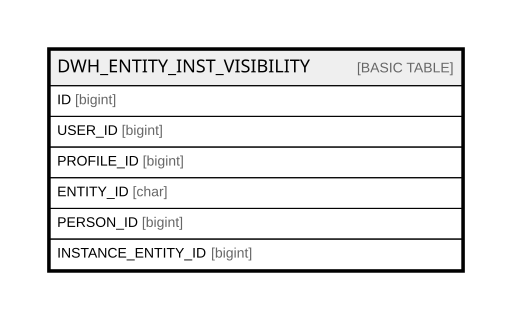

# DWH_ENTITY_INST_VISIBILITY

## Columns

| Name | Type | Default | Nullable | Comment |
| ---- | ---- | ------- | -------- | ------- |
| ID | bigint |  | false |  |
| USER_ID | bigint |  | true |  |
| PROFILE_ID | bigint |  | false |  |
| ENTITY_ID | char |  | false |  |
| PERSON_ID | bigint |  | true |  |
| INSTANCE_ENTITY_ID | bigint |  | true |  |

## Constraints

| Name | Type | Definition |
| ---- | ---- | ---------- |
| PK_DWH_ENTITY_INST_VISIBILITY | PRIMARY KEY | CLUSTERED, unique, part of a PRIMARY KEY constraint, [ ID ] |

## Indexes

| Name | Definition |
| ---- | ---------- |
| PK_DWH_ENTITY_INST_VISIBILITY | CLUSTERED, unique, part of a PRIMARY KEY constraint, [ ID ] |

## Relations

---

> Generated by [tbls](https://github.com/k1LoW/tbls)
