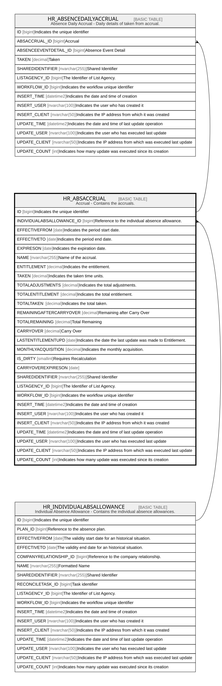

# HR_ABSACCRUAL

## Description

Accrual - Contains the accruals.  

## Columns

| Name | Type | Default | Nullable | Children | Parents | Comment |
| ---- | ---- | ------- | -------- | -------- | ------- | ------- |
| ID | bigint |  | false | [HR_ABSENCEDAILYACCRUAL](HR_ABSENCEDAILYACCRUAL.md) |  | Indicates the unique identifier |
| INDIVIDUALABSALLOWANCE_ID | bigint |  | true |  | [HR_INDIVIDUALABSALLOWANCE](HR_INDIVIDUALABSALLOWANCE.md) | Reference to the individual absence allowance. |
| EFFECTIVEFROM | date |  | true |  |  | Indicates the period start date. |
| EFFECTIVETO | date |  | true |  |  | Indicates the period end date. |
| EXPIRESON | date |  | true |  |  | Indicates the expiration date. |
| NAME | nvarchar(255) |  | true |  |  | Name of the accrual. |
| ENTITLEMENT | decimal |  | true |  |  | Indicates the entitlement. |
| TAKEN | decimal |  | true |  |  | Indicates the taken time units. |
| TOTALADJUSTMENTS | decimal |  | true |  |  | Indicates the total adjustments. |
| TOTALENTITLEMENT | decimal |  | true |  |  | Indicates the total entitlement. |
| TOTALTAKEN | decimal |  | true |  |  | Indicates the total taken. |
| REMAININGAFTERCARRYOVER | decimal |  | true |  |  | Remaining after Carry Over |
| TOTALREMAINING | decimal |  | true |  |  | Total Remaining |
| CARRYOVER | decimal |  | true |  |  | Carry Over |
| LASTENTITLEMENTUPD | date |  | true |  |  | Indicates the date the last update was made to Entitlement. |
| MONTHLYACQUISITION | decimal |  | true |  |  | Indicates the monthly acquisition. |
| IS_DIRTY | smallint |  | true |  |  | Requires Recalculation |
| CARRYOVEREXPIRESON | date |  | true |  |  |  |
| SHAREDIDENTIFIER | nvarchar(255) |  | true |  |  | Shared Identifier |
| LISTAGENCY_ID | bigint |  | true |  |  | The Identifier of List Agency. |
| WORKFLOW_ID | bigint |  | true |  |  | Indicates the workflow unique identifier |
| INSERT_TIME | datetime2 | (sysutcdatetime()) | false |  |  | Indicates the date and time of creation |
| INSERT_USER | nvarchar(100) | (N'MAIN') | false |  |  | Indicates the user who has created it |
| INSERT_CLIENT | nvarchar(50) | (N'localhost') | false |  |  | Indicates the IP address from which it was created |
| UPDATE_TIME | datetime2 | (sysutcdatetime()) | false |  |  | Indicates the date and time of last update operation |
| UPDATE_USER | nvarchar(100) | (N'MAIN') | false |  |  | Indicates the user who has executed last update |
| UPDATE_CLIENT | nvarchar(50) | (N'localhost') | false |  |  | Indicates the IP address from which was executed last update |
| UPDATE_COUNT | int | ((0)) | false |  |  | Indicates how many update was executed since its creation |

## Constraints

| Name | Type | Definition |
| ---- | ---- | ---------- |
| PK_HR_ABSACCRUAL | PRIMARY KEY | CLUSTERED, unique, part of a PRIMARY KEY constraint, [ ID ] |
| UQ_ABSINDIVIDUALALLOWANCEACCR | UNIQUE | NONCLUSTERED, unique, part of a UNIQUE constraint, [ INDIVIDUALABSALLOWANCE_ID, EFFECTIVEFROM ] |
| FK_ABSACCRUAL_INDALLOWANCE | FOREIGN KEY | FOREIGN KEY(INDIVIDUALABSALLOWANCE_ID) REFERENCES HR_INDIVIDUALABSALLOWANCE(ID) ON UPDATE NO_ACTION ON DELETE CASCADE |

## Indexes

| Name | Definition |
| ---- | ---------- |
| PK_HR_ABSACCRUAL | CLUSTERED, unique, part of a PRIMARY KEY constraint, [ ID ] |
| UQ_ABSINDIVIDUALALLOWANCEACCR | NONCLUSTERED, unique, part of a UNIQUE constraint, [ INDIVIDUALABSALLOWANCE_ID, EFFECTIVEFROM ] |

## Relations

---

> Generated by [tbls](https://github.com/k1LoW/tbls)
