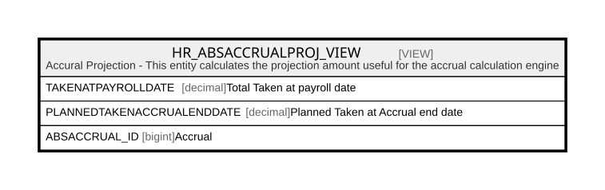

# HR_ABSACCRUALPROJ_VIEW

## Description

Accural Projection - This entity calculates the projection amount useful for the accrual calculation engine  


<details>
<summary><strong>Table Definition</strong></summary>

```sql
-- Talentia Software - All right reserved
-- Type: VIEW                     Name: HR_ABSACCRUALPROJ_VIEW
-- Date: 09-04-2026 07:27:59 (UTC)
-- 
-- ChangeLogId: 00000000-0000-0000-0000-000000000000
-- ChangeSetId: 2a2a0851-78a0-438d-88a6-c37794420592
-- Original file name: C:\repos\Talentia-Software\hcm-core/DB/ProductDB/EDM\Schema\Views\HR_ABSACCRUALPROJ_VIEW.xml


CREATE VIEW [HR_ABSACCRUALPROJ_VIEW]
 ( TAKENATPAYROLLDATE, PLANNEDTAKENACCRUALENDDATE, ABSACCRUAL_ID ) 
 AS 
( SELECT
		coalesce(coalesce(HR_ABSACCRUAL.taken,0) + coalesce(TAKENATPAYROLLDATE,0),0) as TAKENATPAYROLLDATE,
		coalesce(PLANNEDTAKENACCRUALENDDATE,0),
		HR_ABSACCRUAL.ID as ABSACCRUAL_ID
		from
		HR_ABSACCRUAL left outer join
		(
		select
		sum(
		coalesce(
		case
		when cast(HR_ABSENCEEVENTDETAIL.REFDATE as date) <= HR_ABSACCRUAL.LASTENTITLEMENTUPD then HR_ABSENCEDAILYACCRUAL.TAKEN
		else 0
		end
		,0)
		) as TAKENATPAYROLLDATE,
		coalesce(
		sum(HR_ABSENCEDAILYACCRUAL.TAKEN),0) as PLANNEDTAKENACCRUALENDDATE,
		HR_ABSACCRUAL.ID as ABSACCRUAL_ID
		from
		HR_ABSACCRUAL
		inner join HR_INDIVIDUALABSALLOWANCE on (HR_INDIVIDUALABSALLOWANCE.ID = HR_ABSACCRUAL.INDIVIDUALABSALLOWANCE_ID)
		inner join HR_ABSENCEPLAN on (HR_ABSENCEPLAN.ID = HR_INDIVIDUALABSALLOWANCE.PLAN_ID and Coalesce(HR_ABSENCEPLAN.MANAGEPROJECTION,0) = 1 and HR_ABSENCEPLAN.ENTITLEMENTRULE_ID = 1930129 )
		inner join HR_ABSENCEEVENT eventNotPayrolSync on (eventNotPayrolSync.INDIVIDUALABSALLOWANCE_ID = HR_ABSACCRUAL.INDIVIDUALABSALLOWANCE_ID and eventNotPayrolSync.PAYROLLDATE is null)
		inner join TF_CODES eventStatus on (eventStatus.ID = eventNotPayrolSync.STATUS_ID and coalesce(eventStatus.CT_BOOL1,0) = 1)
		inner join HR_ABSENCEEVENTDETAIL on (HR_ABSENCEEVENTDETAIL.ABSENCEEVENT_ID = eventNotPayrolSync.ID)
		inner join HR_ABSENCEDAILYACCRUAL  on (HR_ABSACCRUAL.ID = HR_ABSENCEDAILYACCRUAL.ABSACCRUAL_ID and HR_ABSENCEEVENTDETAIL.ID = HR_ABSENCEDAILYACCRUAL.ABSENCEEVENTDETAIL_ID)
		group by HR_ABSACCRUAL.ID
	) PRJ  on (PRJ.ABSACCRUAL_ID = HR_ABSACCRUAL.ID) )

```

</details>

## Columns

| Name | Type | Default | Nullable | Comment |
| ---- | ---- | ------- | -------- | ------- |
| TAKENATPAYROLLDATE | decimal |  | true | Total Taken at payroll date |
| PLANNEDTAKENACCRUALENDDATE | decimal |  | true | Planned Taken at Accrual end date |
| ABSACCRUAL_ID | bigint |  | false | Accrual |

## Referenced Tables

| Name | Columns | Comment | Type |
| ---- | ------- | ------- | ---- |
| [HR_ABSACCRUAL](HR_ABSACCRUAL.md) | 28 | Accrual - Contains the accruals.<br /> | BASIC TABLE |
| [HR_INDIVIDUALABSALLOWANCE](HR_INDIVIDUALABSALLOWANCE.md) | 17 | Individual Absence Allowance - Contains the individual absence allowances.<br /> | BASIC TABLE |
| [HR_ABSENCEPLAN](HR_ABSENCEPLAN.md) | 64 | Absence Plan - Contains the absence plans.<br /> | BASIC TABLE |
| [HR_ABSENCEEVENT](HR_ABSENCEEVENT.md) | 49 | Absence Event - Contains the absence events.<br /> | BASIC TABLE |
| [TF_CODES](TF_CODES.md) | 87 |  | BASIC TABLE |
| [HR_ABSENCEEVENTDETAIL](HR_ABSENCEEVENTDETAIL.md) | 22 | Absence Event Detail - This entity includes the daily absence details.<br /> | BASIC TABLE |
| [HR_ABSENCEDAILYACCRUAL](HR_ABSENCEDAILYACCRUAL.md) | 14 | Absence Daily Accrual - Daily details of taken from accrual.<br /> | BASIC TABLE |

## Relations



---

> Generated by [tbls](https://github.com/k1LoW/tbls)
