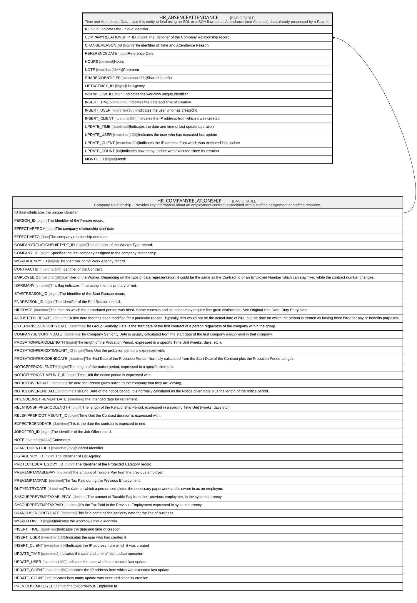

# HR_ABSENCEATTENDANCE

## Description

Time and Attendance Data - Use this entity to load using an SDL or a SOA flow actual Attendance (and Absence) data already processed by a Payroll.  

## Columns

| Name | Type | Default | Nullable | Parents | Comment |
| ---- | ---- | ------- | -------- | ------- | ------- |
| ID | bigint |  | false |  | Indicates the unique identifier |
| COMPANYRELATIONSHIP_ID | bigint |  | false | [HR_COMPANYRELATIONSHIP](HR_COMPANYRELATIONSHIP.md) | The Identifier of the Company Relationship record. |
| CHANGEREASON_ID | bigint |  | true |  | The identifier of Time and Attendance Reason |
| REFERENCEDATE | date |  | false |  | Reference Date |
| HOURS | decimal |  | true |  | Hours |
| NOTE | nvarchar(MAX) |  | true |  | Comment |
| SHAREDIDENTIFIER | nvarchar(255) |  | true |  | Shared idenifier |
| LISTAGENCY_ID | bigint |  | true |  | List Agency |
| WORKFLOW_ID | bigint |  | true |  | Indicates the workflow unique identifier |
| INSERT_TIME | datetime2 | (sysutcdatetime()) | false |  | Indicates the date and time of creation |
| INSERT_USER | nvarchar(100) | (N'MAIN') | false |  | Indicates the user who has created it |
| INSERT_CLIENT | nvarchar(50) | (N'localhost') | false |  | Indicates the IP address from which it was created |
| UPDATE_TIME | datetime2 | (sysutcdatetime()) | false |  | Indicates the date and time of last update operation |
| UPDATE_USER | nvarchar(100) | (N'MAIN') | false |  | Indicates the user who has executed last update |
| UPDATE_CLIENT | nvarchar(50) | (N'localhost') | false |  | Indicates the IP address from which was executed last update |
| UPDATE_COUNT | int | ((0)) | false |  | Indicates how many update was executed since its creation |
| MONTH_ID | bigint |  | true |  | Month |

## Constraints

| Name | Type | Definition |
| ---- | ---- | ---------- |
| PK_ABSENCEATTENDANCE | PRIMARY KEY | CLUSTERED, unique, part of a PRIMARY KEY constraint, [ ID ] |
| UQ_ABSENCEATTENDANCE | UNIQUE | NONCLUSTERED, unique, part of a UNIQUE constraint, [ ID, COMPANYRELATIONSHIP_ID, CHANGEREASON_ID, REFERENCEDATE ] |
| FK_ABSENCEATTENDANCE_COMPREL | FOREIGN KEY | FOREIGN KEY(COMPANYRELATIONSHIP_ID) REFERENCES HR_COMPANYRELATIONSHIP(ID) ON UPDATE NO_ACTION ON DELETE CASCADE |

## Indexes

| Name | Definition |
| ---- | ---------- |
| PK_ABSENCEATTENDANCE | CLUSTERED, unique, part of a PRIMARY KEY constraint, [ ID ] |
| UQ_ABSENCEATTENDANCE | NONCLUSTERED, unique, part of a UNIQUE constraint, [ ID, COMPANYRELATIONSHIP_ID, CHANGEREASON_ID, REFERENCEDATE ] |

## Relations

---

> Generated by [tbls](https://github.com/k1LoW/tbls)
