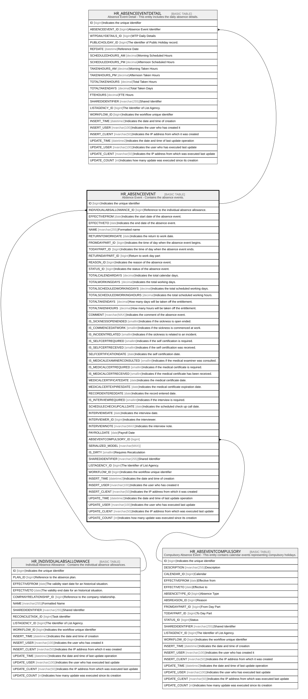

# HR_ABSENCEEVENT

## Description

Absence Event - Contains the absence events.  

## Columns

| Name | Type | Default | Nullable | Children | Parents | Comment |
| ---- | ---- | ------- | -------- | -------- | ------- | ------- |
| ID | bigint |  | false | [HR_ABSENCEEVENTDETAIL](HR_ABSENCEEVENTDETAIL.md) |  | Indicates the unique identifier |
| INDIVIDUALABSALLOWANCE_ID | bigint |  | true |  | [HR_INDIVIDUALABSALLOWANCE](HR_INDIVIDUALABSALLOWANCE.md) | Reference to the individual absence allowance. |
| EFFECTIVEFROM | date |  | true |  |  | Indicates the start date of the absence event. |
| EFFECTIVETO | date |  | true |  |  | Indicates the end date of the absence event. |
| NAME | nvarchar(255) |  | true |  |  | Formatted name |
| RETURNTOWORKDATE | date |  | true |  |  | Indicates the return to work date. |
| FROMDAYPART_ID | bigint |  | true |  |  | Indicates the time of day when the absence event begins. |
| TODAYPART_ID | bigint |  | true |  |  | Indicates the time of day when the absence event ends. |
| RETURNDAYPART_ID | bigint |  | true |  |  | Return to work day part |
| REASON_ID | bigint |  | true |  |  | Indicates the reason of the absence event. |
| STATUS_ID | bigint |  | true |  |  | Indicates the status of the absence event. |
| TOTALCALENDARDAYS | decimal |  | true |  |  | Indicates the total calendar days. |
| TOTALWORKINGDAYS | decimal |  | true |  |  | Indicates the total working days. |
| TOTALSCHEDULEDWORKINGDAYS | decimal |  | true |  |  | Indicates the total scheduled working days. |
| TOTALSCHEDULEDWORKINGHOURS | decimal |  | true |  |  | Indicates the total scheduled working hours. |
| TOTALTAKENDAYS | decimal |  | true |  |  | How many days will be taken off the entitlement. |
| TOTALTAKENHOURS | decimal |  | true |  |  | How many hours will be taken off the entitlement. |
| COMMENT | nvarchar(MAX) |  | true |  |  | Indicates the comment of the absence event. |
| IS_SICKNESSOPENENDED | smallint |  | true |  |  | Indicates if the sickness is open ended. |
| IS_COMMENCEDATWORK | smallint |  | true |  |  | Indicates if the sickness is commenced at work. |
| IS_INCIDENTRELATED | smallint |  | true |  |  | Indicates if the sickness is related to an incident. |
| IS_SELFCERTREQUIRED | smallint |  | true |  |  | Indicates if the self certification is required. |
| IS_SELFCERTRECEIVED | smallint |  | true |  |  | Indicates if the self certification was received. |
| SELFCERTIFICATIONDATE | date |  | true |  |  | Indicates the self certification date. |
| IS_MEDICALEXAMINERCONSULTED | smallint |  | true |  |  | Indicates if the medical examiner was consulted. |
| IS_MEDICALCERTREQUIRED | smallint |  | true |  |  | Indicates if the medical certificate is required. |
| IS_MEDICALCERTRECEIVED | smallint |  | true |  |  | Indicates if the medical certificate has been received. |
| MEDICALCERTIFICATEDATE | date |  | true |  |  | Indicates the medical certificate date. |
| MEDICALCERTEXPIRESDATE | date |  | true |  |  | Indicates the medical certificate expiration date. |
| RECORDENTEREDDATE | date |  | true |  |  | Indicates the record entered date. |
| IS_INTERVIEWREQUIRED | smallint |  | true |  |  | Indicates if the interview is required. |
| SCHEDULECHECKUPCALLDATE | date |  | true |  |  | Indicates the scheduled check up call date. |
| INTERVIEWDATE | date |  | true |  |  | Indicates the interview date. |
| INTERVIEWER_ID | bigint |  | true |  |  | Indicates the interviewer. |
| INTERVIEWNOTE | nvarchar(MAX) |  | true |  |  | Indicates the interview note. |
| PAYROLLDATE | date |  | true |  |  | Payroll Date |
| ABSEVENTCOMPULSORY_ID | bigint |  | true |  | [HR_ABSEVENTCOMPULSORY](HR_ABSEVENTCOMPULSORY.md) |  |
| SERIALIZED_MODEL | nvarchar(MAX) |  | true |  |  |  |
| IS_DIRTY | smallint |  | true |  |  | Requires Recalculation |
| SHAREDIDENTIFIER | nvarchar(255) |  | true |  |  | Shared Identifier |
| LISTAGENCY_ID | bigint |  | true |  |  | The Identifier of List Agency. |
| WORKFLOW_ID | bigint |  | true |  |  | Indicates the workflow unique identifier |
| INSERT_TIME | datetime2 | (sysutcdatetime()) | false |  |  | Indicates the date and time of creation |
| INSERT_USER | nvarchar(100) | (N'MAIN') | false |  |  | Indicates the user who has created it |
| INSERT_CLIENT | nvarchar(50) | (N'localhost') | false |  |  | Indicates the IP address from which it was created |
| UPDATE_TIME | datetime2 | (sysutcdatetime()) | false |  |  | Indicates the date and time of last update operation |
| UPDATE_USER | nvarchar(100) | (N'MAIN') | false |  |  | Indicates the user who has executed last update |
| UPDATE_CLIENT | nvarchar(50) | (N'localhost') | false |  |  | Indicates the IP address from which was executed last update |
| UPDATE_COUNT | int | ((0)) | false |  |  | Indicates how many update was executed since its creation |

## Constraints

| Name | Type | Definition |
| ---- | ---- | ---------- |
| PK_HR_ABSENCEEVENT | PRIMARY KEY | CLUSTERED, unique, part of a PRIMARY KEY constraint, [ ID ] |
| FK_ABSEVENT_COMPULSARY | FOREIGN KEY | FOREIGN KEY(ABSEVENTCOMPULSORY_ID) REFERENCES HR_ABSEVENTCOMPULSORY(ID) ON UPDATE NO_ACTION ON DELETE NO_ACTION |
| FK_ABSEVENT_INDALLOWANCE | FOREIGN KEY | FOREIGN KEY(INDIVIDUALABSALLOWANCE_ID) REFERENCES HR_INDIVIDUALABSALLOWANCE(ID) ON UPDATE NO_ACTION ON DELETE NO_ACTION |

## Indexes

| Name | Definition |
| ---- | ---------- |
| PK_HR_ABSENCEEVENT | CLUSTERED, unique, part of a PRIMARY KEY constraint, [ ID ] |
| IDX_INDVABS_PAYD_ST | NONCLUSTERED, [ INDIVIDUALABSALLOWANCE_ID, PAYROLLDATE, STATUS_ID ] |

## Relations

---

> Generated by [tbls](https://github.com/k1LoW/tbls)
