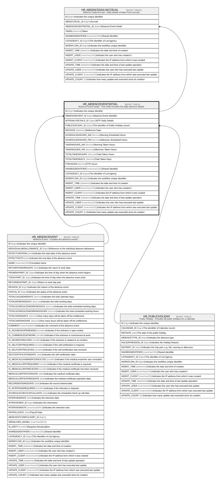

# HR_ABSENCEEVENTDETAIL

## Description

Absence Event Detail - This entity includes the daily absence details.  

## Columns

| Name | Type | Default | Nullable | Children | Parents | Comment |
| ---- | ---- | ------- | -------- | -------- | ------- | ------- |
| ID | bigint |  | false | [HR_ABSENCEDAILYACCRUAL](HR_ABSENCEDAILYACCRUAL.md) |  | Indicates the unique identifier |
| ABSENCEEVENT_ID | bigint |  | false |  | [HR_ABSENCEEVENT](HR_ABSENCEEVENT.md) | Absence Event Identifier |
| WTPDAILYDETAILS_ID | bigint |  | true |  |  | WTP Daily Details |
| PUBLICHOLIDAY_ID | bigint |  | true |  | [HR_PUBLICHOLIDAY](HR_PUBLICHOLIDAY.md) | The identifier of Public Holiday record. |
| REFDATE | datetime |  | false |  |  | Reference Date |
| SCHEDULEDHOURS_AM | decimal |  | true |  |  | Morning Scheduled Hours |
| SCHEDULEDHOURS_PM | decimal |  | true |  |  | Afternoon Scheduled Hours |
| TAKENHOURS_AM | decimal |  | true |  |  | Morning Taken Hours |
| TAKENHOURS_PM | decimal |  | true |  |  | Afternoon Taken Hours |
| TOTALTAKENHOURS | decimal |  | true |  |  | Total Taken Hours |
| TOTALTAKENDAYS | decimal |  | true |  |  | Total Taken Days |
| FTEHOURS | decimal |  | true |  |  | FTE Hours |
| SHAREDIDENTIFIER | nvarchar(255) |  | true |  |  | Shared Identifier |
| LISTAGENCY_ID | bigint |  | true |  |  | The Identifier of List Agency. |
| WORKFLOW_ID | bigint |  | true |  |  | Indicates the workflow unique identifier |
| INSERT_TIME | datetime2 | (sysutcdatetime()) | false |  |  | Indicates the date and time of creation |
| INSERT_USER | nvarchar(100) | (N'MAIN') | false |  |  | Indicates the user who has created it |
| INSERT_CLIENT | nvarchar(50) | (N'localhost') | false |  |  | Indicates the IP address from which it was created |
| UPDATE_TIME | datetime2 | (sysutcdatetime()) | false |  |  | Indicates the date and time of last update operation |
| UPDATE_USER | nvarchar(100) | (N'MAIN') | false |  |  | Indicates the user who has executed last update |
| UPDATE_CLIENT | nvarchar(50) | (N'localhost') | false |  |  | Indicates the IP address from which was executed last update |
| UPDATE_COUNT | int | ((0)) | false |  |  | Indicates how many update was executed since its creation |

## Constraints

| Name | Type | Definition |
| ---- | ---- | ---------- |
| PK_HR_ABSENCEEVENTDETAIL | PRIMARY KEY | CLUSTERED, unique, part of a PRIMARY KEY constraint, [ ID ] |
| UQ_HR_ABSENCEEVENTDETAIL | UNIQUE | NONCLUSTERED, unique, part of a UNIQUE constraint, [ REFDATE, ABSENCEEVENT_ID ] |
| FK_ABSEVENTDETAIL_ABSENCEEVEN | FOREIGN KEY | FOREIGN KEY(ABSENCEEVENT_ID) REFERENCES HR_ABSENCEEVENT(ID) ON UPDATE NO_ACTION ON DELETE CASCADE |
| FK_ABSEVENTDETAIL_PUBLICHOLID | FOREIGN KEY | FOREIGN KEY(PUBLICHOLIDAY_ID) REFERENCES HR_PUBLICHOLIDAY(ID) ON UPDATE NO_ACTION ON DELETE SET_NULL |

## Indexes

| Name | Definition |
| ---- | ---------- |
| PK_HR_ABSENCEEVENTDETAIL | CLUSTERED, unique, part of a PRIMARY KEY constraint, [ ID ] |
| UQ_HR_ABSENCEEVENTDETAIL | NONCLUSTERED, unique, part of a UNIQUE constraint, [ REFDATE, ABSENCEEVENT_ID ] |
| IDX_ABS_ABSENCEEVENT | NONCLUSTERED, [ ABSENCEEVENT_ID ] |

## Relations

---

> Generated by [tbls](https://github.com/k1LoW/tbls)
