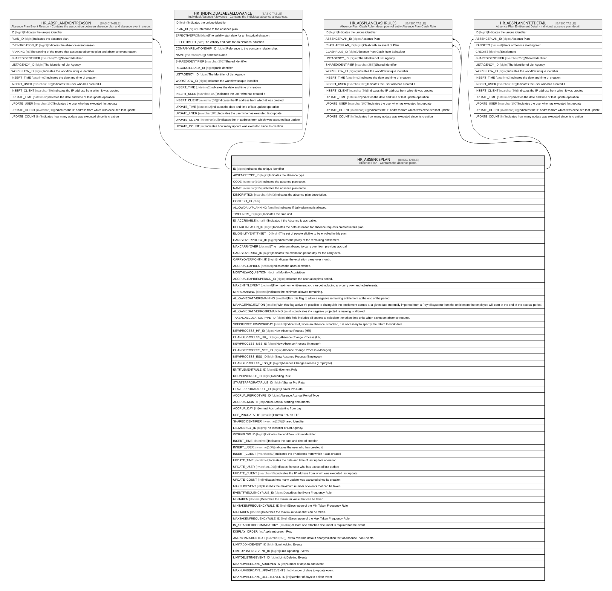

# HR_ABSENCEPLAN

## Description

Absence Plan - Contains the absence plans.  

## Columns

| Name | Type | Default | Nullable | Children | Comment |
| ---- | ---- | ------- | -------- | -------- | ------- |
| ID | bigint |  | false | [HR_ABSPLANEVENTREASON](HR_ABSPLANEVENTREASON.md) [HR_INDIVIDUALABSALLOWANCE](HR_INDIVIDUALABSALLOWANCE.md) [HR_ABSPLANCLASHRULES](HR_ABSPLANCLASHRULES.md) [HR_ABSPLANENTITDETAIL](HR_ABSPLANENTITDETAIL.md) | Indicates the unique identifier |
| ABSENCETYPE_ID | bigint |  | true |  | Indicates the absence type. |
| CODE | nvarchar(100) |  | false |  | Indicates the absence plan code. |
| NAME | nvarchar(255) |  | true |  | Indicates the absence plan name. |
| DESCRIPTION | nvarchar(MAX) |  | true |  | Indicates the absence plan description. |
| CONTEXT_ID | char |  | true |  |  |
| ALLOWDAILYPLANNING | smallint |  | true |  | Indicates if daily planning is allowed. |
| TIMEUNITS_ID | bigint |  | true |  | Indicates the time unit. |
| IS_ACCRUABLE | smallint |  | true |  | Indicates if the Absence is accruable. |
| DEFAULTREASON_ID | bigint |  | true |  | Indicates the default reason for absence requests created in this plan. |
| ELIGIBILITYENTITYSET_ID | bigint |  | true |  | The set of people eligible to be enrolled in this plan. |
| CARRYOVERPOLICY_ID | bigint |  | true |  | Indicates the policy of the remaining entitlement. |
| MAXCARRYOVER | decimal |  | true |  | The maximum allowed to carry over from previous accrual. |
| CARRYOVERDAY_ID | bigint |  | true |  | Indicates the expiration period day for the carry over. |
| CARRYOVERMONTH_ID | bigint |  | true |  | Indicates the expiration carry over month. |
| ACCRUALEXPIRES | decimal |  | true |  | Indicates the accrual expires. |
| MONTHLYACQUISITION | decimal |  | true |  | Monthly Acquisition |
| ACCRUALEXPIRESPERIOD_ID | bigint |  | true |  | Indicates the accrual expires period. |
| MAXENTITLEMENT | decimal |  | true |  | The maximum entitlement you can get including any carry over and adjustments. |
| MINREMAINING | decimal |  | true |  | Indicates the minimum allowed remaining. |
| ALLOWNEGATIVEREMAINING | smallint |  | true |  | Tick this flag to allow a negative remaining entitlement at the end of the period. |
| MANAGEPROJECTION | smallint |  | true |  | With this flag active it's possible to distinguish the entitlement earned at a given date (normally imported from a Payroll system) from the entitlement the employee will earn at the end of the accrual period. |
| ALLOWNEGATIVEPROJREMAINING | smallint |  | true |  | Indicates if a negative projected remaining is allowed. |
| TAKENCALCULATIONTYPE_ID | bigint |  | true |  | This field includes all options to calculate the taken time units when saving an absence request. |
| SPECIFYRETURNWORKDAY | smallint |  | true |  | Indicates if, when an absence is booked, it is necessary to specify the return to work date. |
| NEWPROCESS_HR_ID | bigint |  | true |  | New Absence Process (HR) |
| CHANGEPROCESS_HR_ID | bigint |  | true |  | Absence Change Process (HR) |
| NEWPROCESS_MSS_ID | bigint |  | true |  | New Absence Process (Manager) |
| CHANGEPROCESS_MSS_ID | bigint |  | true |  | Absence Change Process (Manager) |
| NEWPROCESS_ESS_ID | bigint |  | true |  | New Absence Process (Employee) |
| CHANGEPROCESS_ESS_ID | bigint |  | true |  | Absence Change Process (Employee) |
| ENTITLEMENTRULE_ID | bigint |  | true |  | Entitlement Rule |
| ROUNDINGRULE_ID | bigint |  | true |  | Rounding Rule |
| STARTERPRORATARULE_ID | bigint |  | true |  | Starter Pro Rata |
| LEAVERPRORATARULE_ID | bigint |  | true |  | Leaver Pro Rata |
| ACCRUALPERIODTYPE_ID | bigint |  | true |  | Absence Accrual Period Type |
| ACCRUALMONTH | int |  | true |  | Annual Accrual starting from month |
| ACCRUALDAY | int |  | true |  | Annual Accrual starting from day |
| USE_PRORATAFTE | smallint |  | true |  | Prorata Ent. on FTE |
| SHAREDIDENTIFIER | nvarchar(255) |  | true |  | Shared Identifier |
| LISTAGENCY_ID | bigint |  | true |  | The Identifier of List Agency. |
| WORKFLOW_ID | bigint |  | true |  | Indicates the workflow unique identifier |
| INSERT_TIME | datetime2 | (sysutcdatetime()) | false |  | Indicates the date and time of creation |
| INSERT_USER | nvarchar(100) | (N'MAIN') | false |  | Indicates the user who has created it |
| INSERT_CLIENT | nvarchar(50) | (N'localhost') | false |  | Indicates the IP address from which it was created |
| UPDATE_TIME | datetime2 | (sysutcdatetime()) | false |  | Indicates the date and time of last update operation |
| UPDATE_USER | nvarchar(100) | (N'MAIN') | false |  | Indicates the user who has executed last update |
| UPDATE_CLIENT | nvarchar(50) | (N'localhost') | false |  | Indicates the IP address from which was executed last update |
| UPDATE_COUNT | int | ((0)) | false |  | Indicates how many update was executed since its creation |
| MAXNUMEVENT | int |  | true |  | Describes the maximum number of events that can be taken. |
| EVENTFREQUENCYRULE_ID | bigint |  | true |  | Describes the Event Frequency Rule. |
| MINTAKEN | decimal |  | true |  | Describes the minimum value that can be taken. |
| MINTAKENFREQUENCYRULE_ID | bigint |  | true |  | Description of the Min Taken Frequency Rule |
| MAXTAKEN | decimal |  | true |  | Describes the maximum value that can be taken. |
| MAXTAKENFREQUENCYRULE_ID | bigint |  | true |  | Description of the Max Taken Frequency Rule |
| IS_ATTACHEDDOCMANDATORY | smallint |  | true |  | At least one attached document is required for the event. |
| DISPLAY_ORDER | int |  | true |  | Applicant search Row |
| ANONYMIZATIONTEXT | nvarchar(255) |  | true |  | Text to override default anonymization text of Absence Plan Events |
| LIMITADDINGEVENT_ID | bigint |  | true |  | Limit Adding Events |
| LIMITUPDATINGEVENT_ID | bigint |  | true |  | Limit Updating Events |
| LIMITDELETINGEVENT_ID | bigint |  | true |  | Limit Deleting Events |
| MAXNUMBERDAYS_ADDEVENTS | int |  | true |  | Number of days to add event |
| MAXNUMBERDAYS_UPDATEEVENTS | int |  | true |  | Number of days to update event |
| MAXNUMBERDAYS_DELETEEVENTS | int |  | true |  | Number of days to delete event |

## Constraints

| Name | Type | Definition |
| ---- | ---- | ---------- |
| PK_HR_ABSENCEPLAN | PRIMARY KEY | CLUSTERED, unique, part of a PRIMARY KEY constraint, [ ID ] |
| UQ_ABSENCEPLAN | UNIQUE | NONCLUSTERED, unique, part of a UNIQUE constraint, [ ABSENCETYPE_ID, CODE ] |

## Indexes

| Name | Definition |
| ---- | ---------- |
| PK_HR_ABSENCEPLAN | CLUSTERED, unique, part of a PRIMARY KEY constraint, [ ID ] |
| UQ_ABSENCEPLAN | NONCLUSTERED, unique, part of a UNIQUE constraint, [ ABSENCETYPE_ID, CODE ] |

## Relations

---

> Generated by [tbls](https://github.com/k1LoW/tbls)
