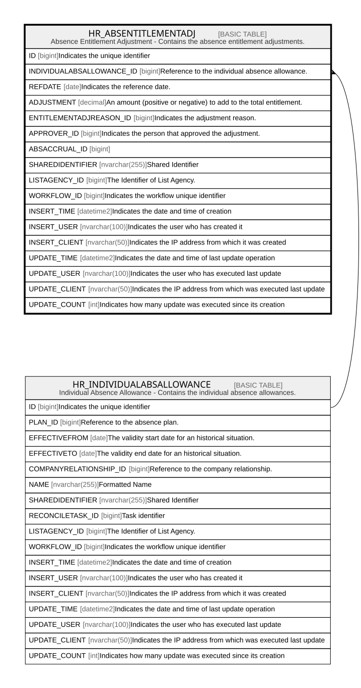

# HR_ABSENTITLEMENTADJ

## Description

Absence Entitlement Adjustment - Contains the absence entitlement adjustments.  

## Columns

| Name | Type | Default | Nullable | Parents | Comment |
| ---- | ---- | ------- | -------- | ------- | ------- |
| ID | bigint |  | false |  | Indicates the unique identifier |
| INDIVIDUALABSALLOWANCE_ID | bigint |  | true | [HR_INDIVIDUALABSALLOWANCE](HR_INDIVIDUALABSALLOWANCE.md) | Reference to the individual absence allowance. |
| REFDATE | date |  | true |  | Indicates the reference date. |
| ADJUSTMENT | decimal |  | true |  | An amount (positive or negative) to add to the total entitlement. |
| ENTITLEMENTADJREASON_ID | bigint |  | true |  | Indicates the adjustment reason. |
| APPROVER_ID | bigint |  | true |  | Indicates the person that approved the adjustment. |
| ABSACCRUAL_ID | bigint |  | true |  |  |
| SHAREDIDENTIFIER | nvarchar(255) |  | true |  | Shared Identifier |
| LISTAGENCY_ID | bigint |  | true |  | The Identifier of List Agency. |
| WORKFLOW_ID | bigint |  | true |  | Indicates the workflow unique identifier |
| INSERT_TIME | datetime2 | (sysutcdatetime()) | false |  | Indicates the date and time of creation |
| INSERT_USER | nvarchar(100) | (N'MAIN') | false |  | Indicates the user who has created it |
| INSERT_CLIENT | nvarchar(50) | (N'localhost') | false |  | Indicates the IP address from which it was created |
| UPDATE_TIME | datetime2 | (sysutcdatetime()) | false |  | Indicates the date and time of last update operation |
| UPDATE_USER | nvarchar(100) | (N'MAIN') | false |  | Indicates the user who has executed last update |
| UPDATE_CLIENT | nvarchar(50) | (N'localhost') | false |  | Indicates the IP address from which was executed last update |
| UPDATE_COUNT | int | ((0)) | false |  | Indicates how many update was executed since its creation |

## Constraints

| Name | Type | Definition |
| ---- | ---- | ---------- |
| PK_HR_ABSENTITLEMENTADJ | PRIMARY KEY | CLUSTERED, unique, part of a PRIMARY KEY constraint, [ ID ] |
| UQ_ABSENTITLEMENTADJ | UNIQUE | NONCLUSTERED, unique, part of a UNIQUE constraint, [ INDIVIDUALABSALLOWANCE_ID, REFDATE, ENTITLEMENTADJREASON_ID ] |
| FK_ENTITLEMENTADJ_INDALLOWANCE | FOREIGN KEY | FOREIGN KEY(INDIVIDUALABSALLOWANCE_ID) REFERENCES HR_INDIVIDUALABSALLOWANCE(ID) ON UPDATE NO_ACTION ON DELETE CASCADE |

## Indexes

| Name | Definition |
| ---- | ---------- |
| PK_HR_ABSENTITLEMENTADJ | CLUSTERED, unique, part of a PRIMARY KEY constraint, [ ID ] |
| UQ_ABSENTITLEMENTADJ | NONCLUSTERED, unique, part of a UNIQUE constraint, [ INDIVIDUALABSALLOWANCE_ID, REFDATE, ENTITLEMENTADJREASON_ID ] |

## Relations

---

> Generated by [tbls](https://github.com/k1LoW/tbls)
