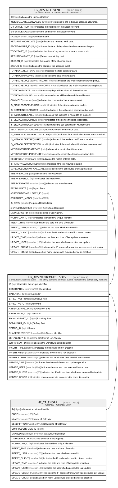

# HR_ABSEVENTCOMPULSORY

## Description

Compulsory Absence Event - This entity contains calendar events representing compulsory holidays.  

## Columns

| Name | Type | Default | Nullable | Children | Parents | Comment |
| ---- | ---- | ------- | -------- | -------- | ------- | ------- |
| ID | bigint |  | false | [HR_ABSENCEEVENT](HR_ABSENCEEVENT.md) |  | Indicates the unique identifier |
| DESCRIPTION | nvarchar(255) |  | true |  |  | Description |
| CALENDAR_ID | bigint |  | true |  | [HR_CALENDAR](HR_CALENDAR.md) | Calendar |
| EFFECTIVEFROM | date |  | true |  |  | Effective from |
| EFFECTIVETO | date |  | true |  |  | Effective to |
| ABSENCETYPE_ID | bigint |  | true |  |  | Absence Type |
| ABSREASON_ID | bigint |  | true |  |  | Reason |
| FROMDAYPART_ID | bigint |  | true |  |  | From Day Part |
| TODAYPART_ID | bigint |  | true |  |  | To Day Part |
| STATUS_ID | bigint |  | true |  |  | Status |
| SHAREDIDENTIFIER | nvarchar(255) |  | true |  |  | Shared Identifier |
| LISTAGENCY_ID | bigint |  | true |  |  | The Identifier of List Agency. |
| WORKFLOW_ID | bigint |  | true |  |  | Indicates the workflow unique identifier |
| INSERT_TIME | datetime2 | (sysutcdatetime()) | false |  |  | Indicates the date and time of creation |
| INSERT_USER | nvarchar(100) | (N'MAIN') | false |  |  | Indicates the user who has created it |
| INSERT_CLIENT | nvarchar(50) | (N'localhost') | false |  |  | Indicates the IP address from which it was created |
| UPDATE_TIME | datetime2 | (sysutcdatetime()) | false |  |  | Indicates the date and time of last update operation |
| UPDATE_USER | nvarchar(100) | (N'MAIN') | false |  |  | Indicates the user who has executed last update |
| UPDATE_CLIENT | nvarchar(50) | (N'localhost') | false |  |  | Indicates the IP address from which was executed last update |
| UPDATE_COUNT | int | ((0)) | false |  |  | Indicates how many update was executed since its creation |

## Constraints

| Name | Type | Definition |
| ---- | ---- | ---------- |
| PK_HR_ABSEVENTCOMPULSORY | PRIMARY KEY | CLUSTERED, unique, part of a PRIMARY KEY constraint, [ ID ] |
| FK_ABSEVTCOMPULSORY_CALENDAR | FOREIGN KEY | FOREIGN KEY(CALENDAR_ID) REFERENCES HR_CALENDAR(ID) ON UPDATE NO_ACTION ON DELETE NO_ACTION |

## Indexes

| Name | Definition |
| ---- | ---------- |
| PK_HR_ABSEVENTCOMPULSORY | CLUSTERED, unique, part of a PRIMARY KEY constraint, [ ID ] |

## Relations

---

> Generated by [tbls](https://github.com/k1LoW/tbls)
