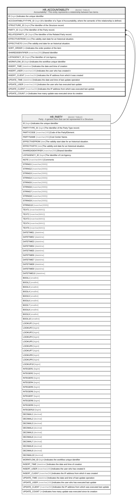

# HR_ACCOUNTABILITY

## Description

Accountability - This entity represents a relationship between two items.  

## Columns

| Name | Type | Default | Nullable | Parents | Comment |
| ---- | ---- | ------- | -------- | ------- | ------- |
| ID | bigint |  | false |  | Indicates the unique identifier |
| ACCOUNTABILITYTYPE_ID | bigint |  | false |  | It’s Identifier of a Type of Accountability, where the semantic of the relationship is defined. |
| STRUCTURE_ID | bigint |  | false |  | The Identifier of the Structure record. |
| PARTY_ID | bigint |  | false | [HR_PARTY](HR_PARTY.md) | The Identifier of the Party record. |
| RELATEDPARTY_ID | bigint |  | true | [HR_PARTY](HR_PARTY.md) | The Identifier of the Related Party record. |
| EFFECTIVEFROM | date |  | false |  | The validity start date for an historical situation. |
| EFFECTIVETO | date |  | true |  | The validity end date for an historical situation. |
| SORT_ORDER | int | ((1)) | false |  | Indicates the order position of the item |
| SHAREDIDENTIFIER | nvarchar(255) |  | true |  | Shared Identifier |
| LISTAGENCY_ID | bigint |  | true |  | The Identifier of List Agency. |
| WORKFLOW_ID | bigint |  | true |  | Indicates the workflow unique identifier |
| INSERT_TIME | datetime2 | (sysutcdatetime()) | false |  | Indicates the date and time of creation |
| INSERT_USER | nvarchar(100) | (N'MAIN') | false |  | Indicates the user who has created it |
| INSERT_CLIENT | nvarchar(50) | (N'localhost') | false |  | Indicates the IP address from which it was created |
| UPDATE_TIME | datetime2 | (sysutcdatetime()) | false |  | Indicates the date and time of last update operation |
| UPDATE_USER | nvarchar(100) | (N'MAIN') | false |  | Indicates the user who has executed last update |
| UPDATE_CLIENT | nvarchar(50) | (N'localhost') | false |  | Indicates the IP address from which was executed last update |
| UPDATE_COUNT | int | ((0)) | false |  | Indicates how many update was executed since its creation |

## Constraints

| Name | Type | Definition |
| ---- | ---- | ---------- |
| PK_ACCOUNTABILITY | PRIMARY KEY | CLUSTERED, unique, part of a PRIMARY KEY constraint, [ ID ] |
| FK_ACCOUNTABILITY_PARTY | FOREIGN KEY | FOREIGN KEY(PARTY_ID) REFERENCES HR_PARTY(ID) ON UPDATE NO_ACTION ON DELETE NO_ACTION |
| FK_ACCOUNTABILITY_RELPARTY | FOREIGN KEY | FOREIGN KEY(RELATEDPARTY_ID) REFERENCES HR_PARTY(ID) ON UPDATE NO_ACTION ON DELETE NO_ACTION |

## Indexes

| Name | Definition |
| ---- | ---------- |
| PK_ACCOUNTABILITY | CLUSTERED, unique, part of a PRIMARY KEY constraint, [ ID ] |
| IDX_ACCOUNTABILITY | NONCLUSTERED, unique, [ ACCOUNTABILITYTYPE_ID, STRUCTURE_ID, PARTY_ID, RELATEDPARTY_ID, EFFECTIVEFROM, EFFECTIVETO ] |

## Relations

---

> Generated by [tbls](https://github.com/k1LoW/tbls)
