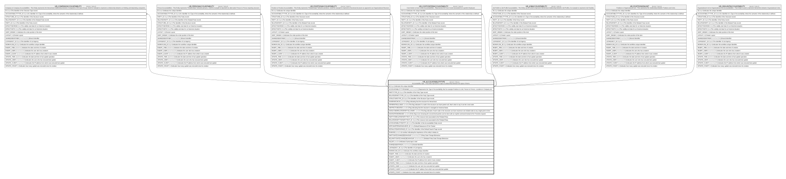

# HR_ACCOUNTABILITYTYPE

## Description

Accountability Type - This entity represents a type of relationship between two types of items.  

## Columns

| Name | Type | Default | Nullable | Children | Comment |
| ---- | ---- | ------- | -------- | -------- | ------- |
| ID | bigint |  | false | [HR_COMPANYACCOUNTABILITY](HR_COMPANYACCOUNTABILITY.md) [HR_PERSONACCOUNTABILITY](HR_PERSONACCOUNTABILITY.md) [HR_POSITIONACCOUNTABILITY](HR_POSITIONACCOUNTABILITY.md) [HR_COSTCENTERACCOUNTABILITY](HR_COSTCENTERACCOUNTABILITY.md) [HR_JOBACCOUNTABILITY](HR_JOBACCOUNTABILITY.md) [HR_POSITIONSINUNIT](HR_POSITIONSINUNIT.md) [HR_ORGUNITACCOUNTABILITY](HR_ORGUNITACCOUNTABILITY.md) | Indicates the unique identifier |
| ACCOUNTABILITYTYPENAME | nvarchar(255) |  | false |  | Represents the Type of Accountability, like for example Positions to Unit, Person to Person, Locations in Company etc. |
| PARTYTYPE_ID | bigint |  | true |  | The Identifier of the Party Type record. |
| RELATEDPARTYTYPE_ID | bigint |  | true |  | The Identifier of the Party Type record. |
| STRUCTURETYPE_ID | bigint |  | true |  | The Identifier of the Structure Type record. |
| ISHIERARCHICAL | smallint |  | true |  | Flag indicating that the structure his hierarchical. |
| ISPARENTNULLABLE | smallint |  | true |  | This flag indicates if a node in the structure can have parent null, that is also to say it can be a root node. |
| ISEFFECTIVEDATED | smallint |  | true |  | Flag indicating that the structure is managed on historical basis. |
| ISONLYONERELATEDPARTYALLOWED | smallint |  | true |  | This flag indicates if each node in the structure can have maximum one related node at any single point in time. |
| NAVIGATEONDEMAND | smallint |  | true |  | If this flag is set, browsing the second level parties can be done with an explicit command instead of the Treeview expand. |
| PARTYTORELATEDPARTYTEXT_ID | bigint |  | true |  | The resource text associated to the Related Party. |
| RELATEDPARTYTOPARTYTEXT_ID | bigint |  | true |  | The resource text associated to the Related Party. |
| ACCOUNTABILITYENTITY_ID | char |  | true |  | The Identifier of the Accountability Entity record. |
| DEFCHARTERDATASOURCE_ID | char |  | true |  | Default Datasource ID for Charter |
| DEFAULTSEARCHPAGE_ID | bigint |  | true |  | The Identifier of the Default Search Page record. |
| RANKING | smallint |  | true |  | A number indicating the importance of the entity it relates to. |
| PARTYDATECHANGEBEHAVIOUR | nvarchar(255) |  | true |  | Party Date Change Behaviour |
| RELPARTYDATECHANGEBEHAVIOUR | nvarchar(255) |  | true |  | Related Party Date Change Behaviour |
| ISLEAF | smallint |  | true |  | Indicates if party type is leaf |
| SHAREDIDENTIFIER | nvarchar(255) |  | true |  | Shared Identifier |
| LISTAGENCY_ID | bigint |  | true |  | The Identifier of List Agency. |
| WORKFLOW_ID | bigint |  | true |  | Indicates the workflow unique identifier |
| INSERT_TIME | datetime2 | (sysutcdatetime()) | false |  | Indicates the date and time of creation |
| INSERT_USER | nvarchar(100) | (N'MAIN') | false |  | Indicates the user who has created it |
| INSERT_CLIENT | nvarchar(50) | (N'localhost') | false |  | Indicates the IP address from which it was created |
| UPDATE_TIME | datetime2 | (sysutcdatetime()) | false |  | Indicates the date and time of last update operation |
| UPDATE_USER | nvarchar(100) | (N'MAIN') | false |  | Indicates the user who has executed last update |
| UPDATE_CLIENT | nvarchar(50) | (N'localhost') | false |  | Indicates the IP address from which was executed last update |
| UPDATE_COUNT | int | ((0)) | false |  | Indicates how many update was executed since its creation |

## Constraints

| Name | Type | Definition |
| ---- | ---- | ---------- |
| PK_ACCOUNTABILITYTYPE | PRIMARY KEY | CLUSTERED, unique, part of a PRIMARY KEY constraint, [ ID ] |

## Indexes

| Name | Definition |
| ---- | ---------- |
| PK_ACCOUNTABILITYTYPE | CLUSTERED, unique, part of a PRIMARY KEY constraint, [ ID ] |

## Relations

---

> Generated by [tbls](https://github.com/k1LoW/tbls)
