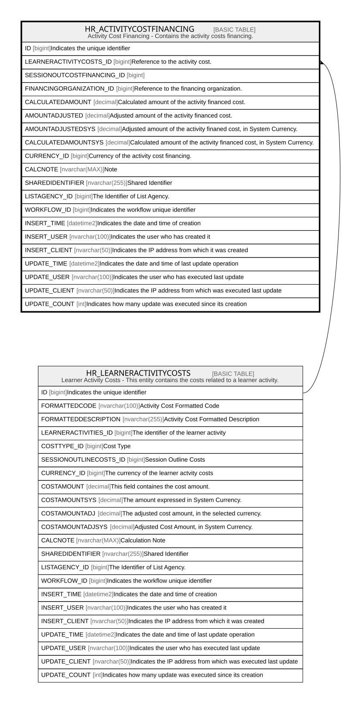

# HR_ACTIVITYCOSTFINANCING

## Description

Activity Cost Financing - Contains the activity costs financing.  

## Columns

| Name | Type | Default | Nullable | Parents | Comment |
| ---- | ---- | ------- | -------- | ------- | ------- |
| ID | bigint |  | false |  | Indicates the unique identifier |
| LEARNERACTIVITYCOSTS_ID | bigint |  | false | [HR_LEARNERACTIVITYCOSTS](HR_LEARNERACTIVITYCOSTS.md) | Reference to the activity cost. |
| SESSIONOUTCOSTFINANCING_ID | bigint |  | true |  |  |
| FINANCINGORGANIZATION_ID | bigint |  | false |  | Reference to the financing organization. |
| CALCULATEDAMOUNT | decimal |  | true |  | Calculated amount of the activity financed cost. |
| AMOUNTADJUSTED | decimal |  | true |  | Adjusted amount of the activity financed cost. |
| AMOUNTADJUSTEDSYS | decimal |  | true |  | Adjusted amount of the activity finaned cost, in System Currency. |
| CALCULATEDAMOUNTSYS | decimal |  | true |  | Calculated amount of the activity financed cost, in System Currency. |
| CURRENCY_ID | bigint |  | true |  | Currency of the activity cost financing. |
| CALCNOTE | nvarchar(MAX) |  | true |  | Note |
| SHAREDIDENTIFIER | nvarchar(255) |  | true |  | Shared Identifier |
| LISTAGENCY_ID | bigint |  | true |  | The Identifier of List Agency. |
| WORKFLOW_ID | bigint |  | true |  | Indicates the workflow unique identifier |
| INSERT_TIME | datetime2 | (sysutcdatetime()) | false |  | Indicates the date and time of creation |
| INSERT_USER | nvarchar(100) | (N'MAIN') | false |  | Indicates the user who has created it |
| INSERT_CLIENT | nvarchar(50) | (N'localhost') | false |  | Indicates the IP address from which it was created |
| UPDATE_TIME | datetime2 | (sysutcdatetime()) | false |  | Indicates the date and time of last update operation |
| UPDATE_USER | nvarchar(100) | (N'MAIN') | false |  | Indicates the user who has executed last update |
| UPDATE_CLIENT | nvarchar(50) | (N'localhost') | false |  | Indicates the IP address from which was executed last update |
| UPDATE_COUNT | int | ((0)) | false |  | Indicates how many update was executed since its creation |

## Constraints

| Name | Type | Definition |
| ---- | ---- | ---------- |
| PK_HR_ACTIVITYCOSTFINANCING | PRIMARY KEY | CLUSTERED, unique, part of a PRIMARY KEY constraint, [ ID ] |
| UQ_ACTIVITYCOSTFINANCING | UNIQUE | NONCLUSTERED, unique, part of a UNIQUE constraint, [ LEARNERACTIVITYCOSTS_ID, FINANCINGORGANIZATION_ID ] |
| FK_ACTCOSTS_ACTCOSTFIN | FOREIGN KEY | FOREIGN KEY(LEARNERACTIVITYCOSTS_ID) REFERENCES HR_LEARNERACTIVITYCOSTS(ID) ON UPDATE NO_ACTION ON DELETE CASCADE |

## Indexes

| Name | Definition |
| ---- | ---------- |
| PK_HR_ACTIVITYCOSTFINANCING | CLUSTERED, unique, part of a PRIMARY KEY constraint, [ ID ] |
| UQ_ACTIVITYCOSTFINANCING | NONCLUSTERED, unique, part of a UNIQUE constraint, [ LEARNERACTIVITYCOSTS_ID, FINANCINGORGANIZATION_ID ] |

## Relations

---

> Generated by [tbls](https://github.com/k1LoW/tbls)
