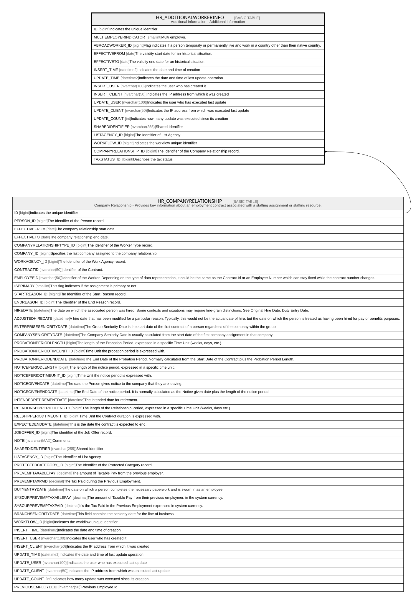

# HR_ADDITIONALWORKERINFO

## Description

Additional information - Additional information  

## Columns

| Name | Type | Default | Nullable | Parents | Comment |
| ---- | ---- | ------- | -------- | ------- | ------- |
| ID | bigint |  | false |  | Indicates the unique identifier |
| MULTIEMPLOYERINDICATOR | smallint |  | true |  | Multi employer. |
| ABROADWORKER_ID | bigint |  | true |  | Flag indicates if a person temporaly or permanently live and work in a country other than their native country. |
| EFFECTIVEFROM | date |  | false |  | The validity start date for an historical situation. |
| EFFECTIVETO | date |  | true |  | The validity end date for an historical situation. |
| INSERT_TIME | datetime2 | (sysutcdatetime()) | false |  | Indicates the date and time of creation |
| UPDATE_TIME | datetime2 | (sysutcdatetime()) | false |  | Indicates the date and time of last update operation |
| INSERT_USER | nvarchar(100) | (N'MAIN') | false |  | Indicates the user who has created it |
| INSERT_CLIENT | nvarchar(50) | (N'localhost') | false |  | Indicates the IP address from which it was created |
| UPDATE_USER | nvarchar(100) | (N'MAIN') | false |  | Indicates the user who has executed last update |
| UPDATE_CLIENT | nvarchar(50) | (N'localhost') | false |  | Indicates the IP address from which was executed last update |
| UPDATE_COUNT | int | ((0)) | false |  | Indicates how many update was executed since its creation |
| SHAREDIDENTIFIER | nvarchar(255) |  | true |  | Shared Identifier |
| LISTAGENCY_ID | bigint |  | true |  | The Identifier of List Agency. |
| WORKFLOW_ID | bigint |  | true |  | Indicates the workflow unique identifier |
| COMPANYRELATIONSHIP_ID | bigint |  | false | [HR_COMPANYRELATIONSHIP](HR_COMPANYRELATIONSHIP.md) | The Identifier of the Company Relationship record. |
| TAXSTATUS_ID | bigint |  | true |  | Describes the tax status |

## Constraints

| Name | Type | Definition |
| ---- | ---- | ---------- |
| PK_ADDITIONALWORKERINFO | PRIMARY KEY | CLUSTERED, unique, part of a PRIMARY KEY constraint, [ ID ] |
| FK_COMPANYREL_ADDITIONALW_INFO | FOREIGN KEY | FOREIGN KEY(COMPANYRELATIONSHIP_ID) REFERENCES HR_COMPANYRELATIONSHIP(ID) ON UPDATE NO_ACTION ON DELETE CASCADE |

## Indexes

| Name | Definition |
| ---- | ---------- |
| PK_ADDITIONALWORKERINFO | CLUSTERED, unique, part of a PRIMARY KEY constraint, [ ID ] |
| IDX_ADDITIONALWORKERINFO | NONCLUSTERED, unique, [ COMPANYRELATIONSHIP_ID, EFFECTIVEFROM ] |
| IDX_ADDITIONALW_INFO_ABROAD_ID | NONCLUSTERED, [ ABROADWORKER_ID ] |
| IDX_ADDITIONALWORKERINFO_P | NONCLUSTERED, [ COMPANYRELATIONSHIP_ID, EFFECTIVEFROM, EFFECTIVETO ] |

## Relations

---

> Generated by [tbls](https://github.com/k1LoW/tbls)
