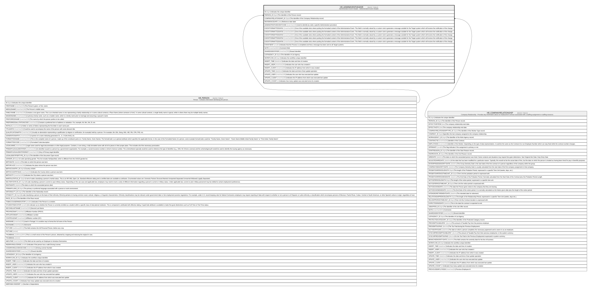

# HR_ADMINEVENTHEADER

## Description

Administrative Event Header - Administrative Event Header.  

## Columns

| Name | Type | Default | Nullable | Parents | Comment |
| ---- | ---- | ------- | -------- | ------- | ------- |
| ID | bigint |  | false |  | Indicates the unique identifier |
| PERSON_ID | bigint |  | true | [HR_PERSON](HR_PERSON.md) | The Identifier of the Person record. |
| COMPANYRELATIONSHIP_ID | bigint |  | true | [HR_COMPANYRELATIONSHIP](HR_COMPANYRELATIONSHIP.md) | The Identifier of the Company Relationship record. |
| REFERENCEDATE | date |  | true |  | Reference date label |
| ADMINISTRATIVEEVENTCODE | nvarchar(100) |  | true |  | Used to identify by code a specific Administrative procedure. |
| EVENTFORMATTEDDATA1 | nvarchar(MAX) |  | true |  | One of the available slots where putting the formatted content of the Administrative Event. This field is normally valued by a custom rule to generate a message suitable for the Target system which will receive the notification of the change. |
| EVENTFORMATTEDDATA2 | nvarchar(MAX) |  | true |  | One of the available slots where putting the formatted content of the Administrative Event. This field is normally valued by a custom rule to generate a message suitable for the Target system which will receive the notification of the change. |
| EVENTFORMATTEDDATA3 | nvarchar(MAX) |  | true |  | One of the available slots where putting the formatted content of the Administrative Event. This field is normally valued by a custom rule to generate a message suitable for the Target system which will receive the notification of the change. |
| EVENTFORMATTEDDATA4 | nvarchar(MAX) |  | true |  | One of the available slots where putting the formatted content of the Administrative Event. This field is normally valued by a custom rule to generate a message suitable for the Target system which will receive the notification of the change. |
| EVENTFORMATTEDDATA5 | nvarchar(MAX) |  | true |  | One of the available slots where putting the formatted content of the Administrative Event. This field is normally valued by a custom rule to generate a message suitable for the Target system which will receive the notification of the change. |
| EVENTSENT | smallint |  | true |  | Indicates that the Process is completed and that a message has been sent to all Target systems. |
| NOTE | nvarchar(MAX) |  | true |  | Comment field. |
| SHAREDIDENTIFIER | nvarchar(255) |  | true |  | Shared Identifier |
| LISTAGENCY_ID | bigint |  | true |  | The Identifier of List Agency. |
| WORKFLOW_ID | bigint |  | true |  | Indicates the workflow unique identifier |
| INSERT_TIME | datetime2 | (sysutcdatetime()) | false |  | Indicates the date and time of creation |
| INSERT_USER | nvarchar(100) | (N'MAIN') | false |  | Indicates the user who has created it |
| INSERT_CLIENT | nvarchar(50) | (N'localhost') | false |  | Indicates the IP address from which it was created |
| UPDATE_TIME | datetime2 | (sysutcdatetime()) | false |  | Indicates the date and time of last update operation |
| UPDATE_USER | nvarchar(100) | (N'MAIN') | false |  | Indicates the user who has executed last update |
| UPDATE_CLIENT | nvarchar(50) | (N'localhost') | false |  | Indicates the IP address from which was executed last update |
| UPDATE_COUNT | int | ((0)) | false |  | Indicates how many update was executed since its creation |

## Constraints

| Name | Type | Definition |
| ---- | ---- | ---------- |
| PK_ADMINEVENTHEADER | PRIMARY KEY | CLUSTERED, unique, part of a PRIMARY KEY constraint, [ ID ] |
| FK_COMPREL_ADMINEVENTHEADER | FOREIGN KEY | FOREIGN KEY(COMPANYRELATIONSHIP_ID) REFERENCES HR_COMPANYRELATIONSHIP(ID) ON UPDATE NO_ACTION ON DELETE NO_ACTION |
| FK_PERSON_ADMINEVENTHEADER | FOREIGN KEY | FOREIGN KEY(PERSON_ID) REFERENCES HR_PERSON(ID) ON UPDATE NO_ACTION ON DELETE CASCADE |

## Indexes

| Name | Definition |
| ---- | ---------- |
| PK_ADMINEVENTHEADER | CLUSTERED, unique, part of a PRIMARY KEY constraint, [ ID ] |

## Relations

---

> Generated by [tbls](https://github.com/k1LoW/tbls)
