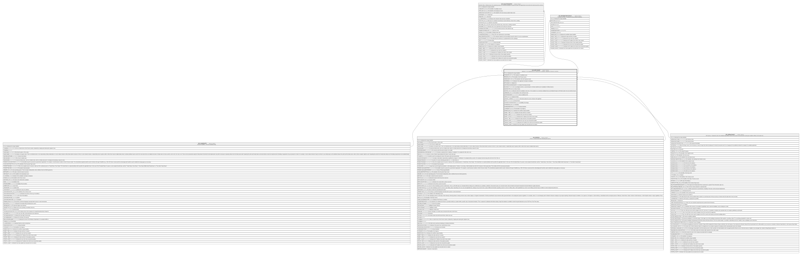

# HR_APPLICANT

## Description

Applicant - It’s an application for a vacancy by a candidate, regardless if internal or external.  

## Columns

| Name | Type | Default | Nullable | Children | Parents | Comment |
| ---- | ---- | ------- | -------- | -------- | ------- | ------- |
| ID | bigint |  | false | [HR_SELECTIONSTEP](HR_SELECTIONSTEP.md) [HR_FEEDBACKBYSTATUS](HR_FEEDBACKBYSTATUS.md) |  | Indicates the unique identifier |
| CANDIDATE_ID | bigint |  | true |  | [HR_CANDIDATE](HR_CANDIDATE.md) | The identifier of candidate record. |
| PERSON_ID | bigint |  | true |  | [HR_PERSON](HR_PERSON.md) | The Identifier of the Person record. |
| JOBVACANCY_ID | bigint |  | false |  | [HR_JOBVACANCY](HR_JOBVACANCY.md) | The Identifier of the Job Vacancy record. |
| ISINTERNAL | smallint |  | true |  |  | Indicates if the applicant is already an employee. |
| APPLIEDON | date |  | true |  |  | Applied On. |
| DATAPROCESSINGENDDATE | date |  | true |  |  | Data Processing End Date |
| SUITABILITY | decimal |  | true |  |  | E’ un punteggio numerico, una percentuale, che indica l’aderenza tra il candidato e l’offerta di lavoro. |
| SOURCETYPE_ID | bigint |  | true |  |  | Source Type. |
| SOURCE_ID | bigint |  | true |  |  | Indicates where the Candidate comes from. If for example it is an external candidate that was shortlisted through an ATS like Arca24, the source will be Arca24. |
| JOBBOARD_ID | bigint |  | true |  |  | The identifier of the Job Board Code. |
| SOURCEADDINFO | nvarchar(MAX) |  | true |  |  | Source Additional Info. |
| STATUS_ID | bigint |  | true |  |  | Applicant status |
| SOURCE_CHANNEL | nvarchar(MAX) |  | true |  |  | This field contains the source channel of the applicant |
| NOTE | nvarchar(MAX) |  | true |  |  | Comment field. |
| SUITABILITYPERCENTAGE | decimal |  | true |  |  | Suitability Percentage |
| SCOREVALUE_ID | bigint |  | true |  |  | Suitability |
| SHAREDIDENTIFIER | nvarchar(255) |  | true |  |  | Shared Identifier |
| LISTAGENCY_ID | bigint |  | true |  |  | The Identifier of List Agency. |
| WORKFLOW_ID | bigint |  | true |  |  | Indicates the workflow unique identifier |
| INSERT_TIME | datetime2 |  | false |  |  | Indicates the date and time of creation |
| INSERT_USER | nvarchar(100) |  | false |  |  | Indicates the user who has created it |
| INSERT_CLIENT | nvarchar(50) |  | false |  |  | Indicates the IP address from which it was created |
| UPDATE_TIME | datetime2 |  | false |  |  | Indicates the date and time of last update operation |
| UPDATE_USER | nvarchar(100) |  | false |  |  | Indicates the user who has executed last update |
| UPDATE_CLIENT | nvarchar(50) |  | false |  |  | Indicates the IP address from which was executed last update |
| UPDATE_COUNT | int |  | false |  |  | Indicates how many update was executed since its creation |

## Constraints

| Name | Type | Definition |
| ---- | ---- | ---------- |
| PK_APPLICANT | PRIMARY KEY | CLUSTERED, unique, part of a PRIMARY KEY constraint, [ ID ] |
| UQ_APPLICANT | UNIQUE | NONCLUSTERED, unique, part of a UNIQUE constraint, [ PERSON_ID, CANDIDATE_ID, JOBVACANCY_ID, APPLIEDON ] |
| FK_APPLICANT_CANDIDATE | FOREIGN KEY | FOREIGN KEY(CANDIDATE_ID) REFERENCES HR_CANDIDATE(ID) ON UPDATE NO_ACTION ON DELETE CASCADE |
| FK_APPLICANT_JOBVACANCY | FOREIGN KEY | FOREIGN KEY(JOBVACANCY_ID) REFERENCES HR_JOBVACANCY(ID) ON UPDATE NO_ACTION ON DELETE NO_ACTION |
| FK_APPLICANT_PERSON | FOREIGN KEY | FOREIGN KEY(PERSON_ID) REFERENCES HR_PERSON(ID) ON UPDATE NO_ACTION ON DELETE CASCADE |

## Indexes

| Name | Definition |
| ---- | ---------- |
| PK_APPLICANT | CLUSTERED, unique, part of a PRIMARY KEY constraint, [ ID ] |
| UQ_APPLICANT | NONCLUSTERED, unique, part of a UNIQUE constraint, [ PERSON_ID, CANDIDATE_ID, JOBVACANCY_ID, APPLIEDON ] |
| IDX_APPLICANT_APPLIEDON | NONCLUSTERED, [ APPLIEDON ] |
| IDX_APPLICANT_SHRID_AGEN | NONCLUSTERED, [ SHAREDIDENTIFIER, LISTAGENCY_ID ] |

## Relations

---

> Generated by [tbls](https://github.com/k1LoW/tbls)
