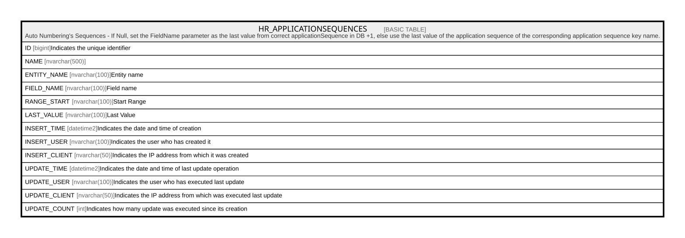

# HR_APPLICATIONSEQUENCES

## Description

Auto Numbering's Sequences - If Null, set the FieldName parameter as the last value from correct applicationSequence in DB +1, else use the last value of the application sequence of the corresponding application sequence key name.  

## Columns

| Name | Type | Default | Nullable | Comment |
| ---- | ---- | ------- | -------- | ------- |
| ID | bigint |  | false | Indicates the unique identifier |
| NAME | nvarchar(500) |  | true |  |
| ENTITY_NAME | nvarchar(100) |  | false | Entity name |
| FIELD_NAME | nvarchar(100) |  | false | Field name |
| RANGE_START | nvarchar(100) |  | false | Start Range |
| LAST_VALUE | nvarchar(100) |  | false | Last Value |
| INSERT_TIME | datetime2 |  | false | Indicates the date and time of creation |
| INSERT_USER | nvarchar(100) |  | false | Indicates the user who has created it |
| INSERT_CLIENT | nvarchar(50) |  | false | Indicates the IP address from which it was created |
| UPDATE_TIME | datetime2 |  | false | Indicates the date and time of last update operation |
| UPDATE_USER | nvarchar(100) |  | false | Indicates the user who has executed last update |
| UPDATE_CLIENT | nvarchar(50) |  | false | Indicates the IP address from which was executed last update |
| UPDATE_COUNT | int |  | false | Indicates how many update was executed since its creation |

## Constraints

| Name | Type | Definition |
| ---- | ---- | ---------- |
| PK_HR_APPLICATIONSEQUENCES | PRIMARY KEY | CLUSTERED, unique, part of a PRIMARY KEY constraint, [ ID ] |
| UQ_APPLICATIONSEQUENCES_NAME | UNIQUE | NONCLUSTERED, unique, part of a UNIQUE constraint, [ NAME ] |

## Indexes

| Name | Definition |
| ---- | ---------- |
| PK_HR_APPLICATIONSEQUENCES | CLUSTERED, unique, part of a PRIMARY KEY constraint, [ ID ] |
| UQ_APPLICATIONSEQUENCES_NAME | NONCLUSTERED, unique, part of a UNIQUE constraint, [ NAME ] |

## Relations

---

> Generated by [tbls](https://github.com/k1LoW/tbls)
