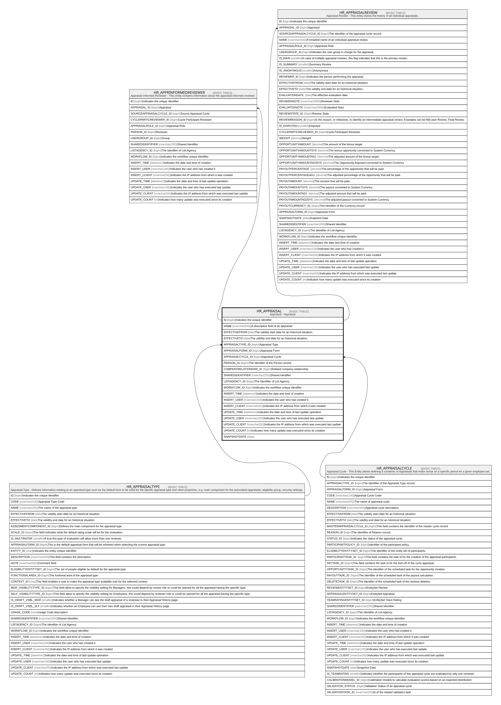

# HR_APPRAISAL

## Description

Appraisal - Appraisal  

## Columns

| Name | Type | Default | Nullable | Children | Parents | Comment |
| ---- | ---- | ------- | -------- | -------- | ------- | ------- |
| ID | bigint |  | false | [HR_APPRINFORMEDREVIEWER](HR_APPRINFORMEDREVIEWER.md) [HR_APPRAISALREVIEW](HR_APPRAISALREVIEW.md) |  | Indicates the unique identifier |
| NAME | nvarchar(500) |  | true |  |  | A descriptive field of an appraisal. |
| EFFECTIVEFROM | date |  | true |  |  | The validity start date for an historical situation. |
| EFFECTIVETO | date |  | true |  |  | The validity end date for an historical situation. |
| APPRAISALTYPE_ID | bigint |  | false |  | [HR_APPRAISALTYPE](HR_APPRAISALTYPE.md) | Appraisal Type |
| APPRAISALFORM_ID | bigint |  | false |  |  | Appraisal Form |
| APPRAISALCYCLE_ID | bigint |  | true |  | [HR_APPRAISALCYCLE](HR_APPRAISALCYCLE.md) | Appraisal Cycle |
| PERSON_ID | bigint |  | true |  |  | The Identifier of the Person record. |
| COMPANYRELATIONSHIP_ID | bigint |  | true |  |  | Related company relationship |
| SHAREDIDENTIFIER | nvarchar(255) |  | true |  |  | Shared Identifier |
| LISTAGENCY_ID | bigint |  | true |  |  | The Identifier of List Agency. |
| WORKFLOW_ID | bigint |  | true |  |  | Indicates the workflow unique identifier |
| INSERT_TIME | datetime2 | (sysutcdatetime()) | false |  |  | Indicates the date and time of creation |
| INSERT_USER | nvarchar(100) | (N'MAIN') | false |  |  | Indicates the user who has created it |
| INSERT_CLIENT | nvarchar(50) | (N'localhost') | false |  |  | Indicates the IP address from which it was created |
| UPDATE_TIME | datetime2 | (sysutcdatetime()) | false |  |  | Indicates the date and time of last update operation |
| UPDATE_USER | nvarchar(100) | (N'MAIN') | false |  |  | Indicates the user who has executed last update |
| UPDATE_CLIENT | nvarchar(50) | (N'localhost') | false |  |  | Indicates the IP address from which was executed last update |
| UPDATE_COUNT | int | ((0)) | false |  |  | Indicates how many update was executed since its creation |
| SNAPSHOTDATE | date |  | true |  |  |  |

## Constraints

| Name | Type | Definition |
| ---- | ---- | ---------- |
| PK_HR_APPRAISAL | PRIMARY KEY | CLUSTERED, unique, part of a PRIMARY KEY constraint, [ ID ] |
| UQ_APPRAISAL | UNIQUE | NONCLUSTERED, unique, part of a UNIQUE constraint, [ PERSON_ID, APPRAISALTYPE_ID, EFFECTIVEFROM ] |
| FK_APPRAISAL_APPRAISALCYCLE | FOREIGN KEY | FOREIGN KEY(APPRAISALCYCLE_ID) REFERENCES HR_APPRAISALCYCLE(ID) ON UPDATE NO_ACTION ON DELETE NO_ACTION |
| FK_APPRAISAL_APPRAISALTYPE | FOREIGN KEY | FOREIGN KEY(APPRAISALTYPE_ID) REFERENCES HR_APPRAISALTYPE(ID) ON UPDATE NO_ACTION ON DELETE NO_ACTION |

## Indexes

| Name | Definition |
| ---- | ---------- |
| PK_HR_APPRAISAL | CLUSTERED, unique, part of a PRIMARY KEY constraint, [ ID ] |
| UQ_APPRAISAL | NONCLUSTERED, unique, part of a UNIQUE constraint, [ PERSON_ID, APPRAISALTYPE_ID, EFFECTIVEFROM ] |
| IDX_APPRAISAL_P | NONCLUSTERED, [ COMPANYRELATIONSHIP_ID, EFFECTIVEFROM, EFFECTIVETO ] |

## Relations

---

> Generated by [tbls](https://github.com/k1LoW/tbls)
