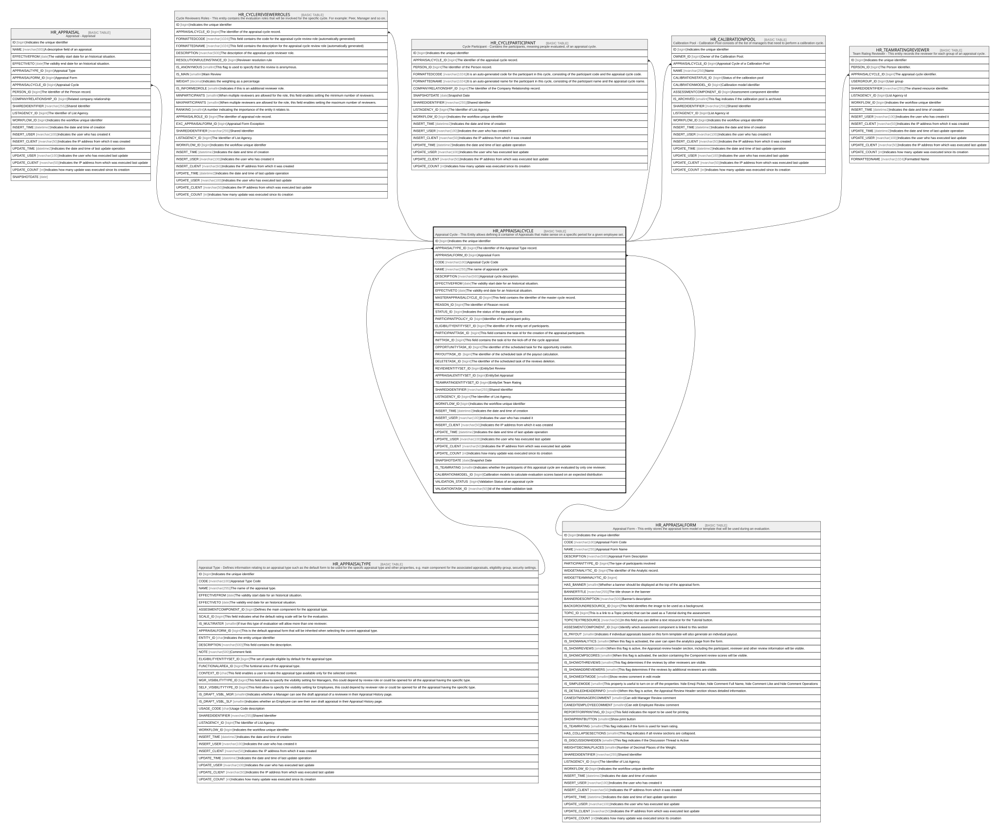

# HR_APPRAISALCYCLE

## Description

Appraisal Cycle - This Entity allows defining a container of Appraisals that make sense on a specific period for a given employee set.  

## Columns

| Name | Type | Default | Nullable | Children | Parents | Comment |
| ---- | ---- | ------- | -------- | -------- | ------- | ------- |
| ID | bigint |  | false | [HR_APPRAISAL](HR_APPRAISAL.md) [HR_CYCLEREVIEWERROLES](HR_CYCLEREVIEWERROLES.md) [HR_CYCLEPARTICIPANT](HR_CYCLEPARTICIPANT.md) [HR_CALIBRATIONPOOL](HR_CALIBRATIONPOOL.md) [HR_TEAMRATINGREVIEWER](HR_TEAMRATINGREVIEWER.md) |  | Indicates the unique identifier |
| APPRAISALTYPE_ID | bigint |  | false |  | [HR_APPRAISALTYPE](HR_APPRAISALTYPE.md) | The identifier of the Appraisal Type record. |
| APPRAISALFORM_ID | bigint |  | true |  | [HR_APPRAISALFORM](HR_APPRAISALFORM.md) | Appraisal Form |
| CODE | nvarchar(100) |  | true |  |  | Appraisal Cycle Code |
| NAME | nvarchar(255) |  | true |  |  | The name of appraisal cycle. |
| DESCRIPTION | nvarchar(500) |  | true |  |  | Appraisal cycle description. |
| EFFECTIVEFROM | date |  | true |  |  | The validity start date for an historical situation. |
| EFFECTIVETO | date |  | true |  |  | The validity end date for an historical situation. |
| MASTERAPPRAISALCYCLE_ID | bigint |  | true |  |  | This field contains the identifier of the master cycle record. |
| REASON_ID | bigint |  | true |  |  | The identifier of Reason record. |
| STATUS_ID | bigint |  | true |  |  | Indicates the status of the appraisal cycle.  |
| PARTICIPANTPOLICY_ID | bigint |  | true |  |  | Identifier of the participant policy. |
| ELIGIBILITYENTITYSET_ID | bigint |  | true |  |  | The identifier of the entity set of participants. |
| PARTICIPANTTASK_ID | bigint |  | true |  |  | This field contains the task id for the creation of the appraisal participants. |
| INITTASK_ID | bigint |  | true |  |  | This field contains the task id for the kick-off of the cycle appraisal. |
| OPPORTUNITYTASK_ID | bigint |  | true |  |  | The identifier of the scheduled task for the opportunity creation. |
| PAYOUTTASK_ID | bigint |  | true |  |  | The identifier of the scheduled task of the payout calculation. |
| DELETETASK_ID | bigint |  | true |  |  | The identifier of the scheduled task of the reviews deletion. |
| REVIEWENTITYSET_ID | bigint |  | true |  |  | EntitySet Review |
| APPRAISALENTITYSET_ID | bigint |  | true |  |  | EntitySet Appraisal |
| TEAMRATINGENTITYSET_ID | bigint |  | true |  |  | EntitySet Team Rating |
| SHAREDIDENTIFIER | nvarchar(255) |  | true |  |  | Shared Identifier |
| LISTAGENCY_ID | bigint |  | true |  |  | The Identifier of List Agency. |
| WORKFLOW_ID | bigint |  | true |  |  | Indicates the workflow unique identifier |
| INSERT_TIME | datetime2 | (sysutcdatetime()) | false |  |  | Indicates the date and time of creation |
| INSERT_USER | nvarchar(100) | (N'MAIN') | false |  |  | Indicates the user who has created it |
| INSERT_CLIENT | nvarchar(50) | (N'localhost') | false |  |  | Indicates the IP address from which it was created |
| UPDATE_TIME | datetime2 | (sysutcdatetime()) | false |  |  | Indicates the date and time of last update operation |
| UPDATE_USER | nvarchar(100) | (N'MAIN') | false |  |  | Indicates the user who has executed last update |
| UPDATE_CLIENT | nvarchar(50) | (N'localhost') | false |  |  | Indicates the IP address from which was executed last update |
| UPDATE_COUNT | int | ((0)) | false |  |  | Indicates how many update was executed since its creation |
| SNAPSHOTDATE | date |  | true |  |  | Snapshot Date |
| IS_TEAMRATING | smallint |  | true |  |  | Indicates whether the participants of this appraisal cycle are evaluated by only one reviewer. |
| CALIBRATIONMODEL_ID | bigint |  | true |  |  | Calibration models to calculate evaluation scores based on an expected distribution |
| VALIDATION_STATUS | bigint |  | true |  |  | Validation Status of an appraisal cycle |
| VALIDATIONTASK_ID | nvarchar(50) |  | true |  |  | Id of the related validation task |

## Constraints

| Name | Type | Definition |
| ---- | ---- | ---------- |
| PK_HR_APPRAISALCYCLE | PRIMARY KEY | CLUSTERED, unique, part of a PRIMARY KEY constraint, [ ID ] |
| UQ_APPRCYCLE | UNIQUE | NONCLUSTERED, unique, part of a UNIQUE constraint, [ CODE ] |
| FK_APPRAISALCYCLE_APPRAISFORM | FOREIGN KEY | FOREIGN KEY(APPRAISALFORM_ID) REFERENCES HR_APPRAISALFORM(ID) ON UPDATE NO_ACTION ON DELETE NO_ACTION |
| FK_APPRAISALCYCLE_APPRAISTYPE | FOREIGN KEY | FOREIGN KEY(APPRAISALTYPE_ID) REFERENCES HR_APPRAISALTYPE(ID) ON UPDATE NO_ACTION ON DELETE NO_ACTION |

## Indexes

| Name | Definition |
| ---- | ---------- |
| PK_HR_APPRAISALCYCLE | CLUSTERED, unique, part of a PRIMARY KEY constraint, [ ID ] |
| UQ_APPRCYCLE | NONCLUSTERED, unique, part of a UNIQUE constraint, [ CODE ] |

## Relations

---

> Generated by [tbls](https://github.com/k1LoW/tbls)
