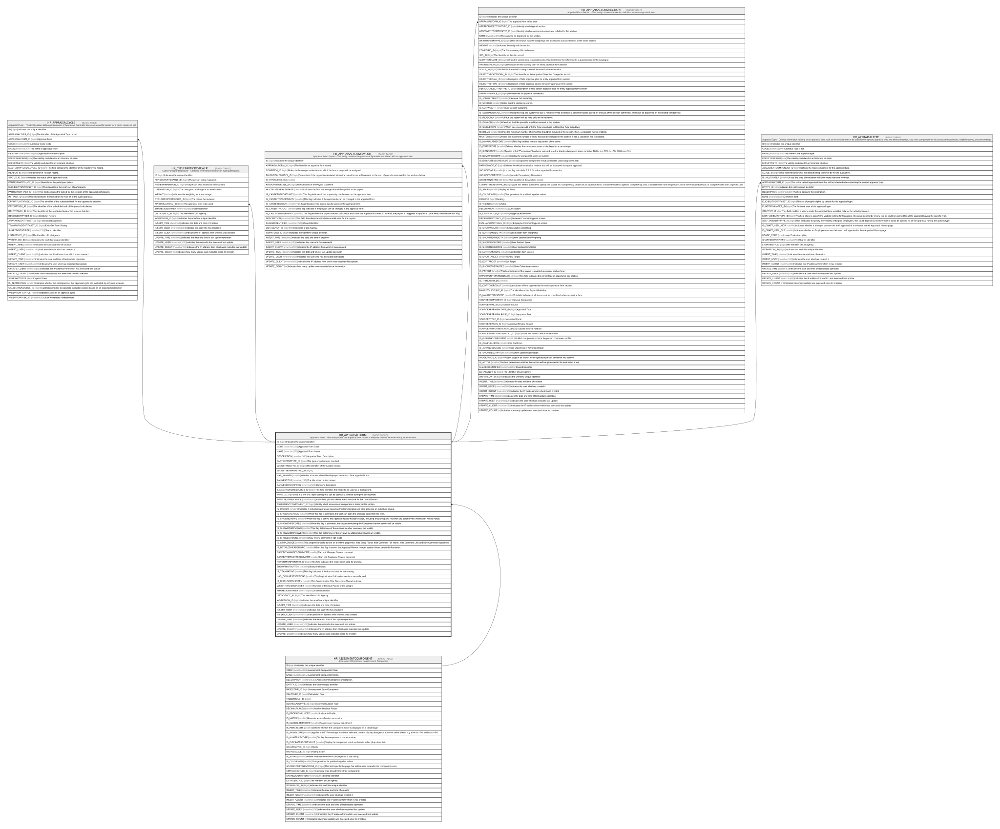

# HR_APPRAISALFORM

## Description

Appraisal Form - This entity stores the appraisal form model or template that will be used during an evaluation.  

## Columns

| Name | Type | Default | Nullable | Children | Parents | Comment |
| ---- | ---- | ------- | -------- | -------- | ------- | ------- |
| ID | bigint |  | false | [HR_APPRAISALCYCLE](HR_APPRAISALCYCLE.md) [HR_CYCLEPARTICREVIEWER](HR_CYCLEPARTICREVIEWER.md) [HR_APPRAISALFORMPAYOUT](HR_APPRAISALFORMPAYOUT.md) [HR_APPRAISALFORMSECTION](HR_APPRAISALFORMSECTION.md) [HR_APPRAISALTYPE](HR_APPRAISALTYPE.md) |  | Indicates the unique identifier |
| CODE | nvarchar(100) |  | false |  |  | Appraisal Form Code |
| NAME | nvarchar(255) |  | false |  |  | Appraisal Form Name |
| DESCRIPTION | nvarchar(500) |  | true |  |  | Appraisal Form Description |
| PARTICIPANTTYPE_ID | bigint |  | true |  |  | The type of participants involved |
| WIDGETANALYTIC_ID | bigint |  | true |  |  | The identifier of the Analytic record. |
| WIDGETTEAMANALYTIC_ID | bigint |  | true |  |  |  |
| HAS_BANNER | smallint |  | true |  |  | Whether a banner should be displayed at the top of the appraisal form. |
| BANNERTITLE | nvarchar(255) |  | true |  |  | The title shown in the banner |
| BANNERDESCRIPTION | nvarchar(500) |  | true |  |  | Banner's description |
| BACKGROUNDRESOURCE_ID | bigint |  | true |  |  | This field identifies the image to be used as a background. |
| TOPIC_ID | bigint |  | true |  |  | This is a link to a Topic (article) that can be used as a Tutorial during the assessment. |
| TOPICTEXTRESOURCE | nvarchar(50) |  | true |  |  | In this field you can define a text resource for the Tutorial button. |
| ASSESMENTCOMPONENT_ID | bigint |  | true |  | [HR_ASSESMENTCOMPONENT](HR_ASSESMENTCOMPONENT.md) | Identify which assessment component is linked to this section |
| IS_PAYOUT | smallint |  | true |  |  | Indicates if individual appraisals based on this form template will also generate an individual payout. |
| IS_SHOWANALYTICS | smallint |  | true |  |  | When this flag is activated, the user can open the analytics page from the form. |
| IS_SHOWREVIEWS | smallint |  | true |  |  | When this flag is active, the Appraisal review header section, including the participant, reviewer and other review information will be visible. |
| IS_SHOWCMPSCORES | smallint |  | true |  |  | When this flag is activated, the section containing the Component review scores will be visible. |
| IS_SHOWOTHREVIEWS | smallint |  | true |  |  | This flag determines if the reviews by other reviewers are visible. |
| IS_SHOWADDREVIEWERS | smallint |  | true |  |  | This flag determines if the reviews by additional reviewers are visible. |
| IS_SHOWEDITMODE | smallint |  | true |  |  | Show review comment in edit mode |
| IS_SIMPLEMODE | smallint |  | true |  |  | This property is useful to turn on or off the properties: hide Emoji Picker, hide Comment Full Name, hide Comment Like and hide Comment Operations |
| IS_DETAILEDHEADERINFO | smallint |  | true |  |  | When this flag is active, the Appraisal Review Header section shows detailed information. |
| CANEDITMANAGERCOMMENT | smallint |  | true |  |  | Can edit Manager Review comment |
| CANEDITEMPLOYEECOMMENT | smallint |  | true |  |  | Can edit Employee Review comment |
| REPORTFORPRINTING_ID | bigint |  | true |  |  | This field indicates the report to be used for printing. |
| SHOWPRINTBUTTON | smallint |  | true |  |  | Show print button |
| IS_TEAMRATING | smallint |  | true |  |  | This flag indicates if the form is used for team rating. |
| HAS_COLLAPSESECTIONS | smallint |  | true |  |  | This flag indicates if all review sections are collapsed. |
| IS_DISCUSSIONHIDDEN | smallint |  | true |  |  | This flag indicates if the Discussion Thread is Active |
| WEIGHTDECIMALPLACES | smallint |  | true |  |  | Number of Decimal Places of the Weight. |
| SHAREDIDENTIFIER | nvarchar(255) |  | true |  |  | Shared Identifier |
| LISTAGENCY_ID | bigint |  | true |  |  | The Identifier of List Agency. |
| WORKFLOW_ID | bigint |  | true |  |  | Indicates the workflow unique identifier |
| INSERT_TIME | datetime2 | (sysutcdatetime()) | false |  |  | Indicates the date and time of creation |
| INSERT_USER | nvarchar(100) | (N'MAIN') | false |  |  | Indicates the user who has created it |
| INSERT_CLIENT | nvarchar(50) | (N'localhost') | false |  |  | Indicates the IP address from which it was created |
| UPDATE_TIME | datetime2 | (sysutcdatetime()) | false |  |  | Indicates the date and time of last update operation |
| UPDATE_USER | nvarchar(100) | (N'MAIN') | false |  |  | Indicates the user who has executed last update |
| UPDATE_CLIENT | nvarchar(50) | (N'localhost') | false |  |  | Indicates the IP address from which was executed last update |
| UPDATE_COUNT | int | ((0)) | false |  |  | Indicates how many update was executed since its creation |

## Constraints

| Name | Type | Definition |
| ---- | ---- | ---------- |
| PK_HR_APPRAISALFORM | PRIMARY KEY | CLUSTERED, unique, part of a PRIMARY KEY constraint, [ ID ] |
| UQ_APPRFORM | UNIQUE | NONCLUSTERED, unique, part of a UNIQUE constraint, [ CODE ] |
| FK_APPRAISALFORM_ASSESMENTCOMP | FOREIGN KEY | FOREIGN KEY(ASSESMENTCOMPONENT_ID) REFERENCES HR_ASSESMENTCOMPONENT(ID) ON UPDATE NO_ACTION ON DELETE NO_ACTION |

## Indexes

| Name | Definition |
| ---- | ---------- |
| PK_HR_APPRAISALFORM | CLUSTERED, unique, part of a PRIMARY KEY constraint, [ ID ] |
| UQ_APPRFORM | NONCLUSTERED, unique, part of a UNIQUE constraint, [ CODE ] |

## Relations

---

> Generated by [tbls](https://github.com/k1LoW/tbls)
