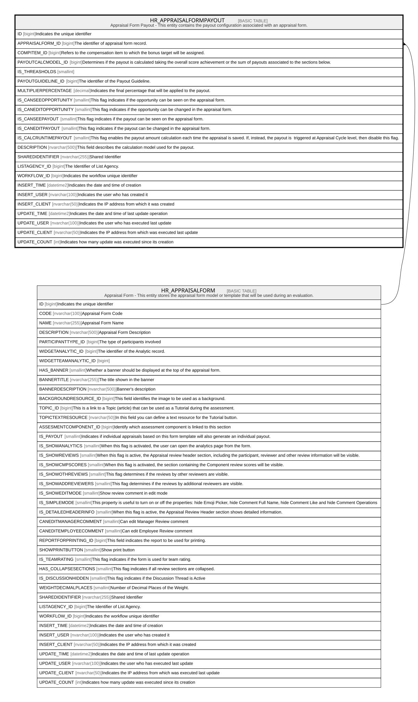

# HR_APPRAISALFORMPAYOUT

## Description

Appraisal Form Payout - This entity contains the payout configuration associated with an appraisal form.  

## Columns

| Name | Type | Default | Nullable | Parents | Comment |
| ---- | ---- | ------- | -------- | ------- | ------- |
| ID | bigint |  | false |  | Indicates the unique identifier |
| APPRAISALFORM_ID | bigint |  | false | [HR_APPRAISALFORM](HR_APPRAISALFORM.md) | The identifier of appraisal form record. |
| COMPITEM_ID | bigint |  | true |  | Refers to the compensation item to which the bonus target will be assigned. |
| PAYOUTCALCMODEL_ID | bigint |  | true |  | Determines if the payout is calculated taking the overall score achievement or the sum of payouts associated to the sections below. |
| IS_THREASHOLDS | smallint |  | true |  |  |
| PAYOUTGUIDELINE_ID | bigint |  | true |  | The identifier of the Payout Guideline. |
| MULTIPLIERPERCENTAGE | decimal |  | true |  | Indicates the final percentage that will be applied to the payout. |
| IS_CANSEEOPPORTUNITY | smallint |  | true |  | This flag indicates if the opportunity can be seen on the appraisal form. |
| IS_CANEDITOPPORTUNITY | smallint |  | true |  | This flag indicates if the opportunity can be changed in the appraisal form. |
| IS_CANSEEPAYOUT | smallint |  | true |  | This flag indicates if the payout can be seen on the appraisal form. |
| IS_CANEDITPAYOUT | smallint |  | true |  | This flag indicates if the payout can be changed in the appraisal form. |
| IS_CALCRUNTIMEPAYOUT | smallint |  | true |  | This flag enables the payout amount calculation each time the appraisal is saved. If, instead, the payout is  triggered at Appraisal Cycle level, then disable this flag. |
| DESCRIPTION | nvarchar(500) |  | true |  | This field describes the calculation model used for the payout. |
| SHAREDIDENTIFIER | nvarchar(255) |  | true |  | Shared Identifier |
| LISTAGENCY_ID | bigint |  | true |  | The Identifier of List Agency. |
| WORKFLOW_ID | bigint |  | true |  | Indicates the workflow unique identifier |
| INSERT_TIME | datetime2 | (sysutcdatetime()) | false |  | Indicates the date and time of creation |
| INSERT_USER | nvarchar(100) | (N'MAIN') | false |  | Indicates the user who has created it |
| INSERT_CLIENT | nvarchar(50) | (N'localhost') | false |  | Indicates the IP address from which it was created |
| UPDATE_TIME | datetime2 | (sysutcdatetime()) | false |  | Indicates the date and time of last update operation |
| UPDATE_USER | nvarchar(100) | (N'MAIN') | false |  | Indicates the user who has executed last update |
| UPDATE_CLIENT | nvarchar(50) | (N'localhost') | false |  | Indicates the IP address from which was executed last update |
| UPDATE_COUNT | int | ((0)) | false |  | Indicates how many update was executed since its creation |

## Constraints

| Name | Type | Definition |
| ---- | ---- | ---------- |
| PK_APPRAISALFORMPAYOUT | PRIMARY KEY | CLUSTERED, unique, part of a PRIMARY KEY constraint, [ ID ] |
| FK_APPFORMPAYOUT_APPRAISALFORM | FOREIGN KEY | FOREIGN KEY(APPRAISALFORM_ID) REFERENCES HR_APPRAISALFORM(ID) ON UPDATE NO_ACTION ON DELETE NO_ACTION |

## Indexes

| Name | Definition |
| ---- | ---------- |
| PK_APPRAISALFORMPAYOUT | CLUSTERED, unique, part of a PRIMARY KEY constraint, [ ID ] |

## Relations

---

> Generated by [tbls](https://github.com/k1LoW/tbls)
