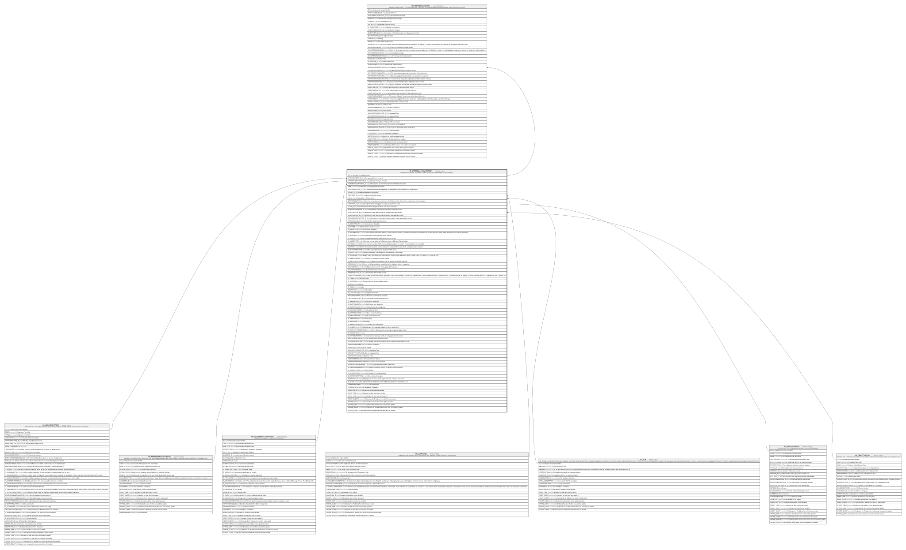

# HR_APPRAISALFORMSECTION

## Description

Appraisal Form Section - This entity contains the section definition within an appraisal form.  

## Columns

| Name | Type | Default | Nullable | Children | Parents | Comment |
| ---- | ---- | ------- | -------- | -------- | ------- | ------- |
| ID | bigint |  | false | [HR_APPRAISALSECTION](HR_APPRAISALSECTION.md) |  | Indicates the unique identifier |
| APPRAISALFORM_ID | bigint |  | false |  | [HR_APPRAISALFORM](HR_APPRAISALFORM.md) | The appraisal form to be used |
| APPRFORMSECTIONTYPE_ID | bigint |  | true |  | [HR_APPRFORMSECTIONTYPE](HR_APPRFORMSECTIONTYPE.md) | Identify which type of section |
| ASSESMENTCOMPONENT_ID | bigint |  | true |  | [HR_ASSESMENTCOMPONENT](HR_ASSESMENTCOMPONENT.md) | Identify which assessment component is linked to this section |
| NAME | nvarchar(255) |  | true |  |  | The name to be displayed for the section |
| WEIGTHDISTRTYPE_ID | bigint |  | true |  |  | This field shows how the weightings are distributed across elements in the same section. |
| WEIGHT | decimal |  | true |  |  | Indicates the weight of the section. |
| COMPGRID_ID | bigint |  | true |  | [HR_COMPGRID](HR_COMPGRID.md) | The Compentency Grid to be used |
| JOB_ID | bigint |  | true |  | [HR_JOB](HR_JOB.md) | The Identifier of the Job record. |
| QUESTIONNAIRE_ID | bigint |  | true |  |  | When the section type is questionnaire, this field stores the reference to a questionnaire in the catalogue. |
| TRAININGPLAN_ID | bigint |  | true |  | [HR_TRAININGPLAN](HR_TRAININGPLAN.md) | description of field training plan for entity appraisal form section |
| SCALE_ID | bigint |  | true |  |  | This field indicate which rating scale will be used for the evaluation. |
| OBJECTIVECATEGORY_ID | bigint |  | true |  |  | The identifier of the Appraisal Objective Categories record. |
| OBJECTIVEPLAN_ID | bigint |  | true |  | [HR_OBJECTIVEPLAN](HR_OBJECTIVEPLAN.md) | description of field objective plan for entity appraisal form section |
| OBJECTIVETYPE_ID | bigint |  | true |  |  | description of field objective source for entity appraisal form section |
| DEFAULTOBJECTIVETYPE_ID | bigint |  | true |  |  | description of field default objective type for entity appraisal form section |
| APPRAISALROLE_ID | bigint |  | true |  |  | The identifier of appraisal role record. |
| IS_JOBSUITABILITY | smallint |  | true |  |  | Calculate Job Suitability |
| IS_SCORED | smallint |  | true |  |  | States that the section is scored. |
| IS_EDITWEIGTH | smallint |  | true |  |  | Edit Section Weighting |
| IS_SENTIMENTCALC | smallint |  | true |  |  | Using this flag, the system will use a remote service to retrieve a sentiment score based on analysis of the section comments, which will be displayed on the related components. |
| IS_READONLY | smallint |  | true |  |  | If true the section will be read only for the reviewer. |
| IS_CANADD | smallint |  | true |  |  | When true it will be possible to add an element in the section. |
| IS_SINGLETYPE | smallint |  | true |  |  | When true you can add only the Type you chose in Objective Type dropdown |
| MINITEMS | smallint |  | true |  |  | Defines the minumum number of items that should be included in the section. If set, a validation rule is enabled. |
| MAXITEMS | smallint |  | true |  |  | Defines the maximum number of items that can be included in the section. If set, a validation rule is enabled. |
| IS_MANUALADJSCORE | smallint |  | true |  |  | This flag enables manual adjustment of the score. |
| IS_PERCSCORE | smallint |  | true |  |  | Defines whether the component score is displayed as a percentage. |
| IS_SIGNSCORE | smallint |  | true |  |  | Applies only if “Percentage” has been selected; used to display divergence above or below 100%, e.g. 93% as -7%, 105% as +5% |
| IS_NUMERICSCORE | smallint |  | true |  |  | Display the component score as number. |
| IS_DISCRATESCOREVALUE | smallint |  | true |  |  | Display the component result as discrete value (drop down list). |
| RATINGMODE_ID | bigint |  | true |  |  | Defines the default evaluation method that will be displayed during the appraisal. |
| INCLUDEBARS | smallint |  | true |  |  | It is the flag to include B.A.R.S. in the appraisal form section. |
| INCLUDECOMPDESC | smallint |  | true |  |  | Include Competency Description |
| WIDGETANALYTIC_ID | bigint |  | true |  |  | The identifier of the Analytic record. |
| COMPETENCIESTYPE_ID | bigint |  | true |  |  | With this field is possible to specify the source of a competency section of an appraisal form; a choice between a specific Competency Grid, Competencies from the primary Job of the evaluated person, or Competencies from a specific Job. |
| IS_STARS | smallint |  | true |  |  | Display as Stars |
| IS_COLORSIGN | smallint |  | true |  |  | Change colour for positive/negative values |
| RANKING | bigint |  | true |  |  | Ranking |
| IS_VISIBLE | smallint |  | true |  |  | Visible |
| DESCRIPTION | nvarchar(500) |  | true |  |  | Description |
| IS_CANTOGGLEQST | smallint |  | true |  |  | Toggle Questionnaire |
| REVIEWERNOTEACL_ID | bigint |  | true |  |  | Reviewer Comment type of access |
| EVALUATEDNOTEACL_ID | bigint |  | true |  |  | Employee Comment type of access |
| IS_SHOWWEIGHT | smallint |  | true |  |  | Show Section Weighting |
| IS_EDITITEMWEIGTH | smallint |  | true |  |  | Edit Section Item Weighting |
| IS_SHOWITEMWEIGTH | smallint |  | true |  |  | Show Section Item Weighting |
| IS_SHOWSECSCORE | smallint |  | true |  |  | Show Section Score |
| IS_SHOWITEMSCORE | smallint |  | true |  |  | Show Section Item Score |
| IS_EDITITEMSCORE | smallint |  | true |  |  | Edit Section Item Scores |
| IS_SHOWTARGET | smallint |  | true |  |  | Show Target |
| IS_EDITTARGET | smallint |  | true |  |  | Edit Target |
| IS_SHOWOTHERASSES | smallint |  | true |  |  | Show Other Assessments |
| IS_PAYOUT | smallint |  | true |  |  | This field indicates if the payout is enabled on current section form. |
| OPPORTUNITYPERCENTAGE | decimal |  | true |  |  | This field indicates the percentage of opportunity per section. |
| IS_THREASHOLDS | smallint |  | true |  |  |  |
| IS_COPYOBJRESULT | smallint |  | true |  |  | description of field copy results for entity appraisal form section |
| PAYOUTGUIDELINE_ID | bigint |  | true |  |  | The identifier of the Payout Guideline. |
| IS_MANDATORYSCORE | smallint |  | true |  |  | This field indicates if all items must be completed when saving the form. |
| SOURCECOMPONENT_ID | bigint |  | true |  |  | Source Component |
| SOURCETYPE_ID | bigint |  | true |  |  | Score Source |
| SOURCEAPPRAISALTYPE_ID | bigint |  | true |  |  | Appraisal Type |
| SOURCEAPPRAISALROLE_ID | bigint |  | true |  |  | Appraisal Role |
| SOURCECYCLE_ID | bigint |  | true |  |  | Appraisal Cycle |
| SOURCEREASON_ID | bigint |  | true |  |  | Appraisal Review Reason |
| SOURCENOTFOUNDACTION_ID | bigint |  | true |  |  | Score Source Fallback |
| SOURCENOTFOUNDDEFAULT_ID | bigint |  | true |  |  | Score Not Found Default Scale Value |
| IS_PUBLISHCOMPONENT | smallint |  | true |  |  | Publish component score in the person component profile |
| IS_CANPULLFROM | smallint |  | true |  |  | Can Pull From |
| IS_ADVANCEDMODE | smallint |  | true |  |  | Edit Objectives in Advanced Mode |
| IS_SHOWDESCRIPTION | smallint |  | true |  |  | Show Section Description |
| WIDGETPAGE_ID | bigint |  | true |  |  | Widget page to be shown inside appraisal person additional info section |
| IS_ACTIVE | smallint |  | true |  |  | This field determines whether the section will be generated in the evaluation or not. |
| SHAREDIDENTIFIER | nvarchar(255) |  | true |  |  | Shared Identifier |
| LISTAGENCY_ID | bigint |  | true |  |  | The Identifier of List Agency. |
| WORKFLOW_ID | bigint |  | true |  |  | Indicates the workflow unique identifier |
| INSERT_TIME | datetime2 | (sysutcdatetime()) | false |  |  | Indicates the date and time of creation |
| INSERT_USER | nvarchar(100) | (N'MAIN') | false |  |  | Indicates the user who has created it |
| INSERT_CLIENT | nvarchar(50) | (N'localhost') | false |  |  | Indicates the IP address from which it was created |
| UPDATE_TIME | datetime2 | (sysutcdatetime()) | false |  |  | Indicates the date and time of last update operation |
| UPDATE_USER | nvarchar(100) | (N'MAIN') | false |  |  | Indicates the user who has executed last update |
| UPDATE_CLIENT | nvarchar(50) | (N'localhost') | false |  |  | Indicates the IP address from which was executed last update |
| UPDATE_COUNT | int | ((0)) | false |  |  | Indicates how many update was executed since its creation |

## Constraints

| Name | Type | Definition |
| ---- | ---- | ---------- |
| PK_HR_APPRAISALFORMSECTION | PRIMARY KEY | CLUSTERED, unique, part of a PRIMARY KEY constraint, [ ID ] |
| UQ_APPRFORMSEC | UNIQUE | NONCLUSTERED, unique, part of a UNIQUE constraint, [ APPRAISALFORM_ID, NAME ] |
| FK_APPFORMSEC_APPRAISALFORM | FOREIGN KEY | FOREIGN KEY(APPRAISALFORM_ID) REFERENCES HR_APPRAISALFORM(ID) ON UPDATE NO_ACTION ON DELETE NO_ACTION |
| FK_APPFORMSEC_APPRFORMSECTYPE | FOREIGN KEY | FOREIGN KEY(APPRFORMSECTIONTYPE_ID) REFERENCES HR_APPRFORMSECTIONTYPE(ID) ON UPDATE NO_ACTION ON DELETE NO_ACTION |
| FK_APPFORMSEC_ASSESMENTCOMP | FOREIGN KEY | FOREIGN KEY(ASSESMENTCOMPONENT_ID) REFERENCES HR_ASSESMENTCOMPONENT(ID) ON UPDATE NO_ACTION ON DELETE NO_ACTION |
| FK_APPFORMSEC_COMPGRID | FOREIGN KEY | FOREIGN KEY(COMPGRID_ID) REFERENCES HR_COMPGRID(ID) ON UPDATE NO_ACTION ON DELETE NO_ACTION |
| FK_APPFORMSEC_JOB | FOREIGN KEY | FOREIGN KEY(JOB_ID) REFERENCES HR_JOB(ID) ON UPDATE NO_ACTION ON DELETE NO_ACTION |
| FK_APPFORMSEC_OBJECTIVEPLAN | FOREIGN KEY | FOREIGN KEY(OBJECTIVEPLAN_ID) REFERENCES HR_OBJECTIVEPLAN(ID) ON UPDATE NO_ACTION ON DELETE NO_ACTION |
| FK_APPFORMSEC_TRAININGPLAN | FOREIGN KEY | FOREIGN KEY(TRAININGPLAN_ID) REFERENCES HR_TRAININGPLAN(ID) ON UPDATE NO_ACTION ON DELETE NO_ACTION |

## Indexes

| Name | Definition |
| ---- | ---------- |
| PK_HR_APPRAISALFORMSECTION | CLUSTERED, unique, part of a PRIMARY KEY constraint, [ ID ] |
| UQ_APPRFORMSEC | NONCLUSTERED, unique, part of a UNIQUE constraint, [ APPRAISALFORM_ID, NAME ] |

## Relations

---

> Generated by [tbls](https://github.com/k1LoW/tbls)
