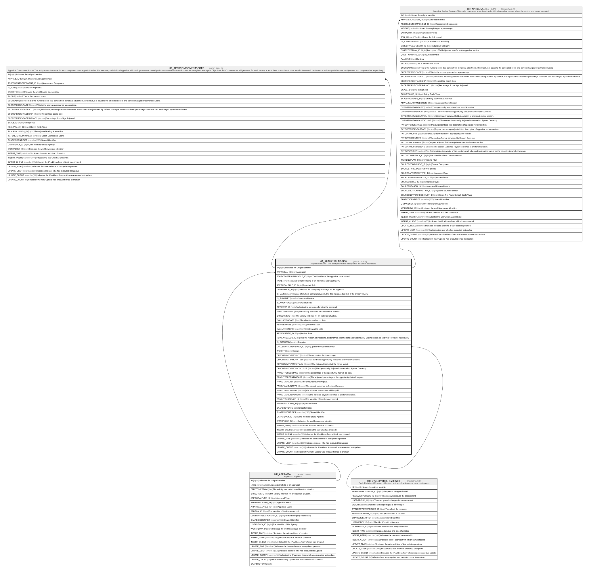

# HR_APPRAISALREVIEW

## Description

Appraisal Review - This entity stores the history of all individual appraisals.  

## Columns

| Name | Type | Default | Nullable | Children | Parents | Comment |
| ---- | ---- | ------- | -------- | -------- | ------- | ------- |
| ID | bigint |  | false | [HR_APPRCOMPONENTSCORE](HR_APPRCOMPONENTSCORE.md) [HR_APPRAISALSECTION](HR_APPRAISALSECTION.md) |  | Indicates the unique identifier |
| APPRAISAL_ID | bigint |  | false |  | [HR_APPRAISAL](HR_APPRAISAL.md) | Appraisal |
| SOURCEAPPRAISALCYCLE_ID | bigint |  | true |  |  | The identifier of the appraisal cycle record. |
| NAME | nvarchar(500) |  | true |  |  | Formatted name of an individual appraisal review. |
| APPRAISALROLE_ID | bigint |  | true |  |  | Appraisal Role |
| USERGROUP_ID | bigint |  | true |  |  | Indicates the user group in charge for the appraisal. |
| IS_MAIN | smallint |  | true |  |  | In case of multiple appraisal reviews, this flag indicates that this is the primary review. |
| IS_SUMMARY | smallint |  | true |  |  | Summary Review |
| IS_ANONYMOUS | smallint |  | true |  |  | Anonymous |
| REVIEWER_ID | bigint |  | true |  |  | Indicates the person performing the appraisal. |
| EFFECTIVEFROM | date |  | true |  |  | The validity start date for an historical situation. |
| EFFECTIVETO | date |  | true |  |  | The validity end date for an historical situation. |
| EVALUATIONDATE | date |  | true |  |  | The effective evaluation date |
| REVIWERNOTE | nvarchar(2000) |  | true |  |  | Reviewer Note |
| EVALUATEDNOTE | nvarchar(2000) |  | true |  |  | Evaluated Note |
| REVIEWSTATE_ID | bigint |  | true |  |  | Review State |
| REVIEWREASON_ID | bigint |  | true |  |  | Is the reason, or milestone, to identify an intermediate appraisal review. Examples can be Mid year Review, Final Review. |
| IS_DISPUTED | smallint |  | true |  |  | Disputed |
| CYCLEPARTICREVIEWER_ID | bigint |  | true |  | [HR_CYCLEPARTICREVIEWER](HR_CYCLEPARTICREVIEWER.md) | Cycle Participant Reviewer |
| WEIGHT | decimal |  | true |  |  | Weight |
| OPPORTUNITYAMOUNT | decimal |  | true |  |  | The amount of the bonus target. |
| OPPORTUNITYAMOUNTSYS | decimal |  | true |  |  | The bonus opportunity converted to System Currency. |
| OPPORTUNITYAMOUNTADJ | decimal |  | true |  |  | The adjusted amount of the bonus target. |
| OPPORTUNITYAMOUNTADJSYS | decimal |  | true |  |  | The Opportunity Adjusted converted to System Currency. |
| PAYOUTPERCENTAGE | decimal |  | true |  |  | The percentage of the opportunity that will be paid. |
| PAYOUTPERCENTAGEADJ | decimal |  | true |  |  | The adjusted percentage of the opportunity that will be paid. |
| PAYOUTAMOUNT | decimal |  | true |  |  | The amount that will be paid. |
| PAYOUTAMOUNTSYS | decimal |  | true |  |  | The payout converted to System Currency. |
| PAYOUTAMOUNTADJ | decimal |  | true |  |  | The adjusted amount that will be paid. |
| PAYOUTAMOUNTADJSYS | decimal |  | true |  |  | The adjusted payout converted to System Currency. |
| PAYOUTCURRENCY_ID | bigint |  | true |  |  | The Identifier of the Currency record. |
| APPRAISALFORM_ID | bigint |  | true |  |  | Appraisal Form |
| SNAPSHOTDATE | date |  | true |  |  | Snapshot Date |
| SHAREDIDENTIFIER | nvarchar(255) |  | true |  |  | Shared Identifier |
| LISTAGENCY_ID | bigint |  | true |  |  | The Identifier of List Agency. |
| WORKFLOW_ID | bigint |  | true |  |  | Indicates the workflow unique identifier |
| INSERT_TIME | datetime2 | (sysutcdatetime()) | false |  |  | Indicates the date and time of creation |
| INSERT_USER | nvarchar(100) | (N'MAIN') | false |  |  | Indicates the user who has created it |
| INSERT_CLIENT | nvarchar(50) | (N'localhost') | false |  |  | Indicates the IP address from which it was created |
| UPDATE_TIME | datetime2 | (sysutcdatetime()) | false |  |  | Indicates the date and time of last update operation |
| UPDATE_USER | nvarchar(100) | (N'MAIN') | false |  |  | Indicates the user who has executed last update |
| UPDATE_CLIENT | nvarchar(50) | (N'localhost') | false |  |  | Indicates the IP address from which was executed last update |
| UPDATE_COUNT | int | ((0)) | false |  |  | Indicates how many update was executed since its creation |

## Constraints

| Name | Type | Definition |
| ---- | ---- | ---------- |
| PK_HR_APPRAISALREVIEW | PRIMARY KEY | CLUSTERED, unique, part of a PRIMARY KEY constraint, [ ID ] |
| UQ_APPRAISALREVIEW | UNIQUE | NONCLUSTERED, unique, part of a UNIQUE constraint, [ APPRAISAL_ID, APPRAISALROLE_ID, REVIEWER_ID, EFFECTIVEFROM ] |
| FK_APPREVIEW_CYCLEPARTICREVIEW | FOREIGN KEY | FOREIGN KEY(CYCLEPARTICREVIEWER_ID) REFERENCES HR_CYCLEPARTICREVIEWER(ID) ON UPDATE NO_ACTION ON DELETE SET_NULL |
| FK_APPRREVIEW_APPRAISAL | FOREIGN KEY | FOREIGN KEY(APPRAISAL_ID) REFERENCES HR_APPRAISAL(ID) ON UPDATE NO_ACTION ON DELETE CASCADE |

## Indexes

| Name | Definition |
| ---- | ---------- |
| PK_HR_APPRAISALREVIEW | CLUSTERED, unique, part of a PRIMARY KEY constraint, [ ID ] |
| UQ_APPRAISALREVIEW | NONCLUSTERED, unique, part of a UNIQUE constraint, [ APPRAISAL_ID, APPRAISALROLE_ID, REVIEWER_ID, EFFECTIVEFROM ] |
| IDX_APPRAISALREVIEW_ROLE | NONCLUSTERED, [ APPRAISAL_ID, APPRAISALROLE_ID ] |

## Relations

---

> Generated by [tbls](https://github.com/k1LoW/tbls)
