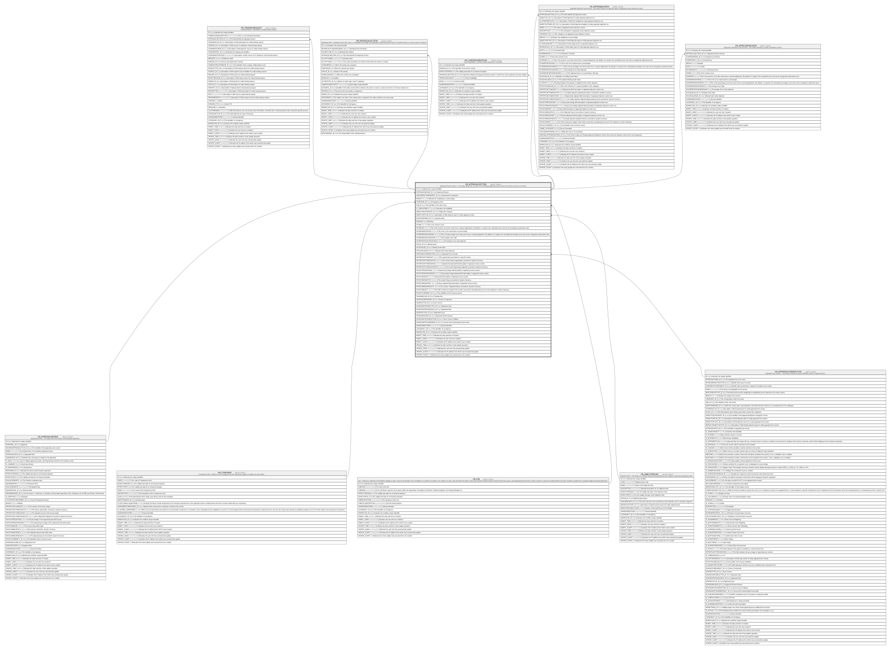

# HR_APPRAISALSECTION

## Description

Appraisal Review Section - This entity represents a section of an individual appraisal review, where the section scores are recorded.  

## Columns

| Name | Type | Default | Nullable | Children | Parents | Comment |
| ---- | ---- | ------- | -------- | -------- | ------- | ------- |
| ID | bigint |  | false | [HR_TRAININGREQUEST](HR_TRAININGREQUEST.md) [HR_INDIVIDUALACTION](HR_INDIVIDUALACTION.md) [HR_CAREERASPIRATIONS](HR_CAREERASPIRATIONS.md) [HR_APPROBJSECROW](HR_APPROBJSECROW.md) [HR_APPRCOMPSECROW](HR_APPRCOMPSECROW.md) |  | Indicates the unique identifier |
| APPRAISALREVIEW_ID | bigint |  | false |  | [HR_APPRAISALREVIEW](HR_APPRAISALREVIEW.md) | Appraisal Review |
| ASSESMENTCOMPONENT_ID | bigint |  | true |  |  | Assessment Component |
| WEIGHT | decimal |  | true |  |  | Indicates the weighting as a percentage |
| COMPGRID_ID | bigint |  | true |  | [HR_COMPGRID](HR_COMPGRID.md) | Competency Grid |
| JOB_ID | bigint |  | true |  | [HR_JOB](HR_JOB.md) | The Identifier of the Job record. |
| IS_JOBSUITABILITY | smallint |  | true |  |  | Calculate Job Suitability |
| OBJECTIVECATEGORY_ID | bigint |  | true |  |  | Objective Category |
| OBJECTIVEPLAN_ID | bigint |  | true |  | [HR_OBJECTIVEPLAN](HR_OBJECTIVEPLAN.md) | description of field objective plan for entity appraisal section |
| QUESTIONNAIRE_ID | bigint |  | true |  |  | Questionnaire |
| RANKING | bigint |  | true |  |  | Ranking |
| SCORE | decimal |  | true |  |  | This is the numeric score. |
| SCOREADJ | decimal |  | true |  |  | This is the numeric score that comes from a manual adjustment. By default, it is equal to the calculated score and can be changed by authorised users. |
| SCOREPERCENTAGE | decimal |  | true |  |  | This is the score expressed as a percentage.  |
| SCOREPERCENTAGEADJ | decimal |  | true |  |  | This is the percentage score that comes from a manual adjustment. By default, it is equal to the calculated percentage score and can be changed by authorised users. |
| SCOREPERCENTAGESIGN | decimal |  | true |  |  | Percentage Score Sign |
| SCOREPERCENTAGESIGNADJ | decimal |  | true |  |  | Percentage Score Sign Adjusted |
| SCALE_ID | bigint |  | true |  |  | Rating Scale |
| SCALEVALUE_ID | bigint |  | true |  |  | Rating Scale Value |
| SCALEVALUEADJ_ID | bigint |  | true |  |  | Rating Scale Value Adjusted |
| APPRAISALFORMSECTION_ID | bigint |  | true |  | [HR_APPRAISALFORMSECTION](HR_APPRAISALFORMSECTION.md) | Appraisal Form Section |
| OPPORTUNITYAMOUNT | decimal |  | true |  |  | The opportunity associated to a specific section. |
| OPPORTUNITYAMOUNTSYS | decimal |  | true |  |  | The section bonus opportunity converted to System Currency. |
| OPPORTUNITYAMOUNTADJ | decimal |  | true |  |  | Opportunity adjusted field description of appraisal review section. |
| OPPORTUNITYAMOUNTADJSYS | decimal |  | true |  |  | The section Opportunity Adjusted converted to System Currency. |
| PAYOUTPERCENTAGE | decimal |  | true |  |  | Payout percentage field description of appraisal review section. |
| PAYOUTPERCENTAGEADJ | decimal |  | true |  |  | Payout percentage adjusted field description of appraisal review section. |
| PAYOUTAMOUNT | decimal |  | true |  |  | Payout field description of appraisal review section. |
| PAYOUTAMOUNTSYS | decimal |  | true |  |  | The section Payout converted to System Currency. |
| PAYOUTAMOUNTADJ | decimal |  | true |  |  | Payout adjusted field description of appraisal review section. |
| PAYOUTAMOUNTADJSYS | decimal |  | true |  |  | The section  Adjusted Payout converted to System Currency. |
| PAYOUTWEIGHT | decimal |  | true |  |  | This field contains the weight of this section result when calculating the bonus for the objective to which it belongs. |
| PAYOUTCURRENCY_ID | bigint |  | true |  |  | The Identifier of the Currency record. |
| TRAININGPLAN_ID | bigint |  | true |  |  | Training Plan |
| SOURCECOMPONENT_ID | bigint |  | true |  |  | Source Component |
| SOURCETYPE_ID | bigint |  | true |  |  | Score Source |
| SOURCEAPPRAISALTYPE_ID | bigint |  | true |  |  | Appraisal Type |
| SOURCEAPPRAISALROLE_ID | bigint |  | true |  |  | Appraisal Role |
| SOURCECYCLE_ID | bigint |  | true |  |  | Appraisal Cycle |
| SOURCEREASON_ID | bigint |  | true |  |  | Appraisal Review Reason |
| SOURCENOTFOUNDACTION_ID | bigint |  | true |  |  | Score Source Fallback |
| SOURCENOTFOUNDDEFAULT_ID | bigint |  | true |  |  | Score Not Found Default Scale Value |
| SHAREDIDENTIFIER | nvarchar(255) |  | true |  |  | Shared Identifier |
| LISTAGENCY_ID | bigint |  | true |  |  | The Identifier of List Agency. |
| WORKFLOW_ID | bigint |  | true |  |  | Indicates the workflow unique identifier |
| INSERT_TIME | datetime2 | (sysutcdatetime()) | false |  |  | Indicates the date and time of creation |
| INSERT_USER | nvarchar(100) | (N'MAIN') | false |  |  | Indicates the user who has created it |
| INSERT_CLIENT | nvarchar(50) | (N'localhost') | false |  |  | Indicates the IP address from which it was created |
| UPDATE_TIME | datetime2 | (sysutcdatetime()) | false |  |  | Indicates the date and time of last update operation |
| UPDATE_USER | nvarchar(100) | (N'MAIN') | false |  |  | Indicates the user who has executed last update |
| UPDATE_CLIENT | nvarchar(50) | (N'localhost') | false |  |  | Indicates the IP address from which was executed last update |
| UPDATE_COUNT | int | ((0)) | false |  |  | Indicates how many update was executed since its creation |

## Constraints

| Name | Type | Definition |
| ---- | ---- | ---------- |
| PK_HR_APPRCOMPSECTION | PRIMARY KEY | CLUSTERED, unique, part of a PRIMARY KEY constraint, [ ID ] |
| FK_APPRSECTION_APPRAISALREVIEW | FOREIGN KEY | FOREIGN KEY(APPRAISALREVIEW_ID) REFERENCES HR_APPRAISALREVIEW(ID) ON UPDATE NO_ACTION ON DELETE CASCADE |
| FK_APPRSECTION_APPRFORMSECTION | FOREIGN KEY | FOREIGN KEY(APPRAISALFORMSECTION_ID) REFERENCES HR_APPRAISALFORMSECTION(ID) ON UPDATE NO_ACTION ON DELETE NO_ACTION |
| FK_APPRSECTION_COMPGRID | FOREIGN KEY | FOREIGN KEY(COMPGRID_ID) REFERENCES HR_COMPGRID(ID) ON UPDATE NO_ACTION ON DELETE NO_ACTION |
| FK_APPRSECTION_JOB | FOREIGN KEY | FOREIGN KEY(JOB_ID) REFERENCES HR_JOB(ID) ON UPDATE NO_ACTION ON DELETE NO_ACTION |
| FK_APPRSECTION_OBJECTIVEPLAN | FOREIGN KEY | FOREIGN KEY(OBJECTIVEPLAN_ID) REFERENCES HR_OBJECTIVEPLAN(ID) ON UPDATE NO_ACTION ON DELETE NO_ACTION |

## Indexes

| Name | Definition |
| ---- | ---------- |
| PK_HR_APPRCOMPSECTION | CLUSTERED, unique, part of a PRIMARY KEY constraint, [ ID ] |
| IDX_APPRAISALSECTION_REVIEW | NONCLUSTERED, [ APPRAISALREVIEW_ID ] |
| IDX_APPRAISALSECTION_COMP | NONCLUSTERED, [ ASSESMENTCOMPONENT_ID, APPRAISALFORMSECTION_ID, APPRAISALREVIEW_ID ] |

## Triggers

| Name | Definition |
| ---- | ---------- |
| DELETEQUESTIONNAIRES | -- Talentia Software - All right reserved -- Type: TRIGGER                  Name: DELETEQUESTIONNAIRES -- Date: 09-04-2026 07:27:59 (UTC) --  -- ChangeLogId: 00000000-0000-0000-0000-000000000000 -- ChangeSetId: f221170a-6e08-4af2-988c-22e9ab3bcfdb -- Original file name: C:\repos\Talentia-Software\hcm-core/DB/ProductDB/EDM\Schema\Triggers\DELETEQUESTIONNAIRES.xml   CREATE TRIGGER DELETEQUESTIONNAIRES ON HR_APPRAISALSECTION AFTER  DELETE AS BEGIN 	SET NOCOUNT ON; 	DELETE TF_QSTRT_QUESTIONNAIRES     FROM DELETED D     INNER JOIN dbo.TF_QSTRT_QUESTIONNAIRES T ON (T.QSTRT_PARENT_ID = D.ID and T.QSTRT_PARENT_ENTITY_ID = '4856d56c-b7bc-4f96-bdc2-b3734020b888' and T.QUESTIONNAIRE_ID = D.QUESTIONNAIRE_ID)  END   |

## Relations

---

> Generated by [tbls](https://github.com/k1LoW/tbls)
