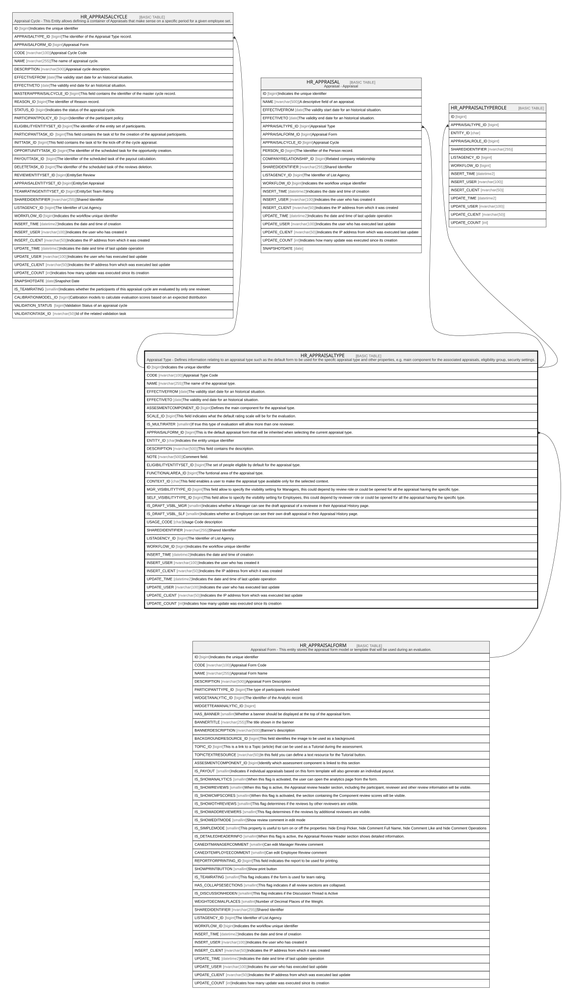

# HR_APPRAISALTYPE

## Description

Appraisal Type - Defines information relating to an appraisal type such as the default form to be used for the specifc appraisal type and other properties, e.g. main component for the associated appraisals, eligibility group, security settings.  

## Columns

| Name | Type | Default | Nullable | Children | Parents | Comment |
| ---- | ---- | ------- | -------- | -------- | ------- | ------- |
| ID | bigint |  | false | [HR_APPRAISALCYCLE](HR_APPRAISALCYCLE.md) [HR_APPRAISAL](HR_APPRAISAL.md) [HR_APPRAISALTYPEROLE](HR_APPRAISALTYPEROLE.md) |  | Indicates the unique identifier |
| CODE | nvarchar(100) |  | false |  |  | Appraisal Type Code |
| NAME | nvarchar(255) |  | false |  |  | The name of the appraisal type. |
| EFFECTIVEFROM | date |  | true |  |  | The validity start date for an historical situation. |
| EFFECTIVETO | date |  | true |  |  | The validity end date for an historical situation. |
| ASSESMENTCOMPONENT_ID | bigint |  | false |  |  | Defines the main component for the appraisal type.  |
| SCALE_ID | bigint |  | true |  |  | This field indicates what the default rating scale will be for the evaluation. |
| IS_MULTIRATER | smallint |  | true |  |  | If true this type of evaluation will allow more than one reviewer. |
| APPRAISALFORM_ID | bigint |  | false |  | [HR_APPRAISALFORM](HR_APPRAISALFORM.md) | This is the default appraisal form that will be inherited when selecting the current appraisal type. |
| ENTITY_ID | char |  | true |  |  | Indicates the entity unique identifier |
| DESCRIPTION | nvarchar(500) |  | true |  |  | This field contains the description. |
| NOTE | nvarchar(500) |  | true |  |  | Comment field. |
| ELIGIBILITYENTITYSET_ID | bigint |  | true |  |  | The set of people eligible by default for the appraisal type. |
| FUNCTIONALAREA_ID | bigint |  | true |  |  | The funtional area of the appraisal type. |
| CONTEXT_ID | char |  | true |  |  | This field enables a user to make the appraisal type available only for the selected context. |
| MGR_VISIBILITYTYPE_ID | bigint |  | true |  |  | This field allow to specify the visibility setting for Managers, this could depend by review role or could be opened for all the appraisal having the specific type. |
| SELF_VISIBILITYTYPE_ID | bigint |  | true |  |  | This field allow to specify the visibility setting for Employees, this could depend by reviewer role or could be opened for all the appraisal having the specific type. |
| IS_DRAFT_VSBL_MGR | smallint |  | true |  |  | Indicates whether a Manager can see the draft appraisal of a reviewee in their Appraisal History page. |
| IS_DRAFT_VSBL_SLF | smallint |  | true |  |  | Indicates whether an Employee can see their own draft appraisal in their Appraisal History page. |
| USAGE_CODE | char |  | true |  |  | Usage Code description |
| SHAREDIDENTIFIER | nvarchar(255) |  | true |  |  | Shared Identifier |
| LISTAGENCY_ID | bigint |  | true |  |  | The Identifier of List Agency. |
| WORKFLOW_ID | bigint |  | true |  |  | Indicates the workflow unique identifier |
| INSERT_TIME | datetime2 | (sysutcdatetime()) | false |  |  | Indicates the date and time of creation |
| INSERT_USER | nvarchar(100) | (N'MAIN') | false |  |  | Indicates the user who has created it |
| INSERT_CLIENT | nvarchar(50) | (N'localhost') | false |  |  | Indicates the IP address from which it was created |
| UPDATE_TIME | datetime2 | (sysutcdatetime()) | false |  |  | Indicates the date and time of last update operation |
| UPDATE_USER | nvarchar(100) | (N'MAIN') | false |  |  | Indicates the user who has executed last update |
| UPDATE_CLIENT | nvarchar(50) | (N'localhost') | false |  |  | Indicates the IP address from which was executed last update |
| UPDATE_COUNT | int | ((0)) | false |  |  | Indicates how many update was executed since its creation |

## Constraints

| Name | Type | Definition |
| ---- | ---- | ---------- |
| PK_HR_APPRAISALTYPE | PRIMARY KEY | CLUSTERED, unique, part of a PRIMARY KEY constraint, [ ID ] |
| UQ_APPRTYPE | UNIQUE | NONCLUSTERED, unique, part of a UNIQUE constraint, [ CODE ] |
| FK_APPRAISALTYPE_APPRAISALFORM | FOREIGN KEY | FOREIGN KEY(APPRAISALFORM_ID) REFERENCES HR_APPRAISALFORM(ID) ON UPDATE NO_ACTION ON DELETE NO_ACTION |

## Indexes

| Name | Definition |
| ---- | ---------- |
| PK_HR_APPRAISALTYPE | CLUSTERED, unique, part of a PRIMARY KEY constraint, [ ID ] |
| UQ_APPRTYPE | NONCLUSTERED, unique, part of a UNIQUE constraint, [ CODE ] |

## Relations

---

> Generated by [tbls](https://github.com/k1LoW/tbls)
