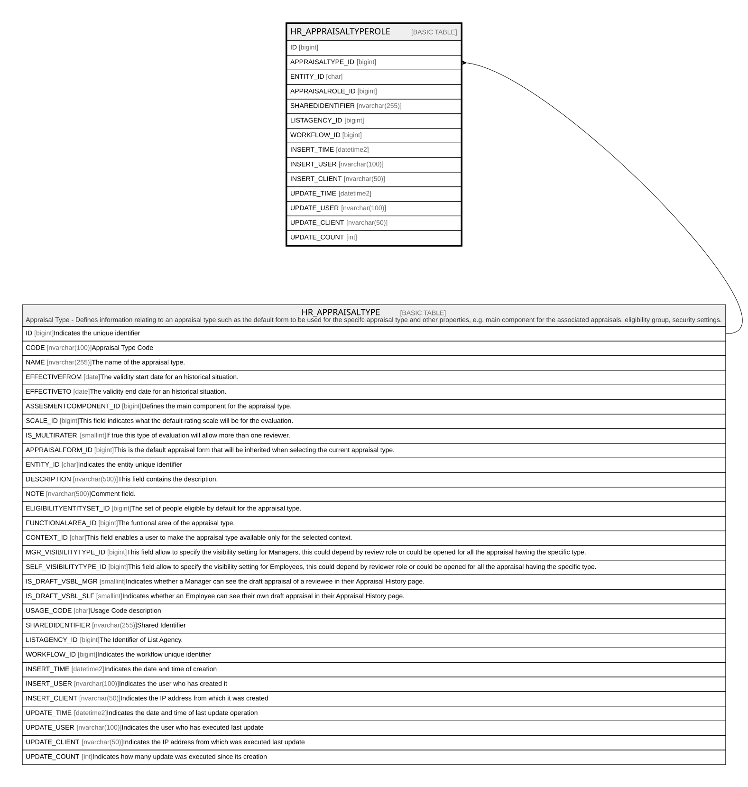

# HR_APPRAISALTYPEROLE

## Columns

| Name | Type | Default | Nullable | Parents | Comment |
| ---- | ---- | ------- | -------- | ------- | ------- |
| ID | bigint |  | false |  |  |
| APPRAISALTYPE_ID | bigint |  | false | [HR_APPRAISALTYPE](HR_APPRAISALTYPE.md) |  |
| ENTITY_ID | char |  | true |  |  |
| APPRAISALROLE_ID | bigint |  | true |  |  |
| SHAREDIDENTIFIER | nvarchar(255) |  | true |  |  |
| LISTAGENCY_ID | bigint |  | true |  |  |
| WORKFLOW_ID | bigint |  | true |  |  |
| INSERT_TIME | datetime2 | (sysutcdatetime()) | false |  |  |
| INSERT_USER | nvarchar(100) | (N'MAIN') | false |  |  |
| INSERT_CLIENT | nvarchar(50) | (N'localhost') | false |  |  |
| UPDATE_TIME | datetime2 | (sysutcdatetime()) | false |  |  |
| UPDATE_USER | nvarchar(100) | (N'MAIN') | false |  |  |
| UPDATE_CLIENT | nvarchar(50) | (N'localhost') | false |  |  |
| UPDATE_COUNT | int | ((0)) | false |  |  |

## Constraints

| Name | Type | Definition |
| ---- | ---- | ---------- |
| PK_HR_APPRAISALTYPEROLE | PRIMARY KEY | CLUSTERED, unique, part of a PRIMARY KEY constraint, [ ID ] |
| FK_APPRTYPEROLE_APPRAISALTYPE | FOREIGN KEY | FOREIGN KEY(APPRAISALTYPE_ID) REFERENCES HR_APPRAISALTYPE(ID) ON UPDATE NO_ACTION ON DELETE NO_ACTION |

## Indexes

| Name | Definition |
| ---- | ---------- |
| PK_HR_APPRAISALTYPEROLE | CLUSTERED, unique, part of a PRIMARY KEY constraint, [ ID ] |

## Relations

---

> Generated by [tbls](https://github.com/k1LoW/tbls)
