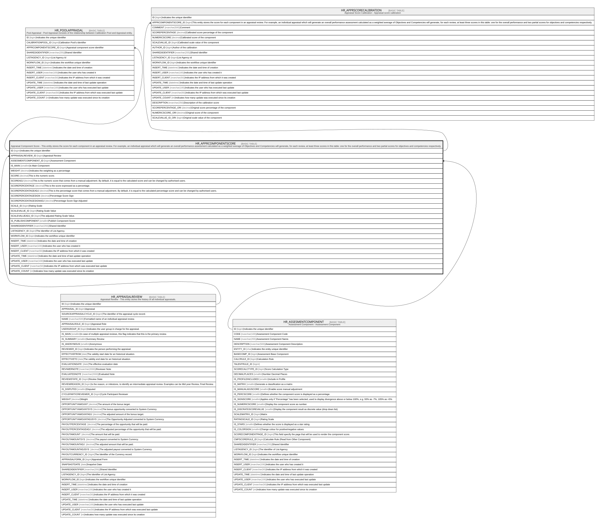

# HR_APPRCOMPONENTSCORE

## Description

Appraisal Component Score - This entity stores the score for each component in an appraisal review. For example, an individual appraisal which will generate an overall performance assessment calculated as a weighted average of Objectives and Competencies will generate, for each review, at least three scores in this table: one for the overall performance and two partial scores for objectives and competencies respectively.

## Columns

| Name | Type | Default | Nullable | Children | Parents | Comment |
| ---- | ---- | ------- | -------- | -------- | ------- | ------- |
| ID | bigint |  | false | [HR_POOLAPPRAISAL](HR_POOLAPPRAISAL.md) [HR_APPRSCORECALIBRATION](HR_APPRSCORECALIBRATION.md) |  | Indicates the unique identifier |
| APPRAISALREVIEW_ID | bigint |  | false |  | [HR_APPRAISALREVIEW](HR_APPRAISALREVIEW.md) | Appraisal Review |
| ASSESMENTCOMPONENT_ID | bigint |  | false |  | [HR_ASSESMENTCOMPONENT](HR_ASSESMENTCOMPONENT.md) | Assessment Component |
| IS_MAIN | smallint |  | true |  |  | Is Main Component |
| WEIGHT | decimal |  | true |  |  | Indicates the weighting as a percentage |
| SCORE | decimal |  | true |  |  | This is the numeric score. |
| SCOREADJ | decimal |  | true |  |  | This is the numeric score that comes from a manual adjustment. By default, it is equal to the calculated score and can be changed by authorised users. |
| SCOREPERCENTAGE | decimal |  | true |  |  | This is the score expressed as a percentage.  |
| SCOREPERCENTAGEADJ | decimal |  | true |  |  | This is the percentage score that comes from a manual adjustment. By default, it is equal to the calculated percentage score and can be changed by authorised users. |
| SCOREPERCENTAGESIGN | decimal |  | true |  |  | Percentage Score Sign |
| SCOREPERCENTAGESIGNADJ | decimal |  | true |  |  | Percentage Score Sign Adjusted |
| SCALE_ID | bigint |  | true |  |  | Rating Scale |
| SCALEVALUE_ID | bigint |  | true |  |  | Rating Scale Value |
| SCALEVALUEADJ_ID | bigint |  | true |  |  | The adjusted Rating Scale Value. |
| IS_PUBLISHCOMPONENT | smallint |  | true |  |  | Publish Component Score |
| SHAREDIDENTIFIER | nvarchar(255) |  | true |  |  | Shared Identifier |
| LISTAGENCY_ID | bigint |  | true |  |  | The Identifier of List Agency. |
| WORKFLOW_ID | bigint |  | true |  |  | Indicates the workflow unique identifier |
| INSERT_TIME | datetime2 | (sysutcdatetime()) | false |  |  | Indicates the date and time of creation |
| INSERT_USER | nvarchar(100) | (N'MAIN') | false |  |  | Indicates the user who has created it |
| INSERT_CLIENT | nvarchar(50) | (N'localhost') | false |  |  | Indicates the IP address from which it was created |
| UPDATE_TIME | datetime2 | (sysutcdatetime()) | false |  |  | Indicates the date and time of last update operation |
| UPDATE_USER | nvarchar(100) | (N'MAIN') | false |  |  | Indicates the user who has executed last update |
| UPDATE_CLIENT | nvarchar(50) | (N'localhost') | false |  |  | Indicates the IP address from which was executed last update |
| UPDATE_COUNT | int | ((0)) | false |  |  | Indicates how many update was executed since its creation |

## Constraints

| Name | Type | Definition |
| ---- | ---- | ---------- |
| PK_HR_APPRAISALCOMPSCORE | PRIMARY KEY | CLUSTERED, unique, part of a PRIMARY KEY constraint, [ ID ] |
| UQ_APPRCOMPSCORE | UNIQUE | NONCLUSTERED, unique, part of a UNIQUE constraint, [ APPRAISALREVIEW_ID, ASSESMENTCOMPONENT_ID ] |
| FK_APPRCOMPSCORE_APPRAISALREV | FOREIGN KEY | FOREIGN KEY(APPRAISALREVIEW_ID) REFERENCES HR_APPRAISALREVIEW(ID) ON UPDATE NO_ACTION ON DELETE CASCADE |
| FK_APPRCOMPSCORE_ASSESMENTCOMP | FOREIGN KEY | FOREIGN KEY(ASSESMENTCOMPONENT_ID) REFERENCES HR_ASSESMENTCOMPONENT(ID) ON UPDATE NO_ACTION ON DELETE NO_ACTION |

## Indexes

| Name | Definition |
| ---- | ---------- |
| PK_HR_APPRAISALCOMPSCORE | CLUSTERED, unique, part of a PRIMARY KEY constraint, [ ID ] |
| UQ_APPRCOMPSCORE | NONCLUSTERED, unique, part of a UNIQUE constraint, [ APPRAISALREVIEW_ID, ASSESMENTCOMPONENT_ID ] |

## Relations

---

> Generated by [tbls](https://github.com/k1LoW/tbls)
