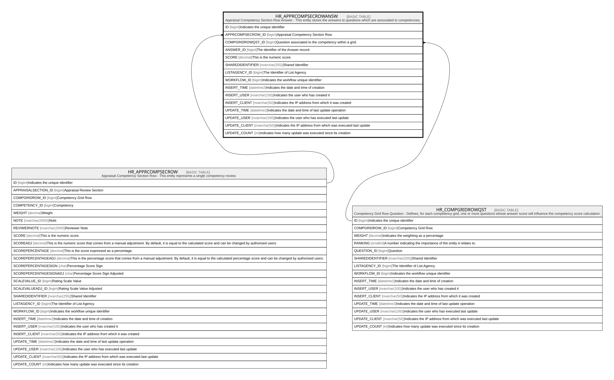

# HR_APPRCOMPSECROWANSW

## Description

Appraisal Competency Section Row Answer - This entity stores the answers to questions which are associated to competencies.  

## Columns

| Name | Type | Default | Nullable | Parents | Comment |
| ---- | ---- | ------- | -------- | ------- | ------- |
| ID | bigint |  | false |  | Indicates the unique identifier |
| APPRCOMPSECROW_ID | bigint |  | true | [HR_APPRCOMPSECROW](HR_APPRCOMPSECROW.md) | Appraisal Competency Section Row |
| COMPGRIDROWQST_ID | bigint |  | true | [HR_COMPGRIDROWQST](HR_COMPGRIDROWQST.md) | Question associated to the competency within a grid.  |
| ANSWER_ID | bigint |  | true |  | The identifier of the Answer record. |
| SCORE | decimal |  | true |  | This is the numeric score. |
| SHAREDIDENTIFIER | nvarchar(255) |  | true |  | Shared Identifier |
| LISTAGENCY_ID | bigint |  | true |  | The Identifier of List Agency. |
| WORKFLOW_ID | bigint |  | true |  | Indicates the workflow unique identifier |
| INSERT_TIME | datetime2 | (sysutcdatetime()) | false |  | Indicates the date and time of creation |
| INSERT_USER | nvarchar(100) | (N'MAIN') | false |  | Indicates the user who has created it |
| INSERT_CLIENT | nvarchar(50) | (N'localhost') | false |  | Indicates the IP address from which it was created |
| UPDATE_TIME | datetime2 | (sysutcdatetime()) | false |  | Indicates the date and time of last update operation |
| UPDATE_USER | nvarchar(100) | (N'MAIN') | false |  | Indicates the user who has executed last update |
| UPDATE_CLIENT | nvarchar(50) | (N'localhost') | false |  | Indicates the IP address from which was executed last update |
| UPDATE_COUNT | int | ((0)) | false |  | Indicates how many update was executed since its creation |

## Constraints

| Name | Type | Definition |
| ---- | ---- | ---------- |
| PK_HR_APPRCOMPSECROWANSW | PRIMARY KEY | CLUSTERED, unique, part of a PRIMARY KEY constraint, [ ID ] |
| FK_CMPSECROWANS_APPRCOMPSECROW | FOREIGN KEY | FOREIGN KEY(APPRCOMPSECROW_ID) REFERENCES HR_APPRCOMPSECROW(ID) ON UPDATE NO_ACTION ON DELETE CASCADE |
| FK_CMPSECROWANS_COMPGRIDROWQST | FOREIGN KEY | FOREIGN KEY(COMPGRIDROWQST_ID) REFERENCES HR_COMPGRIDROWQST(ID) ON UPDATE NO_ACTION ON DELETE NO_ACTION |

## Indexes

| Name | Definition |
| ---- | ---------- |
| PK_HR_APPRCOMPSECROWANSW | CLUSTERED, unique, part of a PRIMARY KEY constraint, [ ID ] |
| IDX_APPRCOMPSECROWANS_APPCSR | NONCLUSTERED, [ APPRCOMPSECROW_ID ] |

## Relations

---

> Generated by [tbls](https://github.com/k1LoW/tbls)
