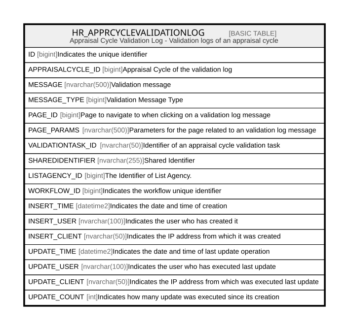

# HR_APPRCYCLEVALIDATIONLOG

## Description

Appraisal Cycle Validation Log - Validation logs of an appraisal cycle  

## Columns

| Name | Type | Default | Nullable | Comment |
| ---- | ---- | ------- | -------- | ------- |
| ID | bigint |  | false | Indicates the unique identifier |
| APPRAISALCYCLE_ID | bigint |  | false | Appraisal Cycle of the validation log |
| MESSAGE | nvarchar(500) |  | true | Validation message |
| MESSAGE_TYPE | bigint |  | true | Validation Message Type |
| PAGE_ID | bigint |  | true | Page to navigate to when clicking on a validation log message |
| PAGE_PARAMS | nvarchar(500) |  | true | Parameters for the page related to an validation log message |
| VALIDATIONTASK_ID | nvarchar(50) |  | true | Identifier of an appraisal cycle validation task |
| SHAREDIDENTIFIER | nvarchar(255) |  | true | Shared Identifier |
| LISTAGENCY_ID | bigint |  | true | The Identifier of List Agency. |
| WORKFLOW_ID | bigint |  | true | Indicates the workflow unique identifier |
| INSERT_TIME | datetime2 |  | false | Indicates the date and time of creation |
| INSERT_USER | nvarchar(100) |  | false | Indicates the user who has created it |
| INSERT_CLIENT | nvarchar(50) |  | false | Indicates the IP address from which it was created |
| UPDATE_TIME | datetime2 |  | false | Indicates the date and time of last update operation |
| UPDATE_USER | nvarchar(100) |  | false | Indicates the user who has executed last update |
| UPDATE_CLIENT | nvarchar(50) |  | false | Indicates the IP address from which was executed last update |
| UPDATE_COUNT | int |  | false | Indicates how many update was executed since its creation |

## Constraints

| Name | Type | Definition |
| ---- | ---- | ---------- |
| PK__HR_APPRC__3214EC27E566A383 | PRIMARY KEY | CLUSTERED, unique, part of a PRIMARY KEY constraint, [ ID ] |

## Indexes

| Name | Definition |
| ---- | ---------- |
| PK__HR_APPRC__3214EC27E566A383 | CLUSTERED, unique, part of a PRIMARY KEY constraint, [ ID ] |

## Relations

---

> Generated by [tbls](https://github.com/k1LoW/tbls)
