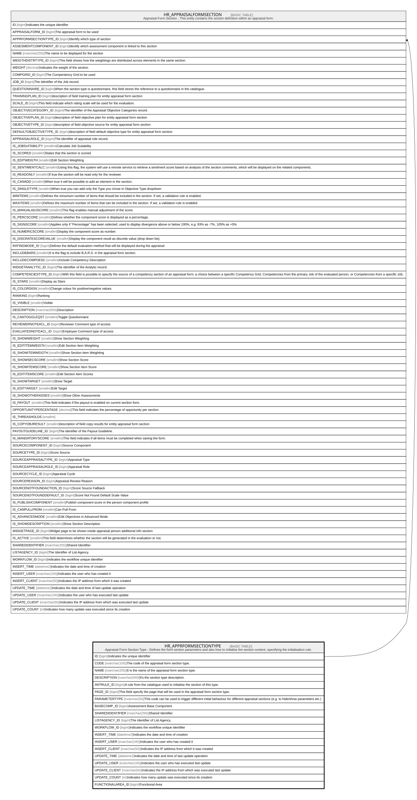

# HR_APPRFORMSECTIONTYPE

## Description

Appraisal Form Section Type - Defines the form section parameters and also how to initialise the section content, specifying the initialisation rule.  

## Columns

| Name | Type | Default | Nullable | Children | Comment |
| ---- | ---- | ------- | -------- | -------- | ------- |
| ID | bigint |  | false | [HR_APPRAISALFORMSECTION](HR_APPRAISALFORMSECTION.md) | Indicates the unique identifier |
| CODE | nvarchar(100) |  | true |  | The code of the appraisal form section type. |
| NAME | nvarchar(255) |  | true |  | It is the name of the appraisal form section type. |
| DESCRIPTION | nvarchar(500) |  | true |  | It's the section type description. |
| INITRULE_ID | bigint |  | true |  | A rule from the catalogue used to initialise the section of this type. |
| PAGE_ID | bigint |  | true |  | This field specify the page that will be used in the appraisal form section type. |
| PARAMETERTYPE | nvarchar(50) |  | true |  | This code can be used to trigger different initial behaviour for different appraisal sections (e.g. to hide/show parameters etc.) |
| BASECOMP_ID | bigint |  | true |  | Assessment Base Component |
| SHAREDIDENTIFIER | nvarchar(255) |  | true |  | Shared Identifier |
| LISTAGENCY_ID | bigint |  | true |  | The Identifier of List Agency. |
| WORKFLOW_ID | bigint |  | true |  | Indicates the workflow unique identifier |
| INSERT_TIME | datetime2 | (sysutcdatetime()) | false |  | Indicates the date and time of creation |
| INSERT_USER | nvarchar(100) | (N'MAIN') | false |  | Indicates the user who has created it |
| INSERT_CLIENT | nvarchar(50) | (N'localhost') | false |  | Indicates the IP address from which it was created |
| UPDATE_TIME | datetime2 | (sysutcdatetime()) | false |  | Indicates the date and time of last update operation |
| UPDATE_USER | nvarchar(100) | (N'MAIN') | false |  | Indicates the user who has executed last update |
| UPDATE_CLIENT | nvarchar(50) | (N'localhost') | false |  | Indicates the IP address from which was executed last update |
| UPDATE_COUNT | int | ((0)) | false |  | Indicates how many update was executed since its creation |
| FUNCTIONALAREA_ID | bigint |  | true |  | Functional Area |

## Constraints

| Name | Type | Definition |
| ---- | ---- | ---------- |
| PK_HR_APPRFORMSECTIONTYPE | PRIMARY KEY | CLUSTERED, unique, part of a PRIMARY KEY constraint, [ ID ] |
| UQ_APPRFORMSECTYPE | UNIQUE | NONCLUSTERED, unique, part of a UNIQUE constraint, [ CODE ] |

## Indexes

| Name | Definition |
| ---- | ---------- |
| PK_HR_APPRFORMSECTIONTYPE | CLUSTERED, unique, part of a PRIMARY KEY constraint, [ ID ] |
| UQ_APPRFORMSECTYPE | NONCLUSTERED, unique, part of a UNIQUE constraint, [ CODE ] |

## Relations

---

> Generated by [tbls](https://github.com/k1LoW/tbls)
