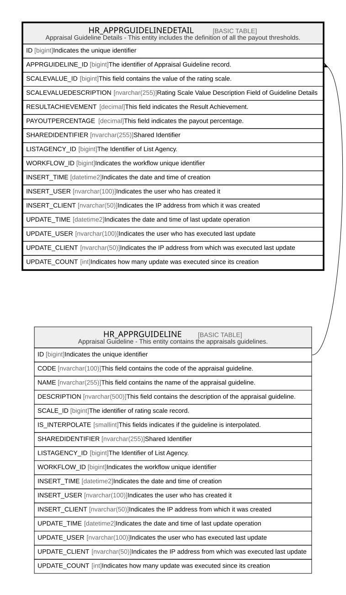

# HR_APPRGUIDELINEDETAIL

## Description

Appraisal Guideline Details - This entity includes the definition of all the payout thresholds.  

## Columns

| Name | Type | Default | Nullable | Parents | Comment |
| ---- | ---- | ------- | -------- | ------- | ------- |
| ID | bigint |  | false |  | Indicates the unique identifier |
| APPRGUIDELINE_ID | bigint |  | true | [HR_APPRGUIDELINE](HR_APPRGUIDELINE.md) | The identifier of Appraisal Guideline record. |
| SCALEVALUE_ID | bigint |  | true |  | This field contains the value of the rating scale. |
| SCALEVALUEDESCRIPTION | nvarchar(255) |  | true |  | Rating Scale Value Description Field of Guideline Details |
| RESULTACHIEVEMENT | decimal |  | true |  | This field indicates the Result Achievement. |
| PAYOUTPERCENTAGE | decimal |  | true |  | This field indicates the payout percentage. |
| SHAREDIDENTIFIER | nvarchar(255) |  | true |  | Shared Identifier |
| LISTAGENCY_ID | bigint |  | true |  | The Identifier of List Agency. |
| WORKFLOW_ID | bigint |  | true |  | Indicates the workflow unique identifier |
| INSERT_TIME | datetime2 | (sysutcdatetime()) | false |  | Indicates the date and time of creation |
| INSERT_USER | nvarchar(100) | (N'MAIN') | false |  | Indicates the user who has created it |
| INSERT_CLIENT | nvarchar(50) | (N'localhost') | false |  | Indicates the IP address from which it was created |
| UPDATE_TIME | datetime2 | (sysutcdatetime()) | false |  | Indicates the date and time of last update operation |
| UPDATE_USER | nvarchar(100) | (N'MAIN') | false |  | Indicates the user who has executed last update |
| UPDATE_CLIENT | nvarchar(50) | (N'localhost') | false |  | Indicates the IP address from which was executed last update |
| UPDATE_COUNT | int | ((0)) | false |  | Indicates how many update was executed since its creation |

## Constraints

| Name | Type | Definition |
| ---- | ---- | ---------- |
| PK_HR_APPRGUIDELINEDETAIL | PRIMARY KEY | CLUSTERED, unique, part of a PRIMARY KEY constraint, [ ID ] |
| FK_APPRGUIDEDET_APPRAISALGUIDE | FOREIGN KEY | FOREIGN KEY(APPRGUIDELINE_ID) REFERENCES HR_APPRGUIDELINE(ID) ON UPDATE NO_ACTION ON DELETE NO_ACTION |

## Indexes

| Name | Definition |
| ---- | ---------- |
| PK_HR_APPRGUIDELINEDETAIL | CLUSTERED, unique, part of a PRIMARY KEY constraint, [ ID ] |

## Relations

---

> Generated by [tbls](https://github.com/k1LoW/tbls)
