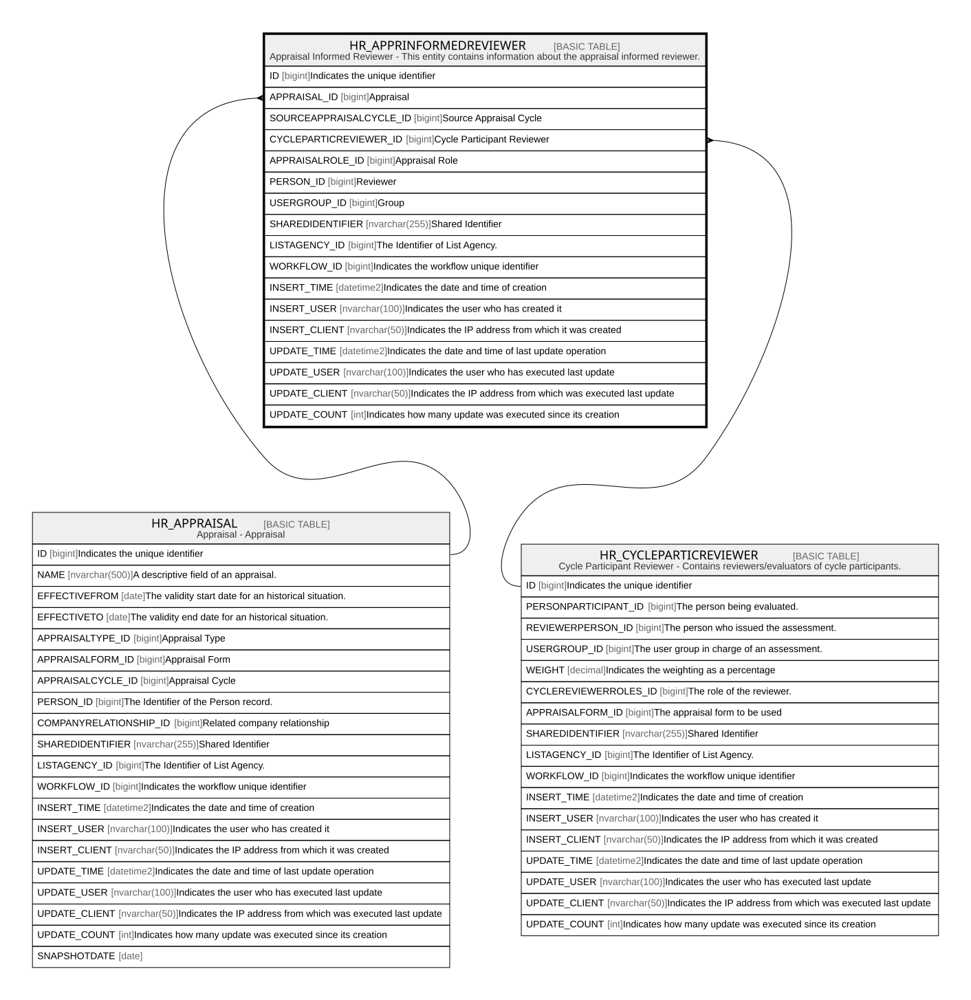

# HR_APPRINFORMEDREVIEWER

## Description

Appraisal Informed Reviewer - This entity contains information about the appraisal informed reviewer.  

## Columns

| Name | Type | Default | Nullable | Parents | Comment |
| ---- | ---- | ------- | -------- | ------- | ------- |
| ID | bigint |  | false |  | Indicates the unique identifier |
| APPRAISAL_ID | bigint |  | false | [HR_APPRAISAL](HR_APPRAISAL.md) | Appraisal |
| SOURCEAPPRAISALCYCLE_ID | bigint |  | true |  | Source Appraisal Cycle |
| CYCLEPARTICREVIEWER_ID | bigint |  | true | [HR_CYCLEPARTICREVIEWER](HR_CYCLEPARTICREVIEWER.md) | Cycle Participant Reviewer |
| APPRAISALROLE_ID | bigint |  | true |  | Appraisal Role |
| PERSON_ID | bigint |  | true |  | Reviewer |
| USERGROUP_ID | bigint |  | true |  | Group |
| SHAREDIDENTIFIER | nvarchar(255) |  | true |  | Shared Identifier |
| LISTAGENCY_ID | bigint |  | true |  | The Identifier of List Agency. |
| WORKFLOW_ID | bigint |  | true |  | Indicates the workflow unique identifier |
| INSERT_TIME | datetime2 | (sysutcdatetime()) | false |  | Indicates the date and time of creation |
| INSERT_USER | nvarchar(100) | (N'MAIN') | false |  | Indicates the user who has created it |
| INSERT_CLIENT | nvarchar(50) | (N'localhost') | false |  | Indicates the IP address from which it was created |
| UPDATE_TIME | datetime2 | (sysutcdatetime()) | false |  | Indicates the date and time of last update operation |
| UPDATE_USER | nvarchar(100) | (N'MAIN') | false |  | Indicates the user who has executed last update |
| UPDATE_CLIENT | nvarchar(50) | (N'localhost') | false |  | Indicates the IP address from which was executed last update |
| UPDATE_COUNT | int | ((0)) | false |  | Indicates how many update was executed since its creation |

## Constraints

| Name | Type | Definition |
| ---- | ---- | ---------- |
| PK_HR_APPRINFORMEDREVIEWER | PRIMARY KEY | CLUSTERED, unique, part of a PRIMARY KEY constraint, [ ID ] |
| UQ_APPRINFORMEDREVIEWER | UNIQUE | NONCLUSTERED, unique, part of a UNIQUE constraint, [ APPRAISAL_ID, SOURCEAPPRAISALCYCLE_ID, CYCLEPARTICREVIEWER_ID, APPRAISALROLE_ID ] |
| FK_APPRINFREVIEWER_APPRAISAL | FOREIGN KEY | FOREIGN KEY(APPRAISAL_ID) REFERENCES HR_APPRAISAL(ID) ON UPDATE NO_ACTION ON DELETE CASCADE |
| FK_APPRINFREVIEWER_PARTICREV | FOREIGN KEY | FOREIGN KEY(CYCLEPARTICREVIEWER_ID) REFERENCES HR_CYCLEPARTICREVIEWER(ID) ON UPDATE NO_ACTION ON DELETE CASCADE |

## Indexes

| Name | Definition |
| ---- | ---------- |
| PK_HR_APPRINFORMEDREVIEWER | CLUSTERED, unique, part of a PRIMARY KEY constraint, [ ID ] |
| UQ_APPRINFORMEDREVIEWER | NONCLUSTERED, unique, part of a UNIQUE constraint, [ APPRAISAL_ID, SOURCEAPPRAISALCYCLE_ID, CYCLEPARTICREVIEWER_ID, APPRAISALROLE_ID ] |

## Relations

---

> Generated by [tbls](https://github.com/k1LoW/tbls)
