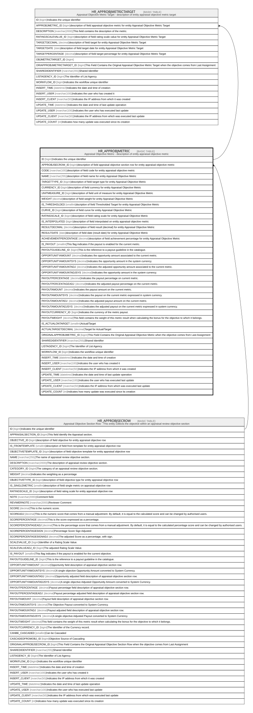

# HR_APPROBJMETRIC

## Description

Appraisal Objective Metric - description of entity appraisal objective metric  

## Columns

| Name | Type | Default | Nullable | Children | Parents | Comment |
| ---- | ---- | ------- | -------- | -------- | ------- | ------- |
| ID | bigint |  | false | [HR_APPROBJMETRICTARGET](HR_APPROBJMETRICTARGET.md) |  | Indicates the unique identifier |
| APPROBJSECROW_ID | bigint |  | false |  | [HR_APPROBJSECROW](HR_APPROBJSECROW.md) | description of field appraisal objective section row for entity appraisal objective metric |
| CODE | nvarchar(100) |  | false |  |  | description of field code for entity appraisal objective metric |
| NAME | nvarchar(255) |  | true |  |  | description of field name for entity Appraisal Objective Metric |
| TARGETTYPE_ID | bigint |  | true |  |  | description of field target type for entity Appraisal Objective Metric |
| CURRENCY_ID | bigint |  | true |  |  | description of field currency for entity Appraisal Objective Metric |
| UNITMEASURE_ID | bigint |  | true |  |  | description of field unit of measure for entity Appraisal Objective Metric |
| WEIGHT | decimal |  | true |  |  | description of field weight for entity Appraisal Objective Metric |
| IS_THRESHOLDED | smallint |  | true |  |  | dscription of field Thresholded Target for entity Appraisal Objective Metric |
| CURVE_ID | bigint |  | true |  |  | description of field curve for entity Appraisal Objective Metric |
| RATINGSCALE_ID | bigint |  | true |  |  | description of field rating scale for entity Appraisal Objective Metric |
| IS_INTERPOLATED | bigint |  | true |  |  | description of field interpolated on entity appraisal objective metric |
| RESULTDECIMAL | decimal |  | true |  |  | description of field result (decimal) for entity Appraisal Objective Metric |
| RESULTDATE | date |  | true |  |  | description of field date (result date) for entity Appraisal Objective Metric |
| ACHIEVEMENTPERCENTAGE | decimal |  | true |  |  | description of field achievement percentage for entity Appraisal Objective Metric |
| IS_PAYOUT | smallint |  | true |  |  | This flag indicates if the payout is enabled for the current metric. |
| PAYOUTGUIDELINE_ID | bigint |  | true |  |  | This is the reference to a payout guideline in the catalogue. |
| OPPORTUNITYAMOUNT | decimal |  | true |  |  | Indicates the opportunity amount associated to the current metric. |
| OPPORTUNITYAMOUNTSYS | decimal |  | true |  |  | Indicates the opportunity amount in the system currency. |
| OPPORTUNITYAMOUNTADJ | decimal |  | true |  |  | Indicates the adjusted opportunity amount associated to the current metric. |
| OPPORTUNITYAMOUNTADJSYS | decimal |  | true |  |  | Indicates the opportunity amount in the system currency. |
| PAYOUTPERCENTAGE | decimal |  | true |  |  | Indicates the payout percentage on current metric. |
| PAYOUTPERCENTAGEADJ | decimal |  | true |  |  | Indicates the adjusted payout percentage on the current metric. |
| PAYOUTAMOUNT | decimal |  | true |  |  | Indicates the payout amount on the current metric. |
| PAYOUTAMOUNTSYS | decimal |  | true |  |  | Indicates the payout on the current metric expressed in system currency. |
| PAYOUTAMOUNTADJ | decimal |  | true |  |  | Indicates the adjusted payout amount on the current metric. |
| PAYOUTAMOUNTADJSYS | decimal |  | true |  |  | Indicates the adjusted payout on the current metric expressed in system currency. |
| PAYOUTCURRENCY_ID | bigint |  | true |  |  | Indicates the currency of the metric payout. |
| PAYOUTWEIGHT | decimal |  | true |  |  | This field contains the weight of this metric result when calculating the bonus for the objective to which it belongs. |
| IS_ACTUALONTARGET | smallint |  | true |  |  | Actual/Target |
| ACTUALTARGETDECIMAL | decimal |  | true |  |  | Target for Actual/Target |
| ORIGINALAPPROBJMETRIC_ID | bigint |  | true |  |  | This Field Contains the Original Appraisal Objective Metric when the objective comes from Last Assignment |
| SHAREDIDENTIFIER | nvarchar(255) |  | true |  |  | Shared Identifier |
| LISTAGENCY_ID | bigint |  | true |  |  | The Identifier of List Agency. |
| WORKFLOW_ID | bigint |  | true |  |  | Indicates the workflow unique identifier |
| INSERT_TIME | datetime2 |  | false |  |  | Indicates the date and time of creation |
| INSERT_USER | nvarchar(100) |  | false |  |  | Indicates the user who has created it |
| INSERT_CLIENT | nvarchar(50) |  | false |  |  | Indicates the IP address from which it was created |
| UPDATE_TIME | datetime2 |  | false |  |  | Indicates the date and time of last update operation |
| UPDATE_USER | nvarchar(100) |  | false |  |  | Indicates the user who has executed last update |
| UPDATE_CLIENT | nvarchar(50) |  | false |  |  | Indicates the IP address from which was executed last update |
| UPDATE_COUNT | int |  | false |  |  | Indicates how many update was executed since its creation |

## Constraints

| Name | Type | Definition |
| ---- | ---- | ---------- |
| PK_HR_APPROBJMETRIC | PRIMARY KEY | CLUSTERED, unique, part of a PRIMARY KEY constraint, [ ID ] |
| FK_APPROBJMETRIC_APPROBJSECROW | FOREIGN KEY | FOREIGN KEY(APPROBJSECROW_ID) REFERENCES HR_APPROBJSECROW(ID) ON UPDATE NO_ACTION ON DELETE CASCADE |

## Indexes

| Name | Definition |
| ---- | ---------- |
| PK_HR_APPROBJMETRIC | CLUSTERED, unique, part of a PRIMARY KEY constraint, [ ID ] |

## Relations

---

> Generated by [tbls](https://github.com/k1LoW/tbls)
