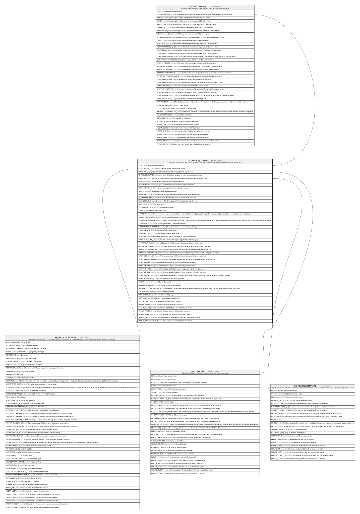

# HR_APPROBJSECROW

## Description

Appraisal Objective Section Row - This entity collects the objective within an appraisal review objective section  

## Columns

| Name | Type | Default | Nullable | Children | Parents | Comment |
| ---- | ---- | ------- | -------- | -------- | ------- | ------- |
| ID | bigint |  | false | [HR_APPROBJMETRIC](HR_APPROBJMETRIC.md) |  | Indicates the unique identifier |
| APPRAISALSECTION_ID | bigint |  | true |  | [HR_APPRAISALSECTION](HR_APPRAISALSECTION.md) | This field identify the Appraisal section. |
| OBJECTIVE_ID | bigint |  | true |  | [HR_OBJECTIVE](HR_OBJECTIVE.md) | description of field objective for entity appraisal objective row |
| IS_FROMTEMPLATE | smallint |  | true |  |  | description of field from template for entity appraisal objective row |
| OBJECTIVETEMPLATE_ID | bigint |  | true |  | [HR_OBJECTIVETEMPLATE](HR_OBJECTIVETEMPLATE.md) | description of field objective template for entity appraisal objective row |
| NAME | nvarchar(255) |  | false |  |  | The name of appraisal review objective section. |
| DESCRIPTION | nvarchar(2000) |  | true |  |  | The description of appraisal review objective section. |
| CATEGORY_ID | bigint |  | true |  |  | The category of an appraisal review objective section. |
| WEIGHT | decimal |  | true |  |  | Indicates the weighting as a percentage |
| OBJECTIVETYPE_ID | bigint |  | true |  |  | description of field objective type for entity appraisal objective row |
| IS_SINGLEMETRIC | smallint |  | true |  |  | description of field single metric on appraisal objective row |
| RATINGSCALE_ID | bigint |  | true |  |  | description of field rating scale for entity appraisal objective row |
| NOTE | nvarchar(2000) |  | true |  |  | Comment field. |
| REVIWERNOTE | nvarchar(2000) |  | true |  |  | Reviewer Comment |
| SCORE | decimal |  | true |  |  | This is the numeric score. |
| SCOREADJ | decimal |  | true |  |  | This is the numeric score that comes from a manual adjustment. By default, it is equal to the calculated score and can be changed by authorised users. |
| SCOREPERCENTAGE | decimal |  | true |  |  | This is the score expressed as a percentage.  |
| SCOREPERCENTAGEADJ | decimal |  | true |  |  | This is the percentage score that comes from a manual adjustment. By default, it is equal to the calculated percentage score and can be changed by authorised users. |
| SCOREPERCENTAGESIGN | decimal |  | true |  |  | Percentage Score Sign Adjusted |
| SCOREPERCENTAGESIGNADJ | decimal |  | true |  |  | The adjusted Score as a percentage, with sign. |
| SCALEVALUE_ID | bigint |  | true |  |  | Identifier of a Rating Scale Value. |
| SCALEVALUEADJ_ID | bigint |  | true |  |  | The adjusted Rating Scale Value. |
| IS_PAYOUT | smallint |  | true |  |  | This flag indicates if the payout is enabled for the current objective. |
| PAYOUTGUIDELINE_ID | bigint |  | true |  |  | This is the reference to a payout guideline in the catalogue. |
| OPPORTUNITYAMOUNT | decimal |  | true |  |  | Opportunity field description of appraisal objective section row. |
| OPPORTUNITYAMOUNTSYS | decimal |  | true |  |  | A single objective Opportunity Amount converted to System Currency. |
| OPPORTUNITYAMOUNTADJ | decimal |  | true |  |  | Opportunity adjusted field description of appraisal objective section row. |
| OPPORTUNITYAMOUNTADJSYS | decimal |  | true |  |  | A single objective Adjusted Opportunity Amount converted to System Currency. |
| PAYOUTPERCENTAGE | decimal |  | true |  |  | Payout percentage field description of appraisal objective section row. |
| PAYOUTPERCENTAGEADJ | decimal |  | true |  |  | Payout percentage adjusted field description of appraisal objective section row. |
| PAYOUTAMOUNT | decimal |  | true |  |  | Payout field description of appraisal objective section row. |
| PAYOUTAMOUNTSYS | decimal |  | true |  |  | The Objective Payout converted to System Currency. |
| PAYOUTAMOUNTADJ | decimal |  | true |  |  | Payout adjusted field description of appraisal objective section row. |
| PAYOUTAMOUNTADJSYS | decimal |  | true |  |  | A single objective Adjusted Payout converted to System Currency. |
| PAYOUTWEIGHT | decimal |  | true |  |  | This field contains the weight of this metric result when calculating the bonus for the objective to which it belongs. |
| PAYOUTCURRENCY_ID | bigint |  | true |  |  | The Identifier of the Currency record. |
| CANBE_CASCADED | smallint |  | true |  |  | Can be Cascaded |
| CASCADEDFROMOBJ_ID | bigint |  | true |  |  | Objective Source of Cascading |
| ORIGINALAPPROBJSECROW_ID | bigint |  | true |  |  | This Field Contains the Original Appraisal Objective Section Row when the objective comes from Last Assignment |
| SHAREDIDENTIFIER | nvarchar(255) |  | true |  |  | Shared Identifier |
| LISTAGENCY_ID | bigint |  | true |  |  | The Identifier of List Agency. |
| WORKFLOW_ID | bigint |  | true |  |  | Indicates the workflow unique identifier |
| INSERT_TIME | datetime2 | (sysutcdatetime()) | false |  |  | Indicates the date and time of creation |
| INSERT_USER | nvarchar(100) | (N'MAIN') | false |  |  | Indicates the user who has created it |
| INSERT_CLIENT | nvarchar(50) | (N'localhost') | false |  |  | Indicates the IP address from which it was created |
| UPDATE_TIME | datetime2 | (sysutcdatetime()) | false |  |  | Indicates the date and time of last update operation |
| UPDATE_USER | nvarchar(100) | (N'MAIN') | false |  |  | Indicates the user who has executed last update |
| UPDATE_CLIENT | nvarchar(50) | (N'localhost') | false |  |  | Indicates the IP address from which was executed last update |
| UPDATE_COUNT | int | ((0)) | false |  |  | Indicates how many update was executed since its creation |

## Constraints

| Name | Type | Definition |
| ---- | ---- | ---------- |
| PK_HR_APPROBJSECROW | PRIMARY KEY | CLUSTERED, unique, part of a PRIMARY KEY constraint, [ ID ] |
| FK_APPROBJSECROW_APPRSECTION | FOREIGN KEY | FOREIGN KEY(APPRAISALSECTION_ID) REFERENCES HR_APPRAISALSECTION(ID) ON UPDATE NO_ACTION ON DELETE CASCADE |
| FK_APPROBJSECROW_OBJECTIVE | FOREIGN KEY | FOREIGN KEY(OBJECTIVE_ID) REFERENCES HR_OBJECTIVE(ID) ON UPDATE NO_ACTION ON DELETE NO_ACTION |
| FK_APPROBJSECROW_OBJECTIVETEMP | FOREIGN KEY | FOREIGN KEY(OBJECTIVETEMPLATE_ID) REFERENCES HR_OBJECTIVETEMPLATE(ID) ON UPDATE NO_ACTION ON DELETE NO_ACTION |

## Indexes

| Name | Definition |
| ---- | ---------- |
| PK_HR_APPROBJSECROW | CLUSTERED, unique, part of a PRIMARY KEY constraint, [ ID ] |

## Relations

---

> Generated by [tbls](https://github.com/k1LoW/tbls)
