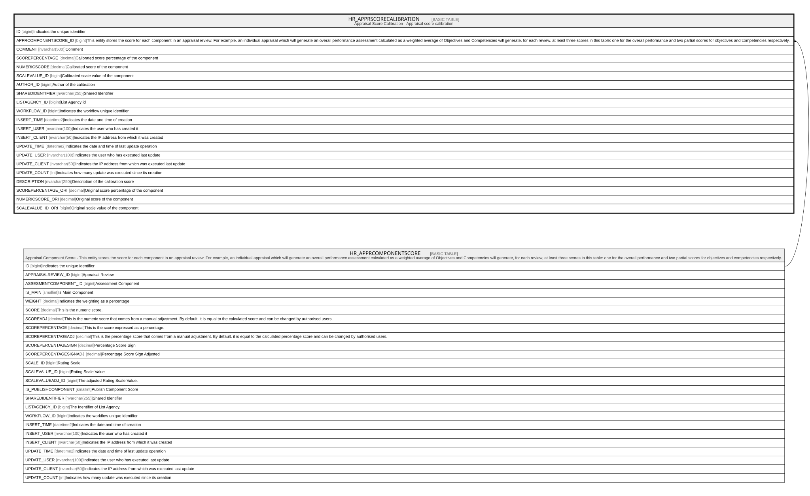

# HR_APPRSCORECALIBRATION

## Description

Appraisal Score Calibration - Appraisal score calibration  

## Columns

| Name | Type | Default | Nullable | Parents | Comment |
| ---- | ---- | ------- | -------- | ------- | ------- |
| ID | bigint |  | false |  | Indicates the unique identifier |
| APPRCOMPONENTSCORE_ID | bigint |  | true | [HR_APPRCOMPONENTSCORE](HR_APPRCOMPONENTSCORE.md) | This entity stores the score for each component in an appraisal review. For example, an individual appraisal which will generate an overall performance assessment calculated as a weighted average of Objectives and Competencies will generate, for each review, at least three scores in this table: one for the overall performance and two partial scores for objectives and competencies respectively. |
| COMMENT | nvarchar(500) |  | true |  | Comment |
| SCOREPERCENTAGE | decimal |  | true |  | Calibrated score percentage of the component |
| NUMERICSCORE | decimal |  | true |  | Calibrated score of the component |
| SCALEVALUE_ID | bigint |  | true |  | Calibrated scale value of the component |
| AUTHOR_ID | bigint |  | true |  | Author of the calibration |
| SHAREDIDENTIFIER | nvarchar(255) |  | true |  | Shared Identifier |
| LISTAGENCY_ID | bigint |  | true |  | List Agency id |
| WORKFLOW_ID | bigint |  | true |  | Indicates the workflow unique identifier |
| INSERT_TIME | datetime2 |  | false |  | Indicates the date and time of creation |
| INSERT_USER | nvarchar(100) |  | false |  | Indicates the user who has created it |
| INSERT_CLIENT | nvarchar(50) |  | false |  | Indicates the IP address from which it was created |
| UPDATE_TIME | datetime2 |  | false |  | Indicates the date and time of last update operation |
| UPDATE_USER | nvarchar(100) |  | false |  | Indicates the user who has executed last update |
| UPDATE_CLIENT | nvarchar(50) |  | false |  | Indicates the IP address from which was executed last update |
| UPDATE_COUNT | int |  | false |  | Indicates how many update was executed since its creation |
| DESCRIPTION | nvarchar(250) |  | true |  | Description of the calibration score |
| SCOREPERCENTAGE_ORI | decimal |  | true |  | Original score percentage of the component |
| NUMERICSCORE_ORI | decimal |  | true |  | Original score of the component |
| SCALEVALUE_ID_ORI | bigint |  | true |  | Original scale value of the component |

## Constraints

| Name | Type | Definition |
| ---- | ---- | ---------- |
| PK__HR_APPRS__3214EC2700B624D2 | PRIMARY KEY | CLUSTERED, unique, part of a PRIMARY KEY constraint, [ ID ] |
| UQ__HR_APPRS__725666CC51EE373D | UNIQUE | NONCLUSTERED, unique, part of a UNIQUE constraint, [ APPRCOMPONENTSCORE_ID ] |
| FK__HR_APPRSC__APPRC__00E0B825 | FOREIGN KEY | FOREIGN KEY(APPRCOMPONENTSCORE_ID) REFERENCES HR_APPRCOMPONENTSCORE(ID) ON UPDATE NO_ACTION ON DELETE CASCADE |

## Indexes

| Name | Definition |
| ---- | ---------- |
| PK__HR_APPRS__3214EC2700B624D2 | CLUSTERED, unique, part of a PRIMARY KEY constraint, [ ID ] |
| UQ__HR_APPRS__725666CC51EE373D | NONCLUSTERED, unique, part of a UNIQUE constraint, [ APPRCOMPONENTSCORE_ID ] |

## Relations

---

> Generated by [tbls](https://github.com/k1LoW/tbls)
