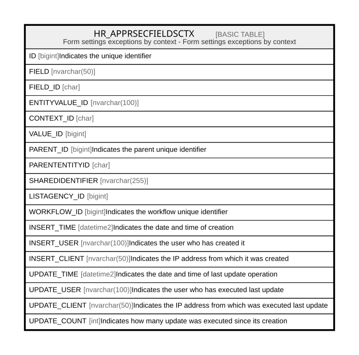

# HR_APPRSECFIELDSCTX

## Description

Form settings exceptions by context - Form settings exceptions by context  

## Columns

| Name | Type | Default | Nullable | Comment |
| ---- | ---- | ------- | -------- | ------- |
| ID | bigint |  | false | Indicates the unique identifier |
| FIELD | nvarchar(50) |  | false |  |
| FIELD_ID | char |  | true |  |
| ENTITYVALUE_ID | nvarchar(100) |  | false |  |
| CONTEXT_ID | char |  | false |  |
| VALUE_ID | bigint |  | false |  |
| PARENT_ID | bigint |  | false | Indicates the parent unique identifier |
| PARENTENTITYID | char |  | true |  |
| SHAREDIDENTIFIER | nvarchar(255) |  | true |  |
| LISTAGENCY_ID | bigint |  | true |  |
| WORKFLOW_ID | bigint |  | true | Indicates the workflow unique identifier |
| INSERT_TIME | datetime2 | (sysutcdatetime()) | false | Indicates the date and time of creation |
| INSERT_USER | nvarchar(100) | (N'MAIN') | false | Indicates the user who has created it |
| INSERT_CLIENT | nvarchar(50) | (N'localhost') | false | Indicates the IP address from which it was created |
| UPDATE_TIME | datetime2 | (sysutcdatetime()) | false | Indicates the date and time of last update operation |
| UPDATE_USER | nvarchar(100) | (N'MAIN') | false | Indicates the user who has executed last update |
| UPDATE_CLIENT | nvarchar(50) | (N'localhost') | false | Indicates the IP address from which was executed last update |
| UPDATE_COUNT | int | ((0)) | false | Indicates how many update was executed since its creation |

## Constraints

| Name | Type | Definition |
| ---- | ---- | ---------- |
| PK_HR_APPRSECFIELDSCTX | PRIMARY KEY | CLUSTERED, unique, part of a PRIMARY KEY constraint, [ ID ] |
| UQ_APPRSECFIELDSCTX_FIELD_CTX | UNIQUE | NONCLUSTERED, unique, part of a UNIQUE constraint, [ PARENT_ID, FIELD, CONTEXT_ID ] |

## Indexes

| Name | Definition |
| ---- | ---------- |
| PK_HR_APPRSECFIELDSCTX | CLUSTERED, unique, part of a PRIMARY KEY constraint, [ ID ] |
| UQ_APPRSECFIELDSCTX_FIELD_CTX | NONCLUSTERED, unique, part of a UNIQUE constraint, [ PARENT_ID, FIELD, CONTEXT_ID ] |

## Relations

---

> Generated by [tbls](https://github.com/k1LoW/tbls)
