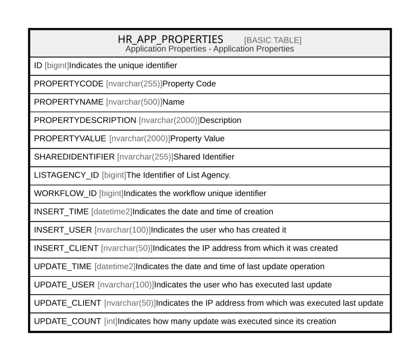

# HR_APP_PROPERTIES

## Description

Application Properties - Application Properties  

## Columns

| Name | Type | Default | Nullable | Comment |
| ---- | ---- | ------- | -------- | ------- |
| ID | bigint |  | false | Indicates the unique identifier |
| PROPERTYCODE | nvarchar(255) |  | false | Property Code |
| PROPERTYNAME | nvarchar(500) |  | true | Name |
| PROPERTYDESCRIPTION | nvarchar(2000) |  | true | Description |
| PROPERTYVALUE | nvarchar(2000) |  | true | Property Value |
| SHAREDIDENTIFIER | nvarchar(255) |  | true | Shared Identifier |
| LISTAGENCY_ID | bigint |  | true | The Identifier of List Agency. |
| WORKFLOW_ID | bigint |  | true | Indicates the workflow unique identifier |
| INSERT_TIME | datetime2 | (sysutcdatetime()) | false | Indicates the date and time of creation |
| INSERT_USER | nvarchar(100) | (N'MAIN') | false | Indicates the user who has created it |
| INSERT_CLIENT | nvarchar(50) | (N'localhost') | false | Indicates the IP address from which it was created |
| UPDATE_TIME | datetime2 | (sysutcdatetime()) | false | Indicates the date and time of last update operation |
| UPDATE_USER | nvarchar(100) | (N'MAIN') | false | Indicates the user who has executed last update |
| UPDATE_CLIENT | nvarchar(50) | (N'localhost') | false | Indicates the IP address from which was executed last update |
| UPDATE_COUNT | int | ((0)) | false | Indicates how many update was executed since its creation |

## Constraints

| Name | Type | Definition |
| ---- | ---- | ---------- |
| PK_HR_APP_PROPERTIES | PRIMARY KEY | CLUSTERED, unique, part of a PRIMARY KEY constraint, [ ID ] |
| UQ_APP_PROPERTIES_PROPERTYCODE | UNIQUE | NONCLUSTERED, unique, part of a UNIQUE constraint, [ PROPERTYCODE ] |

## Indexes

| Name | Definition |
| ---- | ---------- |
| PK_HR_APP_PROPERTIES | CLUSTERED, unique, part of a PRIMARY KEY constraint, [ ID ] |
| UQ_APP_PROPERTIES_PROPERTYCODE | NONCLUSTERED, unique, part of a UNIQUE constraint, [ PROPERTYCODE ] |

## Relations

---

> Generated by [tbls](https://github.com/k1LoW/tbls)
