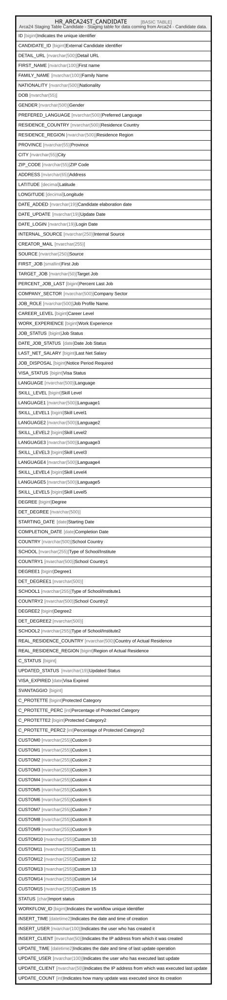

# HR_ARCA24ST_CANDIDATE

## Description

Arca24 Staging Table Candidate - Staging table for data coming from Arca24 - Candidate data.  

## Columns

| Name | Type | Default | Nullable | Comment |
| ---- | ---- | ------- | -------- | ------- |
| ID | bigint |  | false | Indicates the unique identifier |
| CANDIDATE_ID | bigint |  | false | External Candidate identifier |
| DETAIL_URL | nvarchar(500) |  | true | Detail URL |
| FIRST_NAME | nvarchar(100) |  | true | First name |
| FAMILY_NAME | nvarchar(100) |  | true | Family Name |
| NATIONALITY | nvarchar(500) |  | true | Nationality |
| DOB | nvarchar(55) |  | true |  |
| GENDER | nvarchar(500) |  | true | Gender |
| PREFERED_LANGUAGE | nvarchar(500) |  | true | Preferred Language |
| RESIDENCE_COUNTRY | nvarchar(500) |  | true | Residence Country |
| RESIDENCE_REGION | nvarchar(500) |  | true | Residence Region |
| PROVINCE | nvarchar(55) |  | true | Province |
| CITY | nvarchar(55) |  | true | City |
| ZIP_CODE | nvarchar(55) |  | true | ZIP Code |
| ADDRESS | nvarchar(65) |  | true | Address |
| LATITUDE | decimal |  | true | Latitude |
| LONGITUDE | decimal |  | true | Longitude |
| DATE_ADDED | nvarchar(19) |  | true | Candidate elaboration date |
| DATE_UPDATE | nvarchar(19) |  | true | Update Date |
| DATE_LOGIN | nvarchar(19) |  | true | Login Date |
| INTERNAL_SOURCE | nvarchar(250) |  | true | Internal Source |
| CREATOR_MAIL | nvarchar(255) |  | true |  |
| SOURCE | nvarchar(250) |  | true | Source |
| FIRST_JOB | smallint |  | true | First Job |
| TARGET_JOB | nvarchar(50) |  | true | Target Job |
| PERCENT_JOB_LAST | bigint |  | true | Percent Last Job |
| COMPANY_SECTOR | nvarchar(500) |  | true | Company Sector |
| JOB_ROLE | nvarchar(500) |  | true | Job Profile Name. |
| CAREER_LEVEL | bigint |  | true | Career Level |
| WORK_EXPERIENCE | bigint |  | true | Work Experience |
| JOB_STATUS | bigint |  | true | Job Status |
| DATE_JOB_STATUS | date |  | true | Date Job Status |
| LAST_NET_SALARY | bigint |  | true | Last Net Salary |
| JOB_DISPOSAL | bigint |  | true | Notice Period Required |
| VISA_STATUS | bigint |  | true | Visa Status |
| LANGUAGE | nvarchar(500) |  | true | Language |
| SKILL_LEVEL | bigint |  | true | Skill Level |
| LANGUAGE1 | nvarchar(500) |  | true | Language1 |
| SKILL_LEVEL1 | bigint |  | true | Skill Level1 |
| LANGUAGE2 | nvarchar(500) |  | true | Language2 |
| SKILL_LEVEL2 | bigint |  | true | Skill Level2 |
| LANGUAGE3 | nvarchar(500) |  | true | Language3 |
| SKILL_LEVEL3 | bigint |  | true | Skill Level3 |
| LANGUAGE4 | nvarchar(500) |  | true | Language4 |
| SKILL_LEVEL4 | bigint |  | true | Skill Level4 |
| LANGUAGE5 | nvarchar(500) |  | true | Language5 |
| SKILL_LEVEL5 | bigint |  | true | Skill Level5 |
| DEGREE | bigint |  | true | Degree |
| DET_DEGREE | nvarchar(500) |  | true |  |
| STARTING_DATE | date |  | true | Starting Date |
| COMPLETION_DATE | date |  | true | Completion Date |
| COUNTRY | nvarchar(500) |  | true | School Country |
| SCHOOL | nvarchar(255) |  | true | Type of School/Institute |
| COUNTRY1 | nvarchar(500) |  | true | School Country1 |
| DEGREE1 | bigint |  | true | Degree1 |
| DET_DEGREE1 | nvarchar(500) |  | true |  |
| SCHOOL1 | nvarchar(255) |  | true | Type of School/Institute1 |
| COUNTRY2 | nvarchar(500) |  | true | School Country2 |
| DEGREE2 | bigint |  | true | Degree2 |
| DET_DEGREE2 | nvarchar(500) |  | true |  |
| SCHOOL2 | nvarchar(255) |  | true | Type of School/Institute2 |
| REAL_RESIDENCE_COUNTRY | nvarchar(500) |  | true | Country of Actual Residence |
| REAL_RESIDENCE_REGION | bigint |  | true | Region of Actual Residence |
| C_STATUS | bigint |  | true |  |
| UPDATED_STATUS | nvarchar(19) |  | true | Updated Status |
| VISA_EXPIRED | date |  | true | Visa Expired |
| SVANTAGGIO | bigint |  | true |  |
| C_PROTETTE | bigint |  | true | Protected Category |
| C_PROTETTE_PERC | int |  | true | Percentage of Protected Category |
| C_PROTETTE2 | bigint |  | true | Protected Category2 |
| C_PROTETTE_PERC2 | int |  | true | Percentage of Protected Category2 |
| CUSTOM0 | nvarchar(255) |  | true | Custom 0 |
| CUSTOM1 | nvarchar(255) |  | true | Custom 1 |
| CUSTOM2 | nvarchar(255) |  | true | Custom 2 |
| CUSTOM3 | nvarchar(255) |  | true | Custom 3 |
| CUSTOM4 | nvarchar(255) |  | true | Custom 4 |
| CUSTOM5 | nvarchar(255) |  | true | Custom 5 |
| CUSTOM6 | nvarchar(255) |  | true | Custom 6 |
| CUSTOM7 | nvarchar(255) |  | true | Custom 7 |
| CUSTOM8 | nvarchar(255) |  | true | Custom 8 |
| CUSTOM9 | nvarchar(255) |  | true | Custom 9 |
| CUSTOM10 | nvarchar(255) |  | true | Custom 10 |
| CUSTOM11 | nvarchar(255) |  | true | Custom 11 |
| CUSTOM12 | nvarchar(255) |  | true | Custom 12 |
| CUSTOM13 | nvarchar(255) |  | true | Custom 13 |
| CUSTOM14 | nvarchar(255) |  | true | Custom 14 |
| CUSTOM15 | nvarchar(255) |  | true | Custom 15 |
| STATUS | char | ('I') | true | Import status |
| WORKFLOW_ID | bigint |  | true | Indicates the workflow unique identifier |
| INSERT_TIME | datetime2 |  | false | Indicates the date and time of creation |
| INSERT_USER | nvarchar(100) |  | false | Indicates the user who has created it |
| INSERT_CLIENT | nvarchar(50) |  | false | Indicates the IP address from which it was created |
| UPDATE_TIME | datetime2 |  | false | Indicates the date and time of last update operation |
| UPDATE_USER | nvarchar(100) |  | false | Indicates the user who has executed last update |
| UPDATE_CLIENT | nvarchar(50) |  | false | Indicates the IP address from which was executed last update |
| UPDATE_COUNT | int |  | false | Indicates how many update was executed since its creation |

## Constraints

| Name | Type | Definition |
| ---- | ---- | ---------- |
| PK_HR_ARCA24ST_CANDIDATE | PRIMARY KEY | CLUSTERED, unique, part of a PRIMARY KEY constraint, [ ID ] |

## Indexes

| Name | Definition |
| ---- | ---------- |
| PK_HR_ARCA24ST_CANDIDATE | CLUSTERED, unique, part of a PRIMARY KEY constraint, [ ID ] |
| IDX_A24ST_CAND_INSERT_TIME | NONCLUSTERED, [ INSERT_TIME, STATUS ] |

## Relations

---

> Generated by [tbls](https://github.com/k1LoW/tbls)
