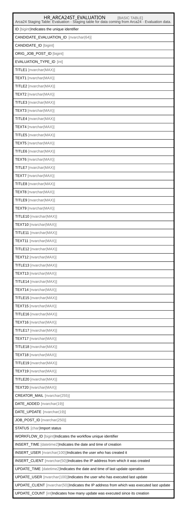

# HR_ARCA24ST_EVALUATION

## Description

Arca24 Staging Table: Evaluation - Staging table for data coming from Arca24 - Evaluation data.

## Columns

| Name | Type | Default | Nullable | Comment |
| ---- | ---- | ------- | -------- | ------- |
| ID | bigint |  | false | Indicates the unique identifier |
| CANDIDATE_EVALUATION_ID | nvarchar(64) |  | false |  |
| CANDIDATE_ID | bigint |  | false |  |
| ORIG_JOB_POST_ID | bigint |  | false |  |
| EVALUATION_TYPE_ID | int |  | true |  |
| TITLE1 | nvarchar(MAX) |  | true |  |
| TEXT1 | nvarchar(MAX) |  | true |  |
| TITLE2 | nvarchar(MAX) |  | true |  |
| TEXT2 | nvarchar(MAX) |  | true |  |
| TITLE3 | nvarchar(MAX) |  | true |  |
| TEXT3 | nvarchar(MAX) |  | true |  |
| TITLE4 | nvarchar(MAX) |  | true |  |
| TEXT4 | nvarchar(MAX) |  | true |  |
| TITLE5 | nvarchar(MAX) |  | true |  |
| TEXT5 | nvarchar(MAX) |  | true |  |
| TITLE6 | nvarchar(MAX) |  | true |  |
| TEXT6 | nvarchar(MAX) |  | true |  |
| TITLE7 | nvarchar(MAX) |  | true |  |
| TEXT7 | nvarchar(MAX) |  | true |  |
| TITLE8 | nvarchar(MAX) |  | true |  |
| TEXT8 | nvarchar(MAX) |  | true |  |
| TITLE9 | nvarchar(MAX) |  | true |  |
| TEXT9 | nvarchar(MAX) |  | true |  |
| TITLE10 | nvarchar(MAX) |  | true |  |
| TEXT10 | nvarchar(MAX) |  | true |  |
| TITLE11 | nvarchar(MAX) |  | true |  |
| TEXT11 | nvarchar(MAX) |  | true |  |
| TITLE12 | nvarchar(MAX) |  | true |  |
| TEXT12 | nvarchar(MAX) |  | true |  |
| TITLE13 | nvarchar(MAX) |  | true |  |
| TEXT13 | nvarchar(MAX) |  | true |  |
| TITLE14 | nvarchar(MAX) |  | true |  |
| TEXT14 | nvarchar(MAX) |  | true |  |
| TITLE15 | nvarchar(MAX) |  | true |  |
| TEXT15 | nvarchar(MAX) |  | true |  |
| TITLE16 | nvarchar(MAX) |  | true |  |
| TEXT16 | nvarchar(MAX) |  | true |  |
| TITLE17 | nvarchar(MAX) |  | true |  |
| TEXT17 | nvarchar(MAX) |  | true |  |
| TITLE18 | nvarchar(MAX) |  | true |  |
| TEXT18 | nvarchar(MAX) |  | true |  |
| TITLE19 | nvarchar(MAX) |  | true |  |
| TEXT19 | nvarchar(MAX) |  | true |  |
| TITLE20 | nvarchar(MAX) |  | true |  |
| TEXT20 | nvarchar(MAX) |  | true |  |
| CREATOR_MAIL | nvarchar(255) |  | true |  |
| DATE_ADDED | nvarchar(19) |  | true |  |
| DATE_UPDATE | nvarchar(19) |  | true |  |
| JOB_POST_ID | nvarchar(250) |  | true |  |
| STATUS | char | ('I') | true | Import status |
| WORKFLOW_ID | bigint |  | true | Indicates the workflow unique identifier |
| INSERT_TIME | datetime2 |  | true | Indicates the date and time of creation |
| INSERT_USER | nvarchar(100) |  | true | Indicates the user who has created it |
| INSERT_CLIENT | nvarchar(50) |  | true | Indicates the IP address from which it was created |
| UPDATE_TIME | datetime2 |  | true | Indicates the date and time of last update operation |
| UPDATE_USER | nvarchar(100) |  | true | Indicates the user who has executed last update |
| UPDATE_CLIENT | nvarchar(50) |  | true | Indicates the IP address from which was executed last update |
| UPDATE_COUNT | int |  | false | Indicates how many update was executed since its creation |

## Constraints

| Name | Type | Definition |
| ---- | ---- | ---------- |
| PK_HR_ARCA24ST_EVALUATION | PRIMARY KEY | CLUSTERED, unique, part of a PRIMARY KEY constraint, [ ID ] |

## Indexes

| Name | Definition |
| ---- | ---------- |
| PK_HR_ARCA24ST_EVALUATION | CLUSTERED, unique, part of a PRIMARY KEY constraint, [ ID ] |
| IDX_A24ST_EVA_INSERT_TIME | NONCLUSTERED, [ INSERT_TIME, STATUS ] |

## Relations

---

> Generated by [tbls](https://github.com/k1LoW/tbls)
