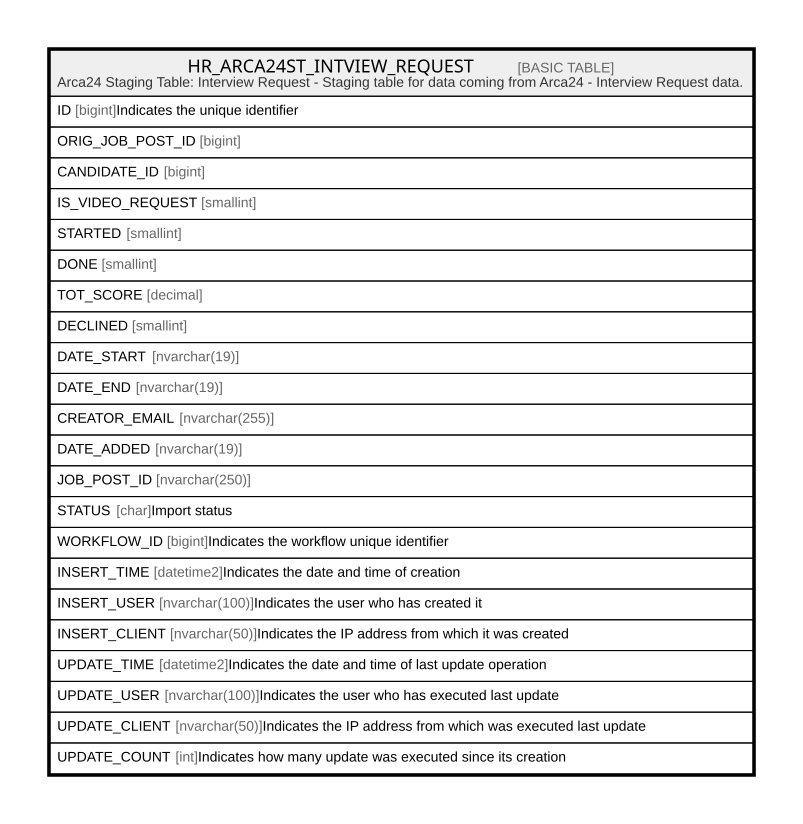

# HR_ARCA24ST_INTVIEW_REQUEST

## Description

Arca24 Staging Table: Interview Request - Staging table for data coming from Arca24 - Interview Request data.

## Columns

| Name | Type | Default | Nullable | Comment |
| ---- | ---- | ------- | -------- | ------- |
| ID | bigint |  | false | Indicates the unique identifier |
| ORIG_JOB_POST_ID | bigint |  | false |  |
| CANDIDATE_ID | bigint |  | false |  |
| IS_VIDEO_REQUEST | smallint |  | true |  |
| STARTED | smallint |  | true |  |
| DONE | smallint |  | true |  |
| TOT_SCORE | decimal |  | true |  |
| DECLINED | smallint |  | true |  |
| DATE_START | nvarchar(19) |  | true |  |
| DATE_END | nvarchar(19) |  | true |  |
| CREATOR_EMAIL | nvarchar(255) |  | true |  |
| DATE_ADDED | nvarchar(19) |  | true |  |
| JOB_POST_ID | nvarchar(250) |  | true |  |
| STATUS | char | ('I') | true | Import status |
| WORKFLOW_ID | bigint |  | true | Indicates the workflow unique identifier |
| INSERT_TIME | datetime2 |  | true | Indicates the date and time of creation |
| INSERT_USER | nvarchar(100) |  | true | Indicates the user who has created it |
| INSERT_CLIENT | nvarchar(50) |  | true | Indicates the IP address from which it was created |
| UPDATE_TIME | datetime2 |  | true | Indicates the date and time of last update operation |
| UPDATE_USER | nvarchar(100) |  | true | Indicates the user who has executed last update |
| UPDATE_CLIENT | nvarchar(50) |  | true | Indicates the IP address from which was executed last update |
| UPDATE_COUNT | int |  | false | Indicates how many update was executed since its creation |

## Constraints

| Name | Type | Definition |
| ---- | ---- | ---------- |
| PK_HR_ARCA24ST_INTVIEW_REQUEST | PRIMARY KEY | CLUSTERED, unique, part of a PRIMARY KEY constraint, [ ID ] |

## Indexes

| Name | Definition |
| ---- | ---------- |
| PK_HR_ARCA24ST_INTVIEW_REQUEST | CLUSTERED, unique, part of a PRIMARY KEY constraint, [ ID ] |
| IDX_A24ST_INTREQ_INSERT_TIME | NONCLUSTERED, [ INSERT_TIME, STATUS ] |

## Relations

---

> Generated by [tbls](https://github.com/k1LoW/tbls)
