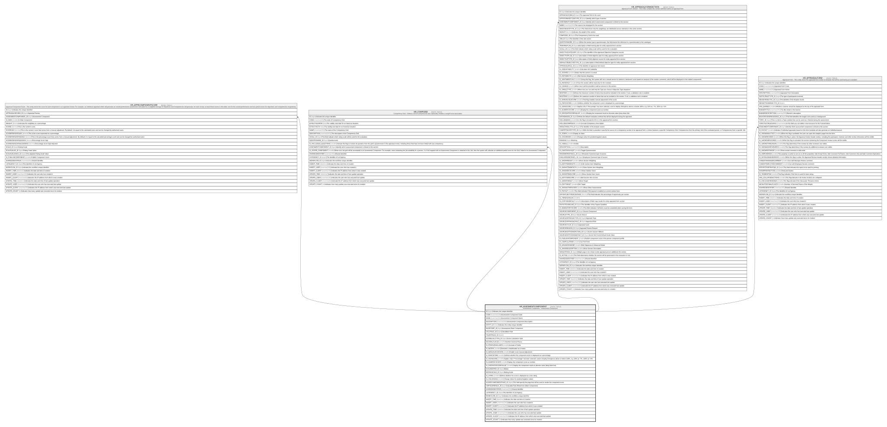

# HR_ASSESMENTCOMPONENT

## Description

Assessment Component - Assessment Component  

## Columns

| Name | Type | Default | Nullable | Children | Comment |
| ---- | ---- | ------- | -------- | -------- | ------- |
| ID | bigint |  | false | [HR_APPRCOMPONENTSCORE](HR_APPRCOMPONENTSCORE.md) [HR_COMPGRID](HR_COMPGRID.md) [HR_APPRAISALFORMSECTION](HR_APPRAISALFORMSECTION.md) [HR_APPRAISALFORM](HR_APPRAISALFORM.md) | Indicates the unique identifier |
| CODE | nvarchar(100) |  | false |  | Assessment Component Code |
| NAME | nvarchar(255) |  | false |  | Assessment Component Name. |
| DESCRIPTION | nvarchar(500) |  | true |  | Assessment Component Description. |
| ENTITY_ID | char |  | true |  | Indicates the entity unique identifier |
| BASECOMP_ID | bigint |  | true |  | Assessment Base Component |
| CALCRULE_ID | bigint |  | true |  | Calculation Rule |
| TALENTRULE_ID | bigint |  | true |  |  |
| SCORECALCTYPE_ID | bigint |  | true |  | Score Calculation Type |
| DECIMALPLACES | smallint |  | true |  | Number Decimal Places |
| IS_PROFILEINCLUDED | smallint |  | true |  | Include in Profile |
| IS_MATRIX | smallint |  | true |  | Generate a classification as a matrix |
| IS_MANUALADJSCORE | smallint |  | true |  | Enable score manual adjustment |
| IS_PERCSCORE | smallint |  | true |  | Defines whether the component score is displayed as a percentage. |
| IS_SIGNSCORE | smallint |  | true |  | Applies only if “Percentage” has been selected; used to display divergence above or below 100%, e.g. 93% as -7%, 105% as +5% |
| IS_NUMERICSCORE | smallint |  | true |  | Display the component score as number. |
| IS_DISCRATESCOREVALUE | smallint |  | true |  | Display the component result as discrete value (drop down list). |
| SCALEMATRIX_ID | bigint |  | true |  | Matrix |
| RATINGSCALE_ID | bigint |  | true |  | Rating Scale |
| IS_STARS | smallint |  | true |  | Defines whether the score is displayed as a star rating. |
| IS_COLORSIGN | smallint |  | true |  | Change colour for positive/negative values |
| SCORECOMPONENTPAGE_ID | bigint |  | true |  | This field specify the page that will be used to render the component score. |
| CMPSCORERULE_ID | bigint |  | true |  | Calculate Rule (Read from Other Component) |
| SHAREDIDENTIFIER | nvarchar(255) |  | true |  | Shared Identifier |
| LISTAGENCY_ID | bigint |  | true |  | The Identifier of List Agency. |
| WORKFLOW_ID | bigint |  | true |  | Indicates the workflow unique identifier |
| INSERT_TIME | datetime2 | (sysutcdatetime()) | false |  | Indicates the date and time of creation |
| INSERT_USER | nvarchar(100) | (N'MAIN') | false |  | Indicates the user who has created it |
| INSERT_CLIENT | nvarchar(50) | (N'localhost') | false |  | Indicates the IP address from which it was created |
| UPDATE_TIME | datetime2 | (sysutcdatetime()) | false |  | Indicates the date and time of last update operation |
| UPDATE_USER | nvarchar(100) | (N'MAIN') | false |  | Indicates the user who has executed last update |
| UPDATE_CLIENT | nvarchar(50) | (N'localhost') | false |  | Indicates the IP address from which was executed last update |
| UPDATE_COUNT | int | ((0)) | false |  | Indicates how many update was executed since its creation |

## Constraints

| Name | Type | Definition |
| ---- | ---- | ---------- |
| PK_HR_ASSESMENTCOMPONENT | PRIMARY KEY | CLUSTERED, unique, part of a PRIMARY KEY constraint, [ ID ] |
| UQ_ASSESMCOMPONENT | UNIQUE | NONCLUSTERED, unique, part of a UNIQUE constraint, [ CODE ] |

## Indexes

| Name | Definition |
| ---- | ---------- |
| PK_HR_ASSESMENTCOMPONENT | CLUSTERED, unique, part of a PRIMARY KEY constraint, [ ID ] |
| UQ_ASSESMCOMPONENT | NONCLUSTERED, unique, part of a UNIQUE constraint, [ CODE ] |

## Relations

---

> Generated by [tbls](https://github.com/k1LoW/tbls)
