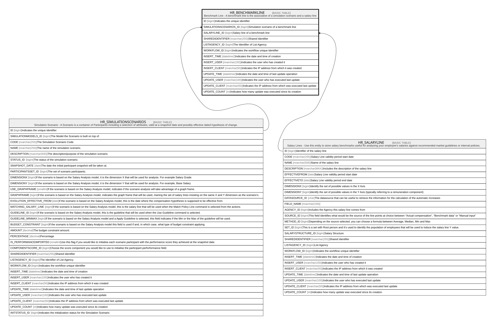

# HR_BENCHMARKLINE

## Description

Benchmark Line - A benchmark line is the associative of a simulation scenario and a salary line  

## Columns

| Name | Type | Default | Nullable | Parents | Comment |
| ---- | ---- | ------- | -------- | ------- | ------- |
| ID | bigint |  | false |  | Indicates the unique identifier |
| SIMULATIONSCENARIOS_ID | bigint |  | true | [HR_SIMULATIONSCENARIOS](HR_SIMULATIONSCENARIOS.md) | Simulation scenario of a benchmark line |
| SALARYLINE_ID | bigint |  | true | [HR_SALARYLINE](HR_SALARYLINE.md) | Salary line of a benchmark line |
| SHAREDIDENTIFIER | nvarchar(255) |  | true |  | Shared Identifier |
| LISTAGENCY_ID | bigint |  | true |  | The Identifier of List Agency. |
| WORKFLOW_ID | bigint |  | true |  | Indicates the workflow unique identifier |
| INSERT_TIME | datetime2 |  | false |  | Indicates the date and time of creation |
| INSERT_USER | nvarchar(100) |  | false |  | Indicates the user who has created it |
| INSERT_CLIENT | nvarchar(50) |  | false |  | Indicates the IP address from which it was created |
| UPDATE_TIME | datetime2 |  | false |  | Indicates the date and time of last update operation |
| UPDATE_USER | nvarchar(100) |  | false |  | Indicates the user who has executed last update |
| UPDATE_CLIENT | nvarchar(50) |  | false |  | Indicates the IP address from which was executed last update |
| UPDATE_COUNT | int |  | false |  | Indicates how many update was executed since its creation |

## Constraints

| Name | Type | Definition |
| ---- | ---- | ---------- |
| PK__HR_BENCH__3214EC27C3AAC2AF | PRIMARY KEY | CLUSTERED, unique, part of a PRIMARY KEY constraint, [ ID ] |
| UQ__HR_BENCH__1C79BB3CE18802BC | UNIQUE | NONCLUSTERED, unique, part of a UNIQUE constraint, [ SIMULATIONSCENARIOS_ID, SALARYLINE_ID ] |
| FK__HR_BENCHM__SALAR__4BCDD168 | FOREIGN KEY | FOREIGN KEY(SALARYLINE_ID) REFERENCES HR_SALARYLINE(ID) ON UPDATE NO_ACTION ON DELETE NO_ACTION |
| FK__HR_BENCHM__SIMUL__4AD9AD2F | FOREIGN KEY | FOREIGN KEY(SIMULATIONSCENARIOS_ID) REFERENCES HR_SIMULATIONSCENARIOS(ID) ON UPDATE NO_ACTION ON DELETE NO_ACTION |

## Indexes

| Name | Definition |
| ---- | ---------- |
| PK__HR_BENCH__3214EC27C3AAC2AF | CLUSTERED, unique, part of a PRIMARY KEY constraint, [ ID ] |
| UQ__HR_BENCH__1C79BB3CE18802BC | NONCLUSTERED, unique, part of a UNIQUE constraint, [ SIMULATIONSCENARIOS_ID, SALARYLINE_ID ] |

## Relations

---

> Generated by [tbls](https://github.com/k1LoW/tbls)
