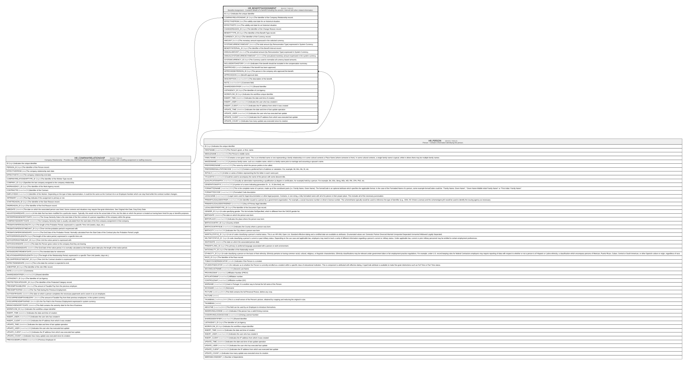

# HR_BENEFITSASSIGNMENT

## Description

Benefits Assignment - Contains details of a benefit including the amount, interval and other related information.  

## Columns

| Name | Type | Default | Nullable | Parents | Comment |
| ---- | ---- | ------- | -------- | ------- | ------- |
| ID | bigint |  | false |  | Indicates the unique identifier |
| COMPANYRELATIONSHIP_ID | bigint |  | false | [HR_COMPANYRELATIONSHIP](HR_COMPANYRELATIONSHIP.md) | The Identifier of the Company Relationship record. |
| EFFECTIVEFROM | date |  | false |  | The validity start date for an historical situation. |
| EFFECTIVETO | date |  | true |  | The validity end date for an historical situation. |
| CHANGEREASON_ID | bigint |  | true |  | The Identifier of the Change Reason record. |
| BENEFITTYPE_ID | bigint |  | false |  | The Identifier of the Benefit Type record. |
| CURRENCY_ID | bigint |  | true |  | The Identifier of the Currency record. |
| AMOUNT | decimal |  | true |  | The monetary amount expressed in the selected currency. |
| SYSTEMCURRENCYAMOUNT | decimal |  | true |  | The total amount (by Remuneration Type) expressed in System Currency. |
| BENEFITINTERVAL_ID | bigint |  | true |  | The Identifier of the Benefit Interval record. |
| ANNUALAMOUNT | decimal |  | true |  | The annualized amount (by Remuneration Type) expressed in System Currency. |
| ANNUALSYSTEMCURRENCYAMOUNT | decimal |  | true |  | The annualized monetary amount expressed in the system currency. |
| SYSTEMCURRENCY_ID | bigint |  | true |  | The Currency used to normalize all currency based amounts. |
| INCLUDEINTOHISTORY | smallint |  | true |  | Indicates if the benefit should be included in the compensation summary. |
| ISAPPROVED | smallint |  | true |  | Indicates if the benefit has been approved. |
| APPROVEDBYPERSON_ID | bigint |  | true | [HR_PERSON](HR_PERSON.md) | The person in the company who approved the benefit. |
| APPROVEDON | date |  | true |  | Benefit approval date. |
| DESCRIPTION | nvarchar(MAX) |  | true |  | The description of the benefit. |
| NOTE | nvarchar(MAX) |  | true |  | Comment field. |
| SHAREDIDENTIFIER | nvarchar(255) |  | true |  | Shared Identifier |
| LISTAGENCY_ID | bigint |  | true |  | The Identifier of List Agency. |
| WORKFLOW_ID | bigint |  | true |  | Indicates the workflow unique identifier |
| INSERT_TIME | datetime2 | (sysutcdatetime()) | false |  | Indicates the date and time of creation |
| INSERT_USER | nvarchar(100) | (N'MAIN') | false |  | Indicates the user who has created it |
| INSERT_CLIENT | nvarchar(50) | (N'localhost') | false |  | Indicates the IP address from which it was created |
| UPDATE_TIME | datetime2 | (sysutcdatetime()) | false |  | Indicates the date and time of last update operation |
| UPDATE_USER | nvarchar(100) | (N'MAIN') | false |  | Indicates the user who has executed last update |
| UPDATE_CLIENT | nvarchar(50) | (N'localhost') | false |  | Indicates the IP address from which was executed last update |
| UPDATE_COUNT | int | ((0)) | false |  | Indicates how many update was executed since its creation |

## Constraints

| Name | Type | Definition |
| ---- | ---- | ---------- |
| PK_BENEFITSASSIGNMENT | PRIMARY KEY | CLUSTERED, unique, part of a PRIMARY KEY constraint, [ ID ] |
| FK_COMPREL_BENEFITSASSIGN | FOREIGN KEY | FOREIGN KEY(COMPANYRELATIONSHIP_ID) REFERENCES HR_COMPANYRELATIONSHIP(ID) ON UPDATE NO_ACTION ON DELETE CASCADE |
| FK_PERSON_BENEFITSASSIGN | FOREIGN KEY | FOREIGN KEY(APPROVEDBYPERSON_ID) REFERENCES HR_PERSON(ID) ON UPDATE NO_ACTION ON DELETE NO_ACTION |

## Indexes

| Name | Definition |
| ---- | ---------- |
| PK_BENEFITSASSIGNMENT | CLUSTERED, unique, part of a PRIMARY KEY constraint, [ ID ] |
| IDX_BENASSIGNMENT_CHANGE | NONCLUSTERED, [ CHANGEREASON_ID ] |
| IDX_BENASSIGNMENT_COMP | NONCLUSTERED, [ BENEFITTYPE_ID ] |
| IDX_BENASSIGNMENT_CUR | NONCLUSTERED, [ CURRENCY_ID ] |
| IDX_BENASSIGNMENT_REMINT | NONCLUSTERED, [ BENEFITINTERVAL_ID ] |
| IDX_BENEFITSASSIGNMENT_S | NONCLUSTERED, [ COMPANYRELATIONSHIP_ID, EFFECTIVEFROM, EFFECTIVETO ] |

## Relations

---

> Generated by [tbls](https://github.com/k1LoW/tbls)
