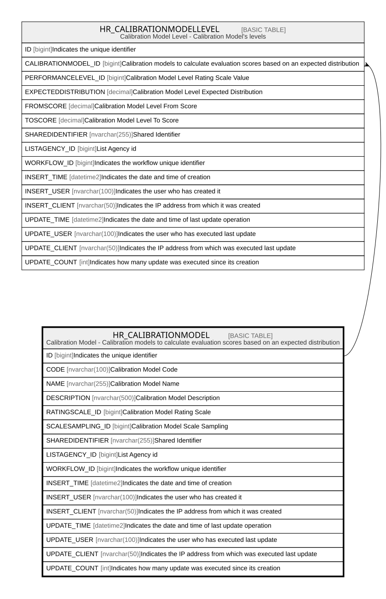

# HR_CALIBRATIONMODEL

## Description

Calibration Model - Calibration models to calculate evaluation scores based on an expected distribution  

## Columns

| Name | Type | Default | Nullable | Children | Comment |
| ---- | ---- | ------- | -------- | -------- | ------- |
| ID | bigint |  | false | [HR_CALIBRATIONMODELLEVEL](HR_CALIBRATIONMODELLEVEL.md) | Indicates the unique identifier |
| CODE | nvarchar(100) |  | true |  | Calibration Model Code |
| NAME | nvarchar(255) |  | true |  | Calibration Model Name |
| DESCRIPTION | nvarchar(500) |  | true |  | Calibration Model Description |
| RATINGSCALE_ID | bigint |  | true |  | Calibration Model Rating Scale |
| SCALESAMPLING_ID | bigint |  | true |  | Calibration Model Scale Sampling |
| SHAREDIDENTIFIER | nvarchar(255) |  | true |  | Shared Identifier |
| LISTAGENCY_ID | bigint |  | true |  | List Agency id |
| WORKFLOW_ID | bigint |  | true |  | Indicates the workflow unique identifier |
| INSERT_TIME | datetime2 |  | false |  | Indicates the date and time of creation |
| INSERT_USER | nvarchar(100) |  | false |  | Indicates the user who has created it |
| INSERT_CLIENT | nvarchar(50) |  | false |  | Indicates the IP address from which it was created |
| UPDATE_TIME | datetime2 |  | false |  | Indicates the date and time of last update operation |
| UPDATE_USER | nvarchar(100) |  | false |  | Indicates the user who has executed last update |
| UPDATE_CLIENT | nvarchar(50) |  | false |  | Indicates the IP address from which was executed last update |
| UPDATE_COUNT | int |  | false |  | Indicates how many update was executed since its creation |

## Constraints

| Name | Type | Definition |
| ---- | ---- | ---------- |
| PK__HR_CALIB__3214EC27820F822A | PRIMARY KEY | CLUSTERED, unique, part of a PRIMARY KEY constraint, [ ID ] |
| UQ_CALIBRATIONMODEL | UNIQUE | NONCLUSTERED, unique, part of a UNIQUE constraint, [ CODE ] |

## Indexes

| Name | Definition |
| ---- | ---------- |
| PK__HR_CALIB__3214EC27820F822A | CLUSTERED, unique, part of a PRIMARY KEY constraint, [ ID ] |
| UQ_CALIBRATIONMODEL | NONCLUSTERED, unique, part of a UNIQUE constraint, [ CODE ] |
| IDX_SCALESAMPLING | NONCLUSTERED, [ SCALESAMPLING_ID ] |

## Relations

---

> Generated by [tbls](https://github.com/k1LoW/tbls)
