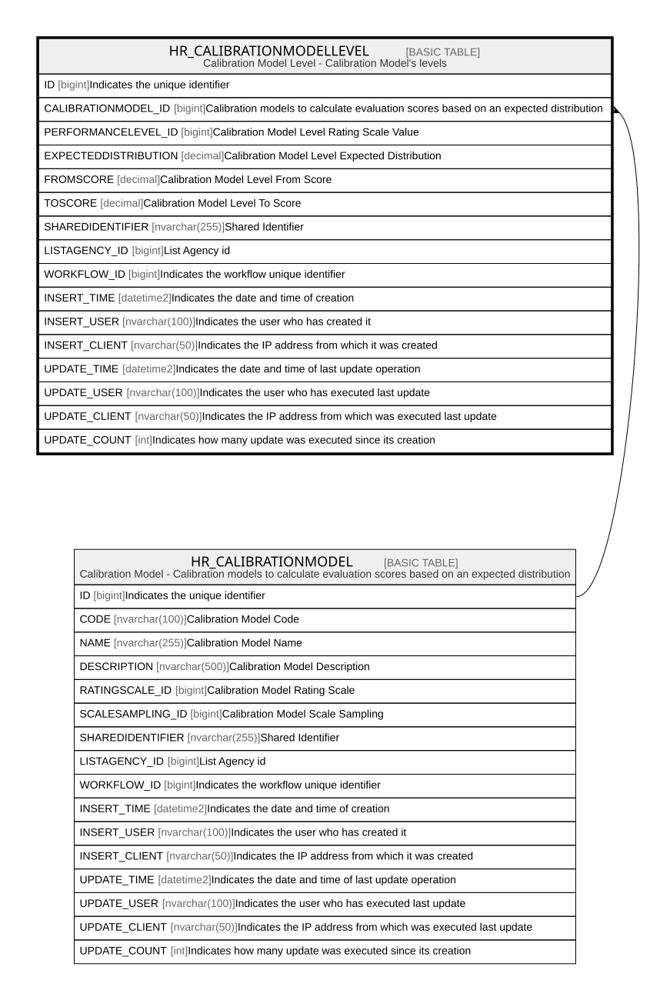

# HR_CALIBRATIONMODELLEVEL

## Description

Calibration Model Level - Calibration Model's levels  

## Columns

| Name | Type | Default | Nullable | Parents | Comment |
| ---- | ---- | ------- | -------- | ------- | ------- |
| ID | bigint |  | false |  | Indicates the unique identifier |
| CALIBRATIONMODEL_ID | bigint |  | false | [HR_CALIBRATIONMODEL](HR_CALIBRATIONMODEL.md) | Calibration models to calculate evaluation scores based on an expected distribution |
| PERFORMANCELEVEL_ID | bigint |  | true |  | Calibration Model Level Rating Scale Value |
| EXPECTEDDISTRIBUTION | decimal |  | true |  | Calibration Model Level Expected Distribution |
| FROMSCORE | decimal |  | true |  | Calibration Model Level From Score |
| TOSCORE | decimal |  | true |  | Calibration Model Level To Score |
| SHAREDIDENTIFIER | nvarchar(255) |  | true |  | Shared Identifier |
| LISTAGENCY_ID | bigint |  | true |  | List Agency id |
| WORKFLOW_ID | bigint |  | true |  | Indicates the workflow unique identifier |
| INSERT_TIME | datetime2 |  | false |  | Indicates the date and time of creation |
| INSERT_USER | nvarchar(100) |  | false |  | Indicates the user who has created it |
| INSERT_CLIENT | nvarchar(50) |  | false |  | Indicates the IP address from which it was created |
| UPDATE_TIME | datetime2 |  | false |  | Indicates the date and time of last update operation |
| UPDATE_USER | nvarchar(100) |  | false |  | Indicates the user who has executed last update |
| UPDATE_CLIENT | nvarchar(50) |  | false |  | Indicates the IP address from which was executed last update |
| UPDATE_COUNT | int |  | false |  | Indicates how many update was executed since its creation |

## Constraints

| Name | Type | Definition |
| ---- | ---- | ---------- |
| PK__HR_CALIB__3214EC278C978E79 | PRIMARY KEY | CLUSTERED, unique, part of a PRIMARY KEY constraint, [ ID ] |
| UQ__HR_CALIB__1802762B73A4F195 | UNIQUE | NONCLUSTERED, unique, part of a UNIQUE constraint, [ CALIBRATIONMODEL_ID, PERFORMANCELEVEL_ID ] |
| FK__HR_CALIBR__CALIB__01D4DC5E | FOREIGN KEY | FOREIGN KEY(CALIBRATIONMODEL_ID) REFERENCES HR_CALIBRATIONMODEL(ID) ON UPDATE NO_ACTION ON DELETE NO_ACTION |

## Indexes

| Name | Definition |
| ---- | ---------- |
| PK__HR_CALIB__3214EC278C978E79 | CLUSTERED, unique, part of a PRIMARY KEY constraint, [ ID ] |
| UQ__HR_CALIB__1802762B73A4F195 | NONCLUSTERED, unique, part of a UNIQUE constraint, [ CALIBRATIONMODEL_ID, PERFORMANCELEVEL_ID ] |

## Relations

---

> Generated by [tbls](https://github.com/k1LoW/tbls)
