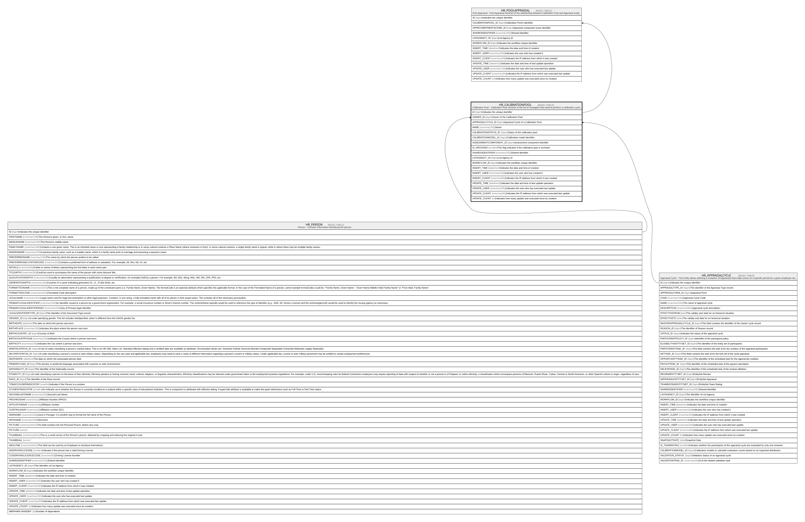

# HR_CALIBRATIONPOOL

## Description

Calibration Pool - Calibration Pool consists of the list of managers that need to perform a calibration cycle.  

## Columns

| Name | Type | Default | Nullable | Children | Parents | Comment |
| ---- | ---- | ------- | -------- | -------- | ------- | ------- |
| ID | bigint |  | false | [HR_POOLAPPRAISAL](HR_POOLAPPRAISAL.md) |  | Indicates the unique identifier |
| OWNER_ID | bigint |  | true |  | [HR_PERSON](HR_PERSON.md) | Owner of the Calibration Pool. |
| APPRAISALCYCLE_ID | bigint |  | true |  | [HR_APPRAISALCYCLE](HR_APPRAISALCYCLE.md) | Appraisal Cycle of a Calibration Pool |
| NAME | nvarchar(250) |  | true |  |  | Name |
| CALIBRATIONSTATUS_ID | bigint |  | true |  |  | Status of the calibration pool |
| CALIBRATIONMODEL_ID | bigint |  | true |  |  | Calibration model identifier |
| ASSESSMENTCOMPONENT_ID | bigint |  | true |  |  | Assessment component identifier |
| IS_ARCHIVED | smallint |  | true |  |  | This flag indicates if the calibration pool is archived. |
| SHAREDIDENTIFIER | nvarchar(255) |  | true |  |  | Shared Identifier |
| LISTAGENCY_ID | bigint |  | true |  |  | List Agency id |
| WORKFLOW_ID | bigint |  | true |  |  | Indicates the workflow unique identifier |
| INSERT_TIME | datetime2 |  | false |  |  | Indicates the date and time of creation |
| INSERT_USER | nvarchar(100) |  | false |  |  | Indicates the user who has created it |
| INSERT_CLIENT | nvarchar(50) |  | false |  |  | Indicates the IP address from which it was created |
| UPDATE_TIME | datetime2 |  | false |  |  | Indicates the date and time of last update operation |
| UPDATE_USER | nvarchar(100) |  | false |  |  | Indicates the user who has executed last update |
| UPDATE_CLIENT | nvarchar(50) |  | false |  |  | Indicates the IP address from which was executed last update |
| UPDATE_COUNT | int |  | false |  |  | Indicates how many update was executed since its creation |

## Constraints

| Name | Type | Definition |
| ---- | ---- | ---------- |
| PK_HR_CALIBRATIONPOOL | PRIMARY KEY | CLUSTERED, unique, part of a PRIMARY KEY constraint, [ ID ] |
| FK_CALIBPOOL_APPRAISAL_CYCLE | FOREIGN KEY | FOREIGN KEY(APPRAISALCYCLE_ID) REFERENCES HR_APPRAISALCYCLE(ID) ON UPDATE NO_ACTION ON DELETE NO_ACTION |
| FK_CALIBPOOL_OWNER | FOREIGN KEY | FOREIGN KEY(OWNER_ID) REFERENCES HR_PERSON(ID) ON UPDATE NO_ACTION ON DELETE NO_ACTION |

## Indexes

| Name | Definition |
| ---- | ---------- |
| PK_HR_CALIBRATIONPOOL | CLUSTERED, unique, part of a PRIMARY KEY constraint, [ ID ] |

## Relations

---

> Generated by [tbls](https://github.com/k1LoW/tbls)
