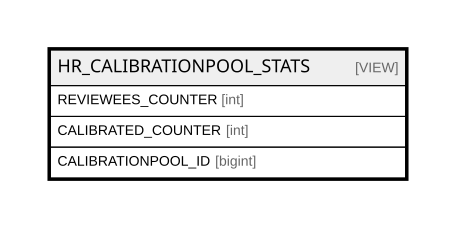

# HR_CALIBRATIONPOOL_STATS

## Description

<details>
<summary><strong>Table Definition</strong></summary>

```sql
-- Talentia Software - All right reserved
-- Type: VIEW                     Name: HR_CALIBRATIONPOOL_STATS
-- Date: 09-04-2026 07:27:59 (UTC)
-- 
-- ChangeLogId: 00000000-0000-0000-0000-000000000000
-- ChangeSetId: ebf0670f-79ed-470f-a5a1-b508d04e35cb
-- Original file name: C:\repos\Talentia-Software\hcm-core/DB/ProductDB/EDM\Schema\Views\HR_CALIBRATIONPOOL_STATS.xml


CREATE VIEW [HR_CALIBRATIONPOOL_STATS]
 ( REVIEWEES_COUNTER, CALIBRATED_COUNTER, CALIBRATIONPOOL_ID ) 
 AS 
( 
					select
					coalesce(REVIEWEES_COUNTER, 0) REVIEWEES_COUNTER,
					coalesce(CALIBRATED_COUNTER, 0) AS CALIBRATED_COUNTER,
					HR_CALIBRATIONPOOL.id as CALIBRATIONPOOL_ID
					from HR_CALIBRATIONPOOL
					left join (select count(HR_POOLAPPRAISAL.CALIBRATIONPOOL_ID) REVIEWEES_COUNTER,  CALIBRATIONPOOL_ID FROM HR_POOLAPPRAISAL group by CALIBRATIONPOOL_ID) as REVIEWEES_COUNTER on (HR_CALIBRATIONPOOL.ID = REVIEWEES_COUNTER.CALIBRATIONPOOL_ID)
					left join (
					select count(HR_POOLAPPRAISAL.CALIBRATIONPOOL_ID) CALIBRATED_COUNTER, HR_POOLAPPRAISAL.CALIBRATIONPOOL_ID
					FROM HR_POOLAPPRAISAL
					INNER JOIN HR_APPRCOMPONENTSCORE ON HR_APPRCOMPONENTSCORE.ID = HR_POOLAPPRAISAL.APPRCOMPONENTSCORE_ID
					INNER JOIN HR_APPRSCORECALIBRATION ON HR_APPRSCORECALIBRATION.APPRCOMPONENTSCORE_ID = HR_APPRCOMPONENTSCORE.ID
					WHERE 1=(CASE WHEN HR_APPRSCORECALIBRATION.NUMERICSCORE <> HR_APPRSCORECALIBRATION.NUMERICSCORE_ORI THEN 1
       WHEN HR_APPRSCORECALIBRATION.SCOREPERCENTAGE <> HR_APPRSCORECALIBRATION.SCOREPERCENTAGE_ORI THEN 1
       WHEN HR_APPRSCORECALIBRATION.SCALEVALUE_ID <> HR_APPRSCORECALIBRATION.SCALEVALUE_ID_ORI THEN 1
       ELSE 0 END)
	   group by HR_POOLAPPRAISAL.CALIBRATIONPOOL_ID) as CALIBRATED_COUNTER on (HR_CALIBRATIONPOOL.ID = CALIBRATED_COUNTER.CALIBRATIONPOOL_ID) )

```

</details>

## Columns

| Name | Type | Default | Nullable | Comment |
| ---- | ---- | ------- | -------- | ------- |
| REVIEWEES_COUNTER | int |  | true |  |
| CALIBRATED_COUNTER | int |  | true |  |
| CALIBRATIONPOOL_ID | bigint |  | false |  |

## Referenced Tables

| Name | Columns | Comment | Type |
| ---- | ------- | ------- | ---- |
| [HR_CALIBRATIONPOOL](HR_CALIBRATIONPOOL.md) | 18 | Calibration Pool - Calibration Pool consists of the list of managers that need to perform a calibration cycle.<br /> | BASIC TABLE |
| [HR_POOLAPPRAISAL](HR_POOLAPPRAISAL.md) | 13 | Pool Appraisal - Pool Appraisal consists of the relationship between Calibration Pool and Appraisal entity.<br /> | BASIC TABLE |
| [HR_APPRCOMPONENTSCORE](HR_APPRCOMPONENTSCORE.md) | 25 | Appraisal Component Score - This entity stores the score for each component in an appraisal review. For example, an individual appraisal which will generate an overall performance assessment calculated as a weighted average of Objectives and Competencies will generate, for each review, at least three scores in this table: one for the overall performance and two partial scores for objectives and competencies respectively. | BASIC TABLE |
| [HR_APPRSCORECALIBRATION](HR_APPRSCORECALIBRATION.md) | 21 | Appraisal Score Calibration - Appraisal score calibration<br /> | BASIC TABLE |

## Relations



---

> Generated by [tbls](https://github.com/k1LoW/tbls)
