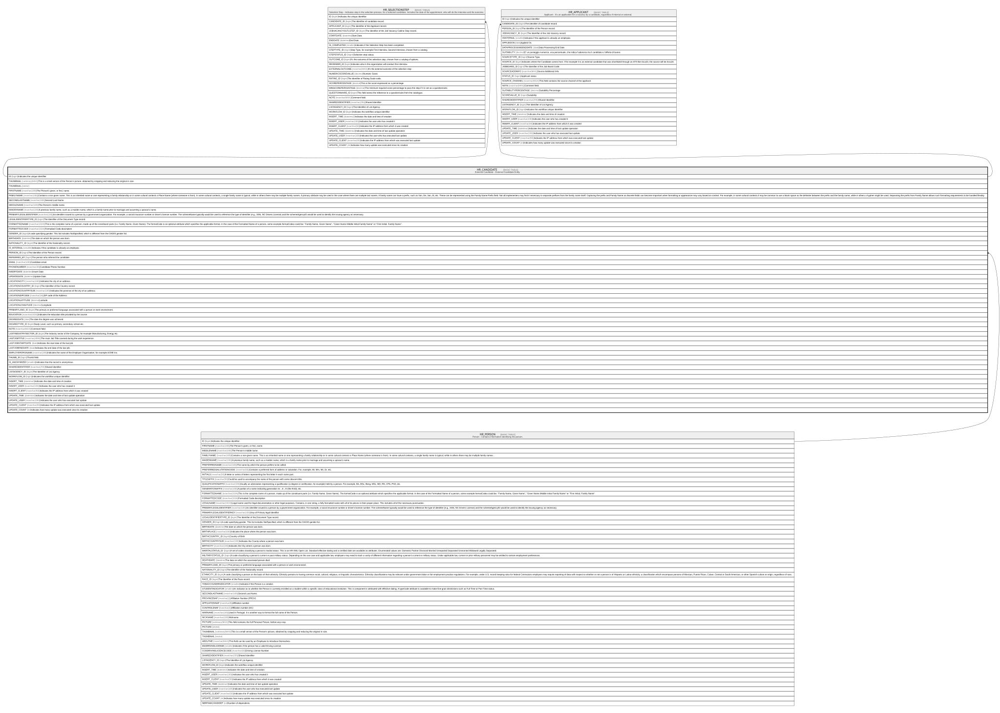

# HR_CANDIDATE

## Description

External Candidate - External Candidate Entity.  

## Columns

| Name | Type | Default | Nullable | Children | Parents | Comment |
| ---- | ---- | ------- | -------- | -------- | ------- | ------- |
| ID | bigint |  | false | [HR_SELECTIONSTEP](HR_SELECTIONSTEP.md) [HR_APPLICANT](HR_APPLICANT.md) |  | Indicates the unique identifier |
| THUMBNAIL | varbinary(MAX) |  | true |  |  | This is a small verson of the Person's picture, obtained by cropping and reducing the original in size. |
| THUMBNAIL | vector |  | true |  |  |  |
| FIRSTNAME | nvarchar(100) |  | true |  |  | The Person's given, or first, name. |
| FAMILYNAME | nvarchar(100) |  | true |  |  | Contains a non-given name. This is an inherited name or one representing a family relationship or in some cultural contexts a Place Name (where someone is from). In some cultural contexts, a single family name is typical, while in others there may be multiple family names. A primary attribute may be used in the case where there are multiple last names. A family name can have a prefix, such as Von, De, Van, Al, etc. These can be represented using the Family Name Prefix field. Not all implementers may find it necessary to separate prefixes from the family name itself. Capturing the prefix and Family Name as discrete fields can become important when formatting or appearance may vary based on context. For example, in some cultural contexts it may be common to use a blank space as the delimiter between the prefix and the family name, while in others a hyphen might be used. Separating the prefix from Family Name allows such formatting requirements to be handled flexibly. |
| SECONDLASTNAME | nvarchar(100) |  | true |  |  | Second Last Name. |
| MIDDLENAME | nvarchar(100) |  | true |  |  | The Person's middle name. |
| MAIDENNAME | nvarchar(100) |  | true |  |  | A previous family name, such as a maiden name, which is a family name prior to marriage and assuming a spouse's name. |
| PRIMARYLEGALIDENTIFIER | nvarchar(100) |  | true |  |  | An identifier issued to a person by a government organization. For example, a social insurance number or driver's license number. The schemeName typically would be used to reference the type of identifier (e.g., SSN, NC Drivers License) and the schemeAgencyID would be used to identify the issuing agency as necessary. |
| LEGALIDENTIFIERTYPE_ID | bigint |  | true |  |  | The Identifier of the Document Type record. |
| FORMATTEDNAME | nvarchar(1024) |  | true |  |  | This is the complete name of a person, made up of the constituent parts (i.e. Family Name, Given Name). The formatCode is an optional attribute which specifies the applicable format. In the case of the Formatted Name of a person, some example formatCodes could be: ''Family Name, Given Name'', ''Given Name Middle Initial Family Name'' or ''First Initial. Family Name''. |
| FORMATTEDCODE | nvarchar(1024) |  | true |  |  | Formatted Code description |
| GENDER_ID | bigint |  | true |  |  | A code specifying gender. This list includes NotSpecified, which is different from the OAGIS gender list. |
| BIRTHDATE | datetime |  | true |  |  | The date on which the person was born. |
| NATIONALITY_ID | bigint |  | true |  |  | The Identifier of the Nationality record. |
| IS_INTERNAL | smallint |  | true |  |  | Indicates if the candidate is already an employee. |
| PERSON_ID | bigint |  | true |  | [HR_PERSON](HR_PERSON.md) | The Identifier of the Person record. |
| REFERRED_BY | bigint |  | true |  |  | The person who referred the candidate. |
| EMAIL | nvarchar(100) |  | true |  |  | Candidate email. |
| PHONENUMBER | nvarchar(30) |  | true |  |  | Candidate Phone Number. |
| INSERTDATE | datetime |  | true |  |  | Insert Date. |
| UPDATEDATE | datetime |  | true |  |  | Update Date. |
| LOCATIONCITY | nvarchar(100) |  | true |  |  | Indicates the city of an address. |
| LOCATIONCOUNTRY_ID | bigint |  | true |  |  | The Identifier of the Country record. |
| LOCATIONCOUNTRYSUB | nvarchar(100) |  | true |  |  | Indicates the province of the city of an address. |
| LOCATIONZIPCODE | nvarchar(16) |  | true |  |  | ZIP code of the Address. |
| LOCATIONLATITUDE | decimal |  | true |  |  | Latitude |
| LOCATIONLONGITUDE | decimal |  | true |  |  | Longitude |
| PRIMARYLANG_ID | bigint |  | true |  |  | The primary or preferred language associated with a person or work environment. |
| EDUCATION | nvarchar(1024) |  | true |  |  | Indicates the education title provided by the course. |
| DEGREEDATE | date |  | true |  |  | The date the degree was achieved. |
| DEGREETYPE_ID | bigint |  | true |  |  | Study Level, such as primary, secondary school etc. |
| NOTE | nvarchar(MAX) |  | true |  |  | Comment field. |
| LASTINDUSTRYSECTOR_ID | bigint |  | true |  |  | The Industry sector of the Company, for example Manufacturing, Energy etc. |
| LASTJOBTITLE | nvarchar(2000) |  | true |  |  | The main Job Title covered during the work experience. |
| LASTJOBSTARTDATE | date |  | true |  |  | Indicates the start date of the last job. |
| LASTJOBENDDATE | date |  | true |  |  | Indicates the end date of the last job. |
| EMPLOYERORGNAME | nvarchar(100) |  | true |  |  | Indicates the name of the Employer Organisation, for example ACME Inc. |
| THUMB_ID | bigint |  | true |  |  | Thumb field. |
| IS_ANONYMIZED | smallint |  | true |  |  | Indicates that the record is anonymous. |
| SHAREDIDENTIFIER | nvarchar(255) |  | true |  |  | Shared Identifier |
| LISTAGENCY_ID | bigint |  | true |  |  | The Identifier of List Agency. |
| WORKFLOW_ID | bigint |  | true |  |  | Indicates the workflow unique identifier |
| INSERT_TIME | datetime2 | (sysutcdatetime()) | false |  |  | Indicates the date and time of creation |
| INSERT_USER | nvarchar(100) | (N'MAIN') | false |  |  | Indicates the user who has created it |
| INSERT_CLIENT | nvarchar(50) | (N'localhost') | false |  |  | Indicates the IP address from which it was created |
| UPDATE_TIME | datetime2 | (sysutcdatetime()) | false |  |  | Indicates the date and time of last update operation |
| UPDATE_USER | nvarchar(100) | (N'MAIN') | false |  |  | Indicates the user who has executed last update |
| UPDATE_CLIENT | nvarchar(50) | (N'localhost') | false |  |  | Indicates the IP address from which was executed last update |
| UPDATE_COUNT | int | ((0)) | false |  |  | Indicates how many update was executed since its creation |

## Constraints

| Name | Type | Definition |
| ---- | ---- | ---------- |
| PK_HR_CANDIDATE | PRIMARY KEY | CLUSTERED, unique, part of a PRIMARY KEY constraint, [ ID ] |
| FK_HR_CANDIDATE_HR_PERSON | FOREIGN KEY | FOREIGN KEY(PERSON_ID) REFERENCES HR_PERSON(ID) ON UPDATE NO_ACTION ON DELETE SET_NULL |

## Indexes

| Name | Definition |
| ---- | ---------- |
| PK_HR_CANDIDATE | CLUSTERED, unique, part of a PRIMARY KEY constraint, [ ID ] |
| IDX_CANDIDATE_SHRID_AGEN | NONCLUSTERED, [ SHAREDIDENTIFIER, LISTAGENCY_ID ] |

## Relations

---

> Generated by [tbls](https://github.com/k1LoW/tbls)
