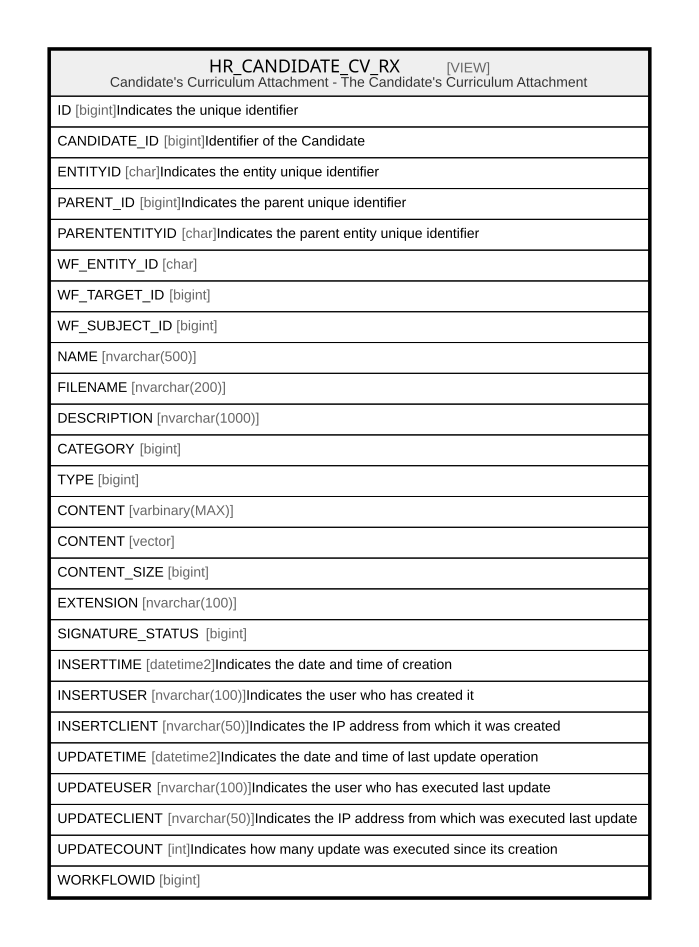

# HR_CANDIDATE_CV_RX

## Description

Candidate's Curriculum Attachment - The Candidate's Curriculum Attachment  


<details>
<summary><strong>Table Definition</strong></summary>

```sql
-- Talentia Software - All right reserved
-- Type: VIEW                     Name: HR_CANDIDATE_CV_RX
-- Date: 09-04-2026 07:27:59 (UTC)
-- 
-- ChangeLogId: 00000000-0000-0000-0000-000000000000
-- ChangeSetId: aec39514-08d0-4f77-b168-6265d284b90f
-- Original file name: C:\repos\Talentia-Software\hcm-core/DB/ProductDB/EDM\Schema\Views\HR_LASTCANDIDATE_CV_RX.xml


CREATE VIEW [HR_CANDIDATE_CV_RX]
 ( ID, CANDIDATE_ID, ENTITYID, PARENT_ID, PARENTENTITYID, WF_ENTITY_ID, WF_TARGET_ID, WF_SUBJECT_ID, NAME, FILENAME, DESCRIPTION, CATEGORY, TYPE, CONTENT, CONTENT_SIZE, EXTENSION, SIGNATURE_STATUS, INSERTTIME, INSERTUSER, INSERTCLIENT, UPDATETIME, UPDATEUSER, UPDATECLIENT, UPDATECOUNT, WORKFLOWID ) 
 AS 
( SELECT  TF_RESOURCES.ID AS ID, HR_CANDIDATE.ID AS CANDIDATE_ID, TF_RESOURCES.ENTITY_ID AS ENTITYID, TF_RESOURCES.PARENT_ID AS PARENT_ID, TF_RESOURCES.PARENT_ENTITY_ID AS PARENTENTITYID, TF_RESOURCES.WF_ENTITY_ID AS WF_ENTITY_ID, TF_RESOURCES.WF_TARGET_ID AS WF_TARGET_ID, TF_RESOURCES.WF_SUBJECT_ID AS WF_SUBJECT_ID, TF_RESOURCES.NAME AS NAME, TF_RESOURCES.FILENAME AS FILENAME, TF_RESOURCES.DESCRIPTION AS DESCRIPTION, TF_RESOURCES.CATEGORY AS CATEGORY, TF_RESOURCES.TYPE AS TYPE, TF_RESOURCES.CONTENT AS CONTENT, TF_RESOURCES.CONTENT_SIZE AS CONTENT_SIZE, TF_RESOURCES.EXTENSION AS EXTENSION, TF_RESOURCES.SIGNATURE_STATUS AS SIGNATURE_STATUS, TF_RESOURCES.INSERT_TIME AS INSERTTIME, TF_RESOURCES.INSERT_USER AS INSERTUSER, TF_RESOURCES.INSERT_CLIENT AS INSERTCLIENT, TF_RESOURCES.UPDATE_TIME AS UPDATETIME, TF_RESOURCES.UPDATE_USER AS UPDATEUSER, TF_RESOURCES.UPDATE_CLIENT AS UPDATECLIENT, TF_RESOURCES.UPDATE_COUNT AS UPDATECOUNT, TF_RESOURCES.WORKFLOW_ID AS WORKFLOWID
					FROM TF_RESOURCES
					INNER JOIN HR_CANDIDATE
					ON (TF_RESOURCES.PARENT_ID = HR_CANDIDATE.ID
					AND TF_RESOURCES.PARENT_ENTITY_ID IN ('974f4d51-facf-489f-8708-d5c004715a87', '1ad3bed5-f999-41ea-a123-c24971f46d83'))
					OR (TF_RESOURCES.PARENT_ID = HR_CANDIDATE.PERSON_ID
					AND TF_RESOURCES.PARENT_ENTITY_ID = '21b23c99-4824-49eb-aed9-e005290b9804')
					WHERE TF_RESOURCES.CATEGORY = 1108593
					AND TF_RESOURCES.UPDATE_TIME = (SELECT MAX(INSERT_TIME)
					FROM TF_RESOURCES AS SUB
					WHERE SUB.PARENT_ID = TF_RESOURCES.PARENT_ID
					AND SUB.CATEGORY = 1108593)
				 )

```

</details>

## Columns

| Name | Type | Default | Nullable | Comment |
| ---- | ---- | ------- | -------- | ------- |
| ID | bigint |  | false | Indicates the unique identifier |
| CANDIDATE_ID | bigint |  | false | Identifier of the Candidate |
| ENTITYID | char |  | false | Indicates the entity unique identifier |
| PARENT_ID | bigint |  | false | Indicates the parent unique identifier |
| PARENTENTITYID | char |  | false | Indicates the parent entity unique identifier |
| WF_ENTITY_ID | char |  | true |  |
| WF_TARGET_ID | bigint |  | true |  |
| WF_SUBJECT_ID | bigint |  | true |  |
| NAME | nvarchar(500) |  | true |  |
| FILENAME | nvarchar(200) |  | true |  |
| DESCRIPTION | nvarchar(1000) |  | false |  |
| CATEGORY | bigint |  | true |  |
| TYPE | bigint |  | true |  |
| CONTENT | varbinary(MAX) |  | true |  |
| CONTENT | vector |  | true |  |
| CONTENT_SIZE | bigint |  | true |  |
| EXTENSION | nvarchar(100) |  | true |  |
| SIGNATURE_STATUS | bigint |  | false |  |
| INSERTTIME | datetime2 |  | false | Indicates the date and time of creation |
| INSERTUSER | nvarchar(100) |  | false | Indicates the user who has created it |
| INSERTCLIENT | nvarchar(50) |  | false | Indicates the IP address from which it was created |
| UPDATETIME | datetime2 |  | false | Indicates the date and time of last update operation |
| UPDATEUSER | nvarchar(100) |  | false | Indicates the user who has executed last update |
| UPDATECLIENT | nvarchar(50) |  | false | Indicates the IP address from which was executed last update |
| UPDATECOUNT | int |  | false | Indicates how many update was executed since its creation |
| WORKFLOWID | bigint |  | true |  |

## Referenced Tables

| Name | Columns | Comment | Type |
| ---- | ------- | ------- | ---- |
| [TF_RESOURCES](TF_RESOURCES.md) | 25 |  | BASIC TABLE |
| [HR_CANDIDATE](HR_CANDIDATE.md) | 50 | External Candidate - External Candidate Entity.<br /> | BASIC TABLE |

## Relations



---

> Generated by [tbls](https://github.com/k1LoW/tbls)
