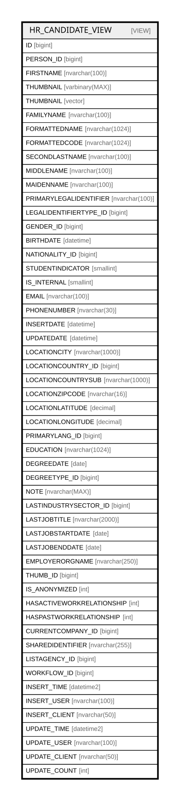

# HR_CANDIDATE_VIEW

## Description

<details>
<summary><strong>Table Definition</strong></summary>

```sql
-- Talentia Software - All right reserved
-- Type: VIEW                     Name: HR_CANDIDATE_VIEW
-- Date: 09-04-2026 07:27:59 (UTC)
-- 
-- ChangeLogId: 00000000-0000-0000-0000-000000000000
-- ChangeSetId: 50c72a5b-ca59-4c31-aa62-c5dbea2991ed
-- Original file name: C:\repos\Talentia-Software\hcm-core/DB/ProductDB/EDM\Schema\Views\HR_CANDIDATE_VIEW.xml


CREATE VIEW [HR_CANDIDATE_VIEW]
 ( ID, PERSON_ID, FIRSTNAME, THUMBNAIL, FAMILYNAME, FORMATTEDNAME, FORMATTEDCODE, SECONDLASTNAME, MIDDLENAME, MAIDENNAME, PRIMARYLEGALIDENTIFIER, LEGALIDENTIFIERTYPE_ID, GENDER_ID, BIRTHDATE, NATIONALITY_ID, STUDENTINDICATOR, IS_INTERNAL, EMAIL, PHONENUMBER, INSERTDATE, UPDATEDATE, LOCATIONCITY, LOCATIONCOUNTRY_ID, LOCATIONCOUNTRYSUB, LOCATIONZIPCODE, LOCATIONLATITUDE, LOCATIONLONGITUDE, PRIMARYLANG_ID, EDUCATION, DEGREEDATE, DEGREETYPE_ID, NOTE, LASTINDUSTRYSECTOR_ID, LASTJOBTITLE, LASTJOBSTARTDATE, LASTJOBENDDATE, EMPLOYERORGNAME, THUMB_ID, IS_ANONYMIZED, HASACTIVEWORKRELATIONSHIP, HASPASTWORKRELATIONSHIP, CURRENTCOMPANY_ID, SHAREDIDENTIFIER, LISTAGENCY_ID, WORKFLOW_ID, INSERT_TIME, INSERT_USER, INSERT_CLIENT, UPDATE_TIME, UPDATE_USER, UPDATE_CLIENT, UPDATE_COUNT ) 
 AS 
( 
                  SELECT
                  HR_CANDIDATE.ID AS ID,
                  HR_CANDIDATE.PERSON_ID AS PERSON_ID,
                  ((CASE WHEN HR_CANDIDATE.PERSON_ID IS NULL THEN HR_CANDIDATE.FIRSTNAME ELSE PERSON.FIRSTNAME END)) AS FIRSTNAME,
                  ((CASE WHEN HR_CANDIDATE.PERSON_ID IS NULL THEN HR_CANDIDATE.THUMBNAIL ELSE PERSON.THUMBNAIL END)) AS THUMBNAIL,
                  ((CASE WHEN HR_CANDIDATE.PERSON_ID IS NULL THEN HR_CANDIDATE.FAMILYNAME ELSE PERSON.FAMILYNAME END)) AS FAMILYNAME,
                  ((CASE WHEN HR_CANDIDATE.PERSON_ID IS NULL THEN HR_CANDIDATE.FORMATTEDNAME ELSE PERSON.FORMATTEDNAME END)) AS FORMATTEDNAME,
                  ((CASE WHEN HR_CANDIDATE.PERSON_ID IS NULL THEN HR_CANDIDATE.FORMATTEDCODE ELSE PERSON.FORMATTEDCODE END)) AS FORMATTEDCODE,
                  ((CASE WHEN HR_CANDIDATE.PERSON_ID IS NULL THEN HR_CANDIDATE.SECONDLASTNAME ELSE PERSON.SECONDLASTNAME END)) AS SECONDLASTNAME,
                  ((CASE WHEN HR_CANDIDATE.PERSON_ID IS NULL THEN HR_CANDIDATE.MIDDLENAME ELSE PERSON.MIDDLENAME END)) AS MIDDLENAME,
                  ((CASE WHEN HR_CANDIDATE.PERSON_ID IS NULL THEN HR_CANDIDATE.MAIDENNAME ELSE PERSON.MAIDENNAME END)) AS MAIDENNAME,
                  ((CASE WHEN HR_CANDIDATE.PERSON_ID IS NULL THEN HR_CANDIDATE.PRIMARYLEGALIDENTIFIER ELSE PERSON.PRIMARYLEGALIDENTIFIER END)) AS PRIMARYLEGALIDENTIFIER,
                  ((CASE WHEN HR_CANDIDATE.PERSON_ID IS NULL THEN HR_CANDIDATE.LEGALIDENTIFIERTYPE_ID ELSE PERSON.LEGALIDENTIFIERTYPE_ID END)) AS LEGALIDENTIFIERTYPE_ID,
                  ((CASE WHEN HR_CANDIDATE.PERSON_ID IS NULL THEN HR_CANDIDATE.GENDER_ID ELSE PERSON.GENDER_ID END)) AS GENDER_ID,
                  ((CASE WHEN HR_CANDIDATE.PERSON_ID IS NULL THEN HR_CANDIDATE.BIRTHDATE ELSE PERSON.BIRTHDATE END)) AS BIRTHDATE,
                  ((CASE WHEN HR_CANDIDATE.PERSON_ID IS NULL THEN HR_CANDIDATE.NATIONALITY_ID ELSE PERSON.NATIONALITY_ID END)) AS NATIONALITY_ID,
                  ((CASE WHEN HR_CANDIDATE.PERSON_ID IS NOT NULL THEN PERSON.STUDENTINDICATOR END)) AS STUDENTINDICATOR,
                  HR_CANDIDATE.IS_INTERNAL AS IS_INTERNAL,
                  ((CASE WHEN HR_CANDIDATE.PERSON_ID IS NULL THEN HR_CANDIDATE.EMAIL ELSE ((CASE WHEN CONTACTS.PERSONALEMAILADDRESS IS NOT NULL THEN CONTACTS.PERSONALEMAILADDRESS ELSE CONTACTS.WORKEMAILADDRESS END)) END)) AS EMAIL,
                  ((CASE WHEN HR_CANDIDATE.PERSON_ID IS NULL THEN HR_CANDIDATE.PHONENUMBER ELSE ((CASE WHEN CONTACTS.PERSONALPHONENUMBER IS NOT NULL THEN CONTACTS.PERSONALPHONENUMBER ELSE CONTACTS.WORKPHONENUMBER END)) END)) AS PHONENUMBER,
                  HR_CANDIDATE.INSERTDATE AS INSERTDATE,
                  HR_CANDIDATE.UPDATEDATE AS UPDATEDATE,
                  ((CASE WHEN HR_CANDIDATE.PERSON_ID IS NULL THEN HR_CANDIDATE.LOCATIONCITY ELSE (SELECT CITY.DESCRIPTION FROM TF_CODES CITY WHERE ADDRESSES.ADDRESSCITY_ID = CITY.ID AND CITY.ENTITY_ID = '5fc80f50-9929-4a40-861c-76becf4b31d1') END)) AS LOCATIONCITY,
                  ((CASE WHEN HR_CANDIDATE.PERSON_ID IS NULL THEN HR_CANDIDATE.LOCATIONCOUNTRY_ID ELSE ADDRESSES.ADDRESSCOUNTRY_ID END)) AS LOCATIONCOUNTRY_ID,
                  ((CASE WHEN HR_CANDIDATE.PERSON_ID IS NULL THEN HR_CANDIDATE.LOCATIONCOUNTRYSUB ELSE (SELECT COUNTRYSUBDIVISIONS.DESCRIPTION FROM TF_CODES COUNTRYSUBDIVISIONS WHERE ADDRESSES.ADDRESSCOUNTRYSUB_ID = COUNTRYSUBDIVISIONS.ID AND COUNTRYSUBDIVISIONS.ENTITY_ID = '7eef8a49-095e-4db0-99fd-33264c9b79f5') END)) AS LOCATIONCOUNTRYSUB,
                  ((CASE WHEN HR_CANDIDATE.PERSON_ID IS NULL THEN HR_CANDIDATE.LOCATIONZIPCODE ELSE ADDRESSES.ADDRESSZIPCODE END)) AS LOCATIONZIPCODE,
                  HR_CANDIDATE.LOCATIONLATITUDE AS LOCATIONLATITUDE,
                  HR_CANDIDATE.LOCATIONLONGITUDE AS LOCATIONLONGITUDE,
                  ((CASE WHEN HR_CANDIDATE.PERSON_ID IS NULL THEN HR_CANDIDATE.PRIMARYLANG_ID ELSE PERSON.PRIMARYLANG_ID END)) AS PRIMARYLANG_ID,
                  ((CASE WHEN HR_CANDIDATE.PERSON_ID IS NULL THEN HR_CANDIDATE.EDUCATION ELSE cast(HR_EDUCATIONHISTORY.STUDY_ID as nvarchar(1024)) END)) AS EDUCATION,
                  ((CASE WHEN HR_CANDIDATE.PERSON_ID IS NULL THEN HR_CANDIDATE.DEGREEDATE ELSE HR_EDUCATIONHISTORY.DEGREEDATE END)) AS DEGREEDATE,
                  ((CASE WHEN HR_CANDIDATE.PERSON_ID IS NULL THEN HR_CANDIDATE.DEGREETYPE_ID ELSE HR_EDUCATIONHISTORY.LEVEL_ID END)) AS DEGREETYPE_ID,
                  ((CASE WHEN HR_CANDIDATE.PERSON_ID IS NULL THEN HR_CANDIDATE.NOTE ELSE PERSON.ABOUTME END)) AS NOTE,
                  HR_CANDIDATE.LASTINDUSTRYSECTOR_ID AS LASTINDUSTRYSECTOR_ID,
                  (CASE WHEN HR_CANDIDATE.PERSON_ID IS NULL THEN HR_CANDIDATE.LASTJOBTITLE ELSE cast(JOBASSIGN.JOB_ID as nvarchar(250)) END) AS LASTJOBTITLE,
                  ((CASE WHEN HR_CANDIDATE.PERSON_ID IS NULL THEN HR_CANDIDATE.LASTJOBSTARTDATE ELSE JOBASSIGN.EFFECTIVEFROM END)) AS LASTJOBSTARTDATE,
                  ((CASE WHEN HR_CANDIDATE.PERSON_ID IS NULL THEN HR_CANDIDATE.LASTJOBENDDATE ELSE JOBASSIGN.EFFECTIVETO END)) AS LASTJOBENDDATE,
                  (CASE WHEN HR_CANDIDATE.PERSON_ID IS NULL THEN HR_CANDIDATE.EMPLOYERORGNAME ELSE cast(HR_COMPANYRELATIONSHIP.COMPANY_ID as nvarchar(250)) END) AS EMPLOYERORGNAME,
                  HR_CANDIDATE.THUMB_ID AS THUMB_ID,
                  ((CASE WHEN HR_CANDIDATE.PERSON_ID IS NULL THEN HR_CANDIDATE.IS_ANONYMIZED ELSE 0 END)) AS IS_ANONYMIZED,
                  ((CASE WHEN HR_COMPANYRELATIONSHIP.ID IS NULL THEN 0 ELSE 1 END)) AS HASACTIVEWORKRELATIONSHIP,
                  ((CASE WHEN EXISTS(SELECT 1 FROM HR_COMPANYRELATIONSHIP WHERE HR_COMPANYRELATIONSHIP.PERSON_ID = HR_CANDIDATE.PERSON_ID AND DATEADD(day, 1, EFFECTIVETO) < GETDATE() ) THEN 1 ELSE 0 END)) AS HASPASTWORKRELATIONSHIP,
                  (HR_COMPANYRELATIONSHIP.COMPANY_ID) AS CURRENTCOMPANY_ID,
                  HR_CANDIDATE.SHAREDIDENTIFIER AS SHAREDIDENTIFIER,
                  HR_CANDIDATE.LISTAGENCY_ID AS LISTAGENCY_ID,
                  HR_CANDIDATE.WORKFLOW_ID AS WORKFLOWID,
                  HR_CANDIDATE.INSERT_TIME AS INSERTTIME,
                  HR_CANDIDATE.INSERT_USER AS INSERTUSER,
                  HR_CANDIDATE.INSERT_CLIENT AS INSERTCLIENT,
                  HR_CANDIDATE.UPDATE_TIME AS UPDATETIME,
                  HR_CANDIDATE.UPDATE_USER AS UPDATEUSER,
                  HR_CANDIDATE.UPDATE_CLIENT AS UPDATECLIENT,
                  HR_CANDIDATE.UPDATE_COUNT AS UPDATECOUNT
                  FROM
                  HR_CANDIDATE LEFT OUTER JOIN
                  HR_PERSON AS PERSON ON PERSON.ID = HR_CANDIDATE.PERSON_ID LEFT OUTER JOIN
                  HR_PERSONADDRESSES AS ADDRESSES ON (ADDRESSES.PERSON_ID = PERSON.ID AND ADDRESSES.PRIMARYINDICATOR = 1 AND GETDATE() BETWEEN ADDRESSES.EFFECTIVEFROM AND ADDRESSES.EFFECTIVETO
                  and ADDRESSES.ID iN (SELECT MAX(ID) FROM HR_PERSONADDRESSES WHERE PRIMARYINDICATOR = 1 AND GETDATE() BETWEEN EFFECTIVEFROM AND EFFECTIVETO GROUP BY PERSON_ID ))
                  LEFT OUTER JOIN HR_PERSONCONTACTS AS CONTACTS ON CONTACTS.PERSON_ID = PERSON.ID AND CONTACTS.PRIMARYINDICATOR = 1
                  LEFT OUTER JOIN HR_COMPANYRELATIONSHIP ON (HR_COMPANYRELATIONSHIP.PERSON_ID = PERSON.ID) AND GETDATE() BETWEEN HR_COMPANYRELATIONSHIP.EFFECTIVEFROM AND HR_COMPANYRELATIONSHIP.EFFECTIVETO AND HR_COMPANYRELATIONSHIP.ISPRIMARY = 1
                  LEFT OUTER JOIN HR_JOBASSIGNMENT JOBASSIGN ON JOBASSIGN.COMPANYRELATIONSHIP_ID = HR_COMPANYRELATIONSHIP.ID AND JOBASSIGN.ISPRIMARY = 1 AND (GETDATE() BETWEEN JOBASSIGN.EFFECTIVEFROM AND JOBASSIGN.EFFECTIVETO)
                  LEFT OUTER JOIN HR_EDUCATIONHISTORY ON (HR_EDUCATIONHISTORY.PERSON_ID = PERSON.ID and HR_EDUCATIONHISTORY.ID IN
                  (SELECT S.ID FROM (SELECT ID, ROW_NUMBER() over (order by degreedate desc) as rowid FROM HR_EDUCATIONHISTORY) as s where rowid = 1)) )

```

</details>

## Columns

| Name | Type | Default | Nullable | Comment |
| ---- | ---- | ------- | -------- | ------- |
| ID | bigint |  | false |  |
| PERSON_ID | bigint |  | true |  |
| FIRSTNAME | nvarchar(100) |  | true |  |
| THUMBNAIL | varbinary(MAX) |  | true |  |
| THUMBNAIL | vector |  | true |  |
| FAMILYNAME | nvarchar(100) |  | true |  |
| FORMATTEDNAME | nvarchar(1024) |  | true |  |
| FORMATTEDCODE | nvarchar(1024) |  | true |  |
| SECONDLASTNAME | nvarchar(100) |  | true |  |
| MIDDLENAME | nvarchar(100) |  | true |  |
| MAIDENNAME | nvarchar(100) |  | true |  |
| PRIMARYLEGALIDENTIFIER | nvarchar(100) |  | true |  |
| LEGALIDENTIFIERTYPE_ID | bigint |  | true |  |
| GENDER_ID | bigint |  | true |  |
| BIRTHDATE | datetime |  | true |  |
| NATIONALITY_ID | bigint |  | true |  |
| STUDENTINDICATOR | smallint |  | true |  |
| IS_INTERNAL | smallint |  | true |  |
| EMAIL | nvarchar(100) |  | true |  |
| PHONENUMBER | nvarchar(30) |  | true |  |
| INSERTDATE | datetime |  | true |  |
| UPDATEDATE | datetime |  | true |  |
| LOCATIONCITY | nvarchar(1000) |  | true |  |
| LOCATIONCOUNTRY_ID | bigint |  | true |  |
| LOCATIONCOUNTRYSUB | nvarchar(1000) |  | true |  |
| LOCATIONZIPCODE | nvarchar(16) |  | true |  |
| LOCATIONLATITUDE | decimal |  | true |  |
| LOCATIONLONGITUDE | decimal |  | true |  |
| PRIMARYLANG_ID | bigint |  | true |  |
| EDUCATION | nvarchar(1024) |  | true |  |
| DEGREEDATE | date |  | true |  |
| DEGREETYPE_ID | bigint |  | true |  |
| NOTE | nvarchar(MAX) |  | true |  |
| LASTINDUSTRYSECTOR_ID | bigint |  | true |  |
| LASTJOBTITLE | nvarchar(2000) |  | true |  |
| LASTJOBSTARTDATE | date |  | true |  |
| LASTJOBENDDATE | date |  | true |  |
| EMPLOYERORGNAME | nvarchar(250) |  | true |  |
| THUMB_ID | bigint |  | true |  |
| IS_ANONYMIZED | int |  | true |  |
| HASACTIVEWORKRELATIONSHIP | int |  | false |  |
| HASPASTWORKRELATIONSHIP | int |  | false |  |
| CURRENTCOMPANY_ID | bigint |  | true |  |
| SHAREDIDENTIFIER | nvarchar(255) |  | true |  |
| LISTAGENCY_ID | bigint |  | true |  |
| WORKFLOW_ID | bigint |  | true |  |
| INSERT_TIME | datetime2 |  | false |  |
| INSERT_USER | nvarchar(100) |  | false |  |
| INSERT_CLIENT | nvarchar(50) |  | false |  |
| UPDATE_TIME | datetime2 |  | false |  |
| UPDATE_USER | nvarchar(100) |  | false |  |
| UPDATE_CLIENT | nvarchar(50) |  | false |  |
| UPDATE_COUNT | int |  | false |  |

## Referenced Tables

| Name | Columns | Comment | Type |
| ---- | ------- | ------- | ---- |
| [TF_CODES](TF_CODES.md) | 87 |  | BASIC TABLE |
| [HR_COMPANYRELATIONSHIP](HR_COMPANYRELATIONSHIP.md) | 47 | Company Relationship - Provides key information about an employment contract associated with a staffing assignment or staffing resource.<br /> | BASIC TABLE |
| [HR_CANDIDATE](HR_CANDIDATE.md) | 50 | External Candidate - External Candidate Entity.<br /> | BASIC TABLE |
| [HR_PERSON](HR_PERSON.md) | 56 | Person - Contains information identifying the person.<br /> | BASIC TABLE |
| [HR_PERSONADDRESSES](HR_PERSONADDRESSES.md) | 32 | Address - Provides the information about the address or semantic address of an associated entity<br /> | BASIC TABLE |
| [HR_PERSONCONTACTS](HR_PERSONCONTACTS.md) | 36 | Contact Information - Contact Information for the Person, including email addresses, phone numbers and social media accounts.<br /> | BASIC TABLE |
| [HR_JOBASSIGNMENT](HR_JOBASSIGNMENT.md) | 21 | Job Assignment - Indicates the Job associated to a Person in the context of a specific Company Relationship.<br /> | BASIC TABLE |
| [HR_EDUCATIONHISTORY](HR_EDUCATIONHISTORY.md) | 30 | Education History - List of qualifications achieved by the person.<br /> | BASIC TABLE |

## Relations



---

> Generated by [tbls](https://github.com/k1LoW/tbls)
