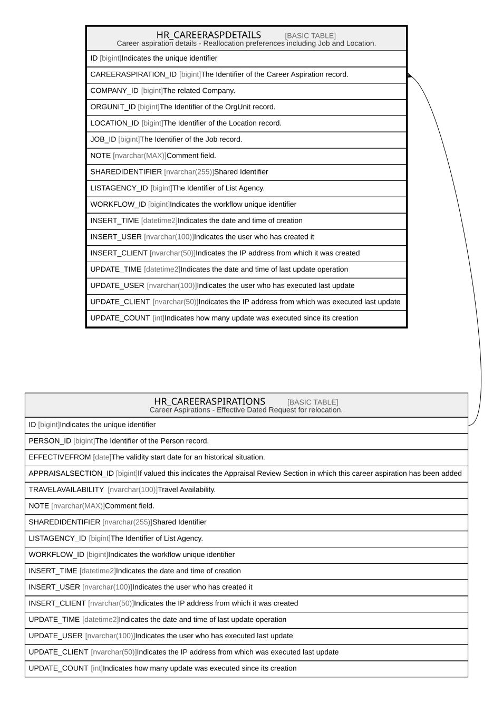

# HR_CAREERASPDETAILS

## Description

Career aspiration details - Reallocation preferences including Job and Location.  

## Columns

| Name | Type | Default | Nullable | Parents | Comment |
| ---- | ---- | ------- | -------- | ------- | ------- |
| ID | bigint |  | false |  | Indicates the unique identifier |
| CAREERASPIRATION_ID | bigint |  | true | [HR_CAREERASPIRATIONS](HR_CAREERASPIRATIONS.md) | The Identifier of the Career Aspiration record. |
| COMPANY_ID | bigint |  | true |  | The related Company. |
| ORGUNIT_ID | bigint |  | true |  | The Identifier of the OrgUnit record. |
| LOCATION_ID | bigint |  | true |  | The Identifier of the Location record. |
| JOB_ID | bigint |  | true |  | The Identifier of the Job record. |
| NOTE | nvarchar(MAX) |  | true |  | Comment field. |
| SHAREDIDENTIFIER | nvarchar(255) |  | true |  | Shared Identifier |
| LISTAGENCY_ID | bigint |  | true |  | The Identifier of List Agency. |
| WORKFLOW_ID | bigint |  | true |  | Indicates the workflow unique identifier |
| INSERT_TIME | datetime2 | (sysutcdatetime()) | false |  | Indicates the date and time of creation |
| INSERT_USER | nvarchar(100) | (N'MAIN') | false |  | Indicates the user who has created it |
| INSERT_CLIENT | nvarchar(50) | (N'localhost') | false |  | Indicates the IP address from which it was created |
| UPDATE_TIME | datetime2 | (sysutcdatetime()) | false |  | Indicates the date and time of last update operation |
| UPDATE_USER | nvarchar(100) | (N'MAIN') | false |  | Indicates the user who has executed last update |
| UPDATE_CLIENT | nvarchar(50) | (N'localhost') | false |  | Indicates the IP address from which was executed last update |
| UPDATE_COUNT | int | ((0)) | false |  | Indicates how many update was executed since its creation |

## Constraints

| Name | Type | Definition |
| ---- | ---- | ---------- |
| PK_CAREERASPDETAILS | PRIMARY KEY | CLUSTERED, unique, part of a PRIMARY KEY constraint, [ ID ] |
| FK_CAREERASP_CAREERASPDET | FOREIGN KEY | FOREIGN KEY(CAREERASPIRATION_ID) REFERENCES HR_CAREERASPIRATIONS(ID) ON UPDATE NO_ACTION ON DELETE CASCADE |

## Indexes

| Name | Definition |
| ---- | ---------- |
| PK_CAREERASPDETAILS | CLUSTERED, unique, part of a PRIMARY KEY constraint, [ ID ] |
| IDX_CAREERASP_COMPANY | NONCLUSTERED, [ COMPANY_ID ] |
| IDX_CAREERASP_ORGUNIT | NONCLUSTERED, [ ORGUNIT_ID ] |
| IDX_CAREERASP_LOCATION | NONCLUSTERED, [ LOCATION_ID ] |
| IDX_CAREERASP_JOB | NONCLUSTERED, [ JOB_ID ] |

## Relations

---

> Generated by [tbls](https://github.com/k1LoW/tbls)
